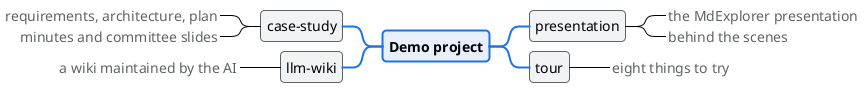

# MdExplorer, the demo project

> **TL;DR** — This project shows what MdExplorer does by using MdExplorer. There is a presentation to
> watch, a tour of eight things to try, and a case study for MarkAgent, the AI agent, to work on.
> Everything you see is a markdown file inside a git repository.

MdExplorer is the place where people and AI agents work on the same documents. People read, correct and
present. Agents read, write and verify. There is one format, markdown, and one history, git.

## Where to start

| If you have | Open | What you find |
|---|---|---|
| ten minutes | [The presentation](presentation/mdexplorer.md) | the idea, in twenty slides |
| half an hour | [The tour: try it yourself](tour/01-living-documents.md) | eight things to try |
| an hour | [The case study](case-study/README.md) | a project for the AI to work on |
| half an hour more | [The agent city](agent-city/README.md) | AI agents that live in the project and write to each other |

## The tour: try it yourself

| # | Page | What you try |
|---|---|---|
| 1 | [Living documents](tour/01-living-documents.md) | included files, commands that run, text you correct in place |
| 2 | [Diagrams that answer](tour/02-diagrams.md) | a click lights up the relations, one colour per type |
| 3 | [MarkAgent](tour/03-markagent.md) | the AI agent that reads and writes the documents of the project |
| 4 | [Presentations](tour/04-presentations.md) | slides written in markdown, corrected from the slide itself |
| 5 | [Word, PDF and site](tour/05-word-pdf-site.md) | the delivery formats, regenerated when needed |
| 6 | [Git without the terminal](tour/06-git.md) | what changed, who changed it, how to save |
| 7 | [Rules, skills and MCP](tour/07-rules-skills-mcp.md) | how the agent learns the way your team works |
| 8 | [Tests written in plain language](tour/08-e2e-tests.md) | the agent checks a site and leaves the evidence |

## The agent city

AI agents can also **live** in the project: each with a name, a role and a document to look after, and able to write
to each other. You decide whom to trust and you get the result in your inbox.
[Six trials](agent-city/README.md) to see it with your own hands, on the Alpina Servizi case study.

## The case study

[Alpina Servizi](case-study/README.md) is a made-up company trying an AI assistant for its help desk.
The folder holds the requirements, the architecture, the plan, the minutes of a meeting and a presentation.
**Three inconsistencies** are hidden in the documents: ask MarkAgent to find them.

## One more example: the wiki that maintains itself

The [llm-wiki](llm-wiki/README.md) folder shows another way to use an MdExplorer project: a wiki that an AI
agent keeps up to date, following the pattern proposed by Andrej Karpathy.

## How this project is laid out

---

*This repository is part of [MdExplorer](https://github.com/salaroglio/MdExplorer), free software under the
MIT licence. In MdExplorer it opens from Mark's guide, with "Create demo project". The Italian version of
this demo is on the `main` branch of the same repository.*
