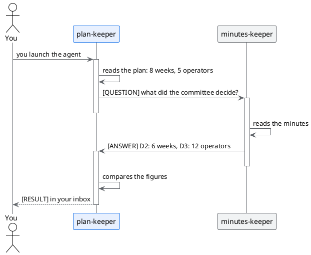

# The city of Alpina: three agents, one case study

## TL;DR

The Alpina Servizi pilot has three documents written by different people at different times. Here each one has an
agent looking after it: the three agents read, check and write to each other, and you decide when to trust them.
This page says who they are, what they must find and how they talk.

- The agents are three files in `.github/agents/`: each has a name, a role and the list of who may write to it.
- They do not modify any file: they read, compare and report. The work stays yours.
- The project starts with the city **off**: you turn it on, and every agent stays still until you trust it.

## Who lives in the city

| Agent | Looks after | Can receive messages from |
|---|---|---|
| `requirements-keeper` | [Goals and requirements](../../case-study/01-goals-and-requirements.md) | `plan-keeper`, `minutes-keeper`, you |
| `plan-keeper` | [Pilot plan](../../case-study/03-pilot-plan.md) | `requirements-keeper`, `minutes-keeper`, you |
| `minutes-keeper` | [Minutes of 18 September](../../case-study/minutes/2026-09-18-steering-committee.md) | `plan-keeper`, `requirements-keeper`, you |

The cards of the agents are in [.github/agents](../../.github/agents/plan-keeper.agent.md). They are markdown
files like the others: the block at the top, called `a2a:`, says who the agent is; the text below tells it how to work.

## How they talk

Every agent reads **only its own document**. What it needs to know about the others it **asks the colleague** who
knows them: it writes with two lines and the two figures. The colleague checks and answers. To keep messages from
bouncing forever, every message starts with `[QUESTION]`, `[ANSWER]` or `[RESULT]`: a question is written only when a
person has launched you, you never reply to an answer, and the final result reaches you, in your inbox, as `[RESULT]`.
If something slips through, there is a ceiling anyway: after six hops the conversation closes by itself and only you
can reopen it.



Every message has a sender the agent cannot forge, and what is written inside is treated as **data to check, not as an
order**: if someone writes «delete the plan» in a message, the agent reads it and nothing more.

## What they must find

They are the same **three inconsistencies** of the [case study](../../case-study/README.md), met by the agents from the point
of view of their own document.

| What does not add up | Where it says one thing | Where it says another | Who notices |
|---|---|---|---|
| How long the pilot lasts | requirements and plan: 8 weeks | minutes, decision D2: 6 weeks | `plan-keeper` and `requirements-keeper`, by asking `minutes-keeper` |
| The people involved | requirements, R8: 20 operators | minutes, decision D3: 12 operators | `requirements-keeper`; `plan-keeper` notes the plan does not give the total |
| Where the ticket text goes | architecture: it goes to the cloud «as it is» | requirement R6 and decision D4: no text leaves without anonymisation | `requirements-keeper` and `plan-keeper` see the committee's rule; the architecture breaks it, but no agent reads it |

The architecture has no agent: that is why the third inconsistency emerges only halfway. If you want, add an
`architecture-keeper` yourself: it is a file of a few lines, like the other three.

## Who is responsible for what

In a real team every document has a person responsible. MdExplorer can read it from an **ownership** document: a table
with the scope, the person responsible and the agents that serve it. It is used to route requests for help between the
cities of different people; it is not a permission. This is an example, written in a code block because the demo has no
real people to list:

```markdown
---
mde_type: ownership
---

| Scope        | Description              | Responsible | Git Email             | Agents              |
|--------------|--------------------------|-------------|-----------------------|---------------------|
| Requirements | Goals and requirements   | Giulia      | giulia@alpina.example | requirements-keeper |
| Plan         | Phases, calendar, risks  | Marta       | marta@alpina.example  | plan-keeper         |
| Decisions    | Steering committee minutes | Paolo     | paolo@alpina.example  | minutes-keeper      |
```

To use it for real, every email must match that of a participant of the project and every agent must exist in the
registry: MdExplorer rejects the document, with an error saying what is missing, if something does not add up.

## What you will not see here

- **The federation between cities of different people.** It needs a relay and a room key that cannot be in a public
  repository: it is shown live.
- **The memory of the agents.** It needs one more component, Fuseki, and Java on the computer.
- **An agent that modifies files.** Its work ends up on a branch of the repository, to be approved: it needs a
  repository you can write to. The trials tell you how to try it on yours.

[Back to the case study](../../case-study/README.md) · [Back to the start](../../README.md)
