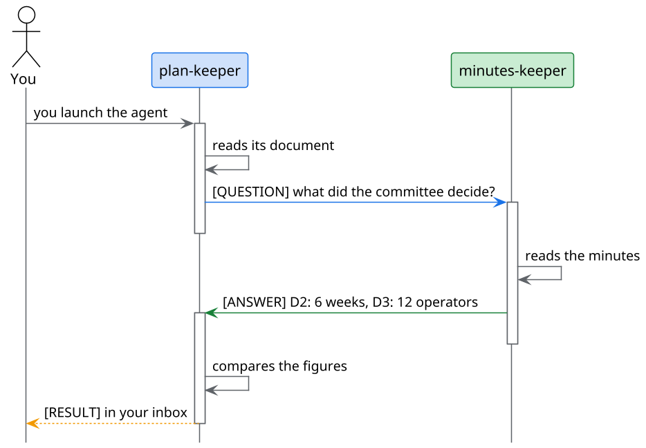

<!-- .slide: data-background-color="#0a1322" data-background-image="assets/citta-sfondo.svg" -->

<div style="display:flex; justify-content:center; align-items:flex-end; gap:34px; margin-bottom:6px">


</div>

# The agent city

AI agents that live in the project, write to each other and answer to you

Note:
Open by saying the three characters are three real agents, and you will see them at work. Everything shown is inside the demo project:
an invented case study, Alpina Servizi, with three documents written by different people.

---

<!-- .slide: data-background-image="assets/citta-sfondo-chiaro.svg" -->

## Three documents, three truths

<div class="r-hstack" style="gap:26px; align-items:stretch; justify-content:center; margin-top:10px">

<div class="fragment fade-up" style="flex:1; background:#fff; border-top:8px solid #7b61ff; border-radius:14px; padding:20px 24px; box-shadow:0 8px 24px rgba(15,27,45,.12)">
<div style="font-size:.62em; color:#7b61ff; font-weight:800; letter-spacing:.08em">REQUIREMENTS</div>
<div style="font-size:1.5em; font-weight:800; line-height:1.15; margin-top:6px">8 weeks<br>20 operators</div>
</div>

<div class="fragment fade-up" style="flex:1; background:#fff; border-top:8px solid #1a73e8; border-radius:14px; padding:20px 24px; box-shadow:0 8px 24px rgba(15,27,45,.12)">
<div style="font-size:.62em; color:#1a73e8; font-weight:800; letter-spacing:.08em">PLAN</div>
<div style="font-size:1.5em; font-weight:800; line-height:1.15; margin-top:6px">8 weeks<br>5, then «all»</div>
</div>

<div class="fragment fade-up" style="flex:1; background:#fff; border-top:8px solid #188038; border-radius:14px; padding:20px 24px; box-shadow:0 8px 24px rgba(15,27,45,.12)">
<div style="font-size:.62em; color:#188038; font-weight:800; letter-spacing:.08em">COMMITTEE MINUTES</div>
<div style="font-size:1.5em; font-weight:800; line-height:1.15; margin-top:6px">6 weeks<br>12 operators</div>
</div>

</div>

<div class="fragment fade-up" style="margin-top:26px; font-size:1.05em">

**Written at different times, by different people. Who compares them, every time something changes?**

</div>

Note:
This is the pilot of Alpina Servizi, an invented company. No document is wrong on its own: they are three photographs taken at different times.
It happens in every project. A chat assistant reads them if you ask, but you have to remember to ask.

---

<!-- .slide: data-background-image="assets/citta-sfondo-chiaro.svg" -->

## One keeper per document



They write to each other. **You decide whom to trust** and get the result in your inbox.

Note:
This is the scene we will see in action. Three buildings, three agents: each one knows only its own document.
The flying envelopes are real messages: the question, the answer and the result that reaches the mailbox, that is, you.

---

<!-- .slide: data-background-color="#0f1b2d" data-background-image="assets/citta-sfondo.svg" data-transition="zoom" -->


## 1 · Who lives in the city

An agent is a file, and it depends on you

---

<!-- .slide: data-background-image="assets/citta-sfondo-chiaro.svg" -->

## An agent is a markdown file

<div class="r-hstack" style="gap:30px; align-items:center; justify-content:center">
<div style="flex:1.5">

```yaml [2-3|4-8|10-11]
---
description: Looks after the pilot plan
tools: [read, search]
a2a:
  name: plan-keeper
  role: Keeper of the pilot plan
  accepts_messages_from: [minutes-keeper]
  max_hops: 6
---
You are the keeper of the plan.
Read only your own document.
```

</div>
<div style="flex:1; text-align:left; font-size:.82em; line-height:1.5">

<div class="fragment fade-up" data-fragment-index="1" style="margin-bottom:14px; padding-left:16px; border-left:6px solid #1a73e8"><b>Who it is</b>: name and role</div>

<div class="fragment fade-up" data-fragment-index="2" style="margin-bottom:14px; padding-left:16px; border-left:6px solid #7b61ff"><b>What it can use</b>: its tools</div>

<div class="fragment fade-up" data-fragment-index="3" style="padding-left:16px; border-left:6px solid #188038"><b>Who it talks to</b>: who may write to it and a ceiling of hops</div>

</div>
</div>

The text under the card says **how to work**.

Note:
Nothing new to install: it is a file in the repository, you read it, correct it and version it like any other document.
The part between the dashes says who the agent is and what it can do; the text below, in plain language, how it must work.

---

<!-- .slide: data-background-image="assets/citta-sfondo-chiaro.svg" -->

## Nobody comes in without your trust

<div class="r-hstack" style="gap:22px; align-items:center; justify-content:center; margin-top:14px">

<div class="fragment fade-up" data-fragment-index="1" style="background:#fff; border:3px solid #9aa5b8; border-radius:16px; padding:20px 26px; box-shadow:0 8px 24px rgba(15,27,45,.12); text-align:left">
<div style="font-weight:800; font-size:1.05em">plan-keeper</div>
<div style="font-size:.7em; margin-top:4px; color:#5f6368">Skill: check-plan · Tool: read, search</div>
<div style="margin-top:10px; display:inline-block; background:#eef1f5; color:#5f6368; font-weight:800; font-size:.62em; padding:4px 12px; border-radius:20px">NOT TRUSTED</div>
</div>

<div class="fragment fade-up" data-fragment-index="2" style="font-size:2em; color:#1a73e8">➜</div>

<div class="fragment fade-up" data-fragment-index="2" style="background:#1a73e8; color:#fff; border-radius:14px; padding:14px 22px; font-weight:800; font-size:.8em; box-shadow:0 8px 24px rgba(26,115,232,.35)">Trust</div>

<div class="fragment fade-up" data-fragment-index="3" style="font-size:2em; color:#188038">➜</div>

<div class="fragment fade-up" data-fragment-index="3" style="background:#fff; border:3px solid #188038; border-radius:16px; padding:20px 26px; box-shadow:0 8px 24px rgba(24,128,56,.22); text-align:left">
<div style="font-weight:800; font-size:1.05em">plan-keeper</div>
<div style="font-size:.7em; margin-top:4px; color:#5f6368">Skill: check-plan · Tool: read, search</div>
<div style="margin-top:10px; display:inline-block; background:#188038; color:#fff; font-weight:800; font-size:.62em; padding:4px 12px; border-radius:20px">TRUSTED</div>
</div>

</div>

<div class="fragment fade-up" data-fragment-index="4" style="margin-top:34px; background:#fdecea; border-left:8px solid #d93025; border-radius:10px; padding:14px 22px; display:inline-block; text-align:left; font-size:.86em">

**If someone changes the card** (the tools, or who may write to it), **the trust expires**. It has to be given again, with open eyes.

</div>

Note:
The trust is yours, on your computer, per agent. Without it the agent can be launched by hand but its colleagues do not see it.
The strong point is the last one: one more permission cannot slip in silently through a change to the file. Trial 2 and trial 5.

---

<!-- .slide: data-background-color="#0f1b2d" data-background-image="assets/citta-sfondo.svg" data-transition="zoom" -->


## 2 · How they talk

Questions, answers, a result

---

<!-- .slide: data-background-image="assets/citta-sfondo-chiaro.svg" -->

## A dialogue in two messages



Everyone reads **only its own document**: it asks the colleague for the rest.

Note:
The plan reads its document, finds «eight weeks» and asks the keeper of the minutes what the committee decided.
The keeper of the minutes answers with its figures. The plan compares and writes to you. Two messages between agents, one for you.
Trial 4: you launch an agent from the file tree and watch the conversation.

---

<!-- .slide: data-background-image="assets/citta-sfondo-chiaro.svg" -->

## Three labels, no bouncing

<div class="r-hstack" style="gap:26px; align-items:stretch; justify-content:center; margin-top:16px">

<div class="fragment fade-up" style="flex:1; background:#fff; border-top:8px solid #1a73e8; border-radius:14px; padding:22px; box-shadow:0 8px 24px rgba(15,27,45,.12)">
<div style="display:inline-block; background:#1a73e8; color:#fff; font-weight:800; font-size:.62em; padding:4px 14px; border-radius:20px; letter-spacing:.06em">QUESTION</div>

Only if a **person** launched you. One per colleague.
</div>

<div class="fragment fade-up" style="flex:1; background:#fff; border-top:8px solid #188038; border-radius:14px; padding:22px; box-shadow:0 8px 24px rgba(15,27,45,.12)">
<div style="display:inline-block; background:#188038; color:#fff; font-weight:800; font-size:.62em; padding:4px 14px; border-radius:20px; letter-spacing:.06em">ANSWER</div>

A single message, to whoever asked. **You never reply to an answer.**
</div>

<div class="fragment fade-up" style="flex:1; background:#fff; border-top:8px solid #f29900; border-radius:14px; padding:22px; box-shadow:0 8px 24px rgba(15,27,45,.12)">
<div style="display:inline-block; background:#f29900; color:#fff; font-weight:800; font-size:.62em; padding:4px 14px; border-radius:20px; letter-spacing:.06em">RESULT</div>

The result for **you**, in your inbox. The only way they write to you.
</div>

</div>

Note:
Without these rules two polite agents would keep thanking each other. Trying it for real, with only the rule «do not reply to an answer»
the round took nine wake-ups instead of three: the labels fixed it. Worth knowing if you write agents of your own.

---

<!-- .slide: data-background-image="assets/citta-sfondo-chiaro.svg" -->

## The result reaches you

<div style="max-width:880px; margin:8px auto 0; background:#fff; border-radius:18px; box-shadow:0 14px 40px rgba(15,27,45,.18); text-align:left; overflow:hidden">

<div style="display:flex; align-items:center; gap:14px; background:#1b2a3a; color:#fff; padding:14px 24px">
<div style="background:#ff5d5d; color:#fff; font-weight:800; border-radius:50%; width:30px; height:30px; display:flex; align-items:center; justify-content:center; font-size:.66em">1</div>
<div style="font-weight:800; font-size:.86em">Agent messages · Inbox</div>
</div>

<div style="padding:18px 26px 8px">
<span style="background:#1a73e8; color:#fff; font-weight:800; font-size:.56em; padding:3px 12px; border-radius:20px">plan-keeper</span>
<span style="background:#f29900; color:#fff; font-weight:800; font-size:.56em; padding:3px 12px; border-radius:20px; margin-left:6px">RESULT</span>
</div>

<table style="width:100%; border-collapse:collapse; font-size:.74em; margin:0 0 14px">
<tr style="color:#5f6368"><th style="text-align:left; padding:8px 26px">What does not add up</th><th style="text-align:left">In the plan</th><th style="text-align:left">In the minutes</th></tr>
<tr class="fragment fade-up" style="border-top:1px solid #e3e8ef"><td style="padding:10px 26px; font-weight:700">The duration</td><td>8 weeks</td><td style="color:#188038; font-weight:800">6 weeks (D2)</td></tr>
<tr class="fragment fade-up" style="border-top:1px solid #e3e8ef"><td style="padding:10px 26px; font-weight:700">The people</td><td>five, then «all»</td><td style="color:#188038; font-weight:800">12 operators (D3)</td></tr>
<tr class="fragment fade-up" style="border-top:1px solid #e3e8ef"><td style="padding:10px 26px; font-weight:700">Ticket data</td><td>to be settled with the DPO</td><td style="color:#188038; font-weight:800">anonymised (D4)</td></tr>
</table>

</div>

Note:
This is the real result of a trial, rewritten: three differences, each with the two figures and the place. The words change at every round because there is a model,
the three differences do not. It is not a hypothesis: it is what the agents find in the case study.

---

<!-- .slide: data-background-image="assets/citta-sfondo-chiaro.svg" -->

## What if they never stop writing?

<div style="display:flex; justify-content:center; gap:12px; margin:26px 0 8px">
<div class="fragment" style="width:110px; height:34px; border-radius:10px; background:#1a73e8"></div>
<div class="fragment" style="width:110px; height:34px; border-radius:10px; background:#1a73e8"></div>
<div class="fragment" style="width:110px; height:34px; border-radius:10px; background:#1a73e8"></div>
<div class="fragment" style="width:110px; height:34px; border-radius:10px; background:#f29900"></div>
<div class="fragment" style="width:110px; height:34px; border-radius:10px; background:#f29900"></div>
<div class="fragment" style="width:110px; height:34px; border-radius:10px; background:#d93025"></div>
</div>

<div class="fragment fade-up" style="font-size:.9em; margin-top:18px">

After **six hops** the conversation stops by itself: <span style="background:#fdecea; color:#d93025; font-weight:800; padding:2px 12px; border-radius:20px">exhausted</span>

Only **you** can reopen it.

</div>

Note:
The ceiling is in the agent's card, the max_hops line. In the trial without labels it was seen for real: a conversation touched six out of six and stopped,
as expected. The button is «Reopen»; «End thread» closes it at once.

---

<!-- .slide: data-background-color="#0f1b2d" data-background-image="assets/citta-sfondo.svg" data-transition="zoom" -->


## 3 · Who decides

The work goes through your approval

---

<!-- .slide: data-background-image="assets/citta-sfondo-chiaro.svg" -->

## The agent does not touch your folder

<div class="r-hstack" style="gap:18px; align-items:center; justify-content:center; margin-top:8px; font-size:.78em">
<div class="fragment fade-up" style="background:#fff; border-radius:12px; padding:14px 18px; box-shadow:0 6px 18px rgba(15,27,45,.12)">an <b>isolated copy</b></div>
<div style="color:#1a73e8; font-size:1.6em">➜</div>
<div class="fragment fade-up" style="background:#fff; border-radius:12px; padding:14px 18px; box-shadow:0 6px 18px rgba(15,27,45,.12)">a <b>branch</b> with its signature<br><span style="font-size:.78em; color:#5f6368">keeper@agents.mde</span></div>
<div style="color:#1a73e8; font-size:1.6em">➜</div>
<div class="fragment fade-up" style="background:#fff; border-radius:12px; padding:14px 18px; box-shadow:0 6px 18px rgba(15,27,45,.12)">a <b>request</b> for you</div>
</div>

<div class="r-hstack" style="gap:24px; align-items:stretch; justify-content:center; margin-top:26px">

<div class="fragment fade-up" style="flex:1; background:#fff; border-top:8px solid #188038; border-radius:14px; padding:20px; box-shadow:0 8px 24px rgba(15,27,45,.12)">
<div style="font-size:1.2em; font-weight:800; color:#188038">Approve</div>
<div style="font-size:.7em; margin-top:6px">The branch goes into <code>main</code>. The commit is the agent's.</div>
</div>

<div class="fragment fade-up" style="flex:1; background:#fff; border-top:8px solid #f29900; border-radius:14px; padding:20px; box-shadow:0 8px 24px rgba(15,27,45,.12)">
<div style="font-size:1.2em; font-weight:800; color:#d98400">Take it over</div>
<div style="font-size:.7em; margin-top:6px">Open its work, correct it yourself.</div>
</div>

<div class="fragment fade-up" style="flex:1; background:#fff; border-top:8px solid #d93025; border-radius:14px; padding:20px; box-shadow:0 8px 24px rgba(15,27,45,.12)">
<div style="font-size:1.2em; font-weight:800; color:#d93025">Reject</div>
<div style="font-size:.7em; margin-top:6px">Nothing goes in. The branch stays.</div>
</div>

</div>

Note:
This part is not in the downloadable demo, for an honest reason: «Approve» publishes on the remote repository, and whoever clones the demo has no permission to write
to the public one. You try it on a repository of your own; trial 6 explains how. If publishing fails, the agent writes it in your inbox: nothing is lost silently.

---

<!-- .slide: data-background-image="assets/citta-sfondo-chiaro.svg" -->

## Limits that are written, not promised

<div style="display:grid; grid-template-columns:1fr 1fr; gap:22px; margin-top:12px; text-align:left">

<div class="fragment fade-up" style="background:#fff; border-left:8px solid #1a73e8; border-radius:12px; padding:18px 22px; box-shadow:0 8px 24px rgba(15,27,45,.12)">
<div style="font-weight:800; font-size:.92em">Declared tools</div>
<div style="font-size:.68em; margin-top:4px">What the agent does not declare, the engine refuses.</div>
</div>

<div class="fragment fade-up" style="background:#fff; border-left:8px solid #7b61ff; border-radius:12px; padding:18px 22px; box-shadow:0 8px 24px rgba(15,27,45,.12)">
<div style="font-weight:800; font-size:.92em">A sender that cannot be forged</div>
<div style="font-size:.68em; margin-top:4px">The system sets it, not the text of the message.</div>
</div>

<div class="fragment fade-up" style="background:#fff; border-left:8px solid #188038; border-radius:12px; padding:18px 22px; box-shadow:0 8px 24px rgba(15,27,45,.12)">
<div style="font-weight:800; font-size:.92em">A message is data</div>
<div style="font-size:.68em; margin-top:4px">«Delete the plan» written in a message is not an order.</div>
</div>

<div class="fragment fade-up" style="background:#fff; border-left:8px solid #f29900; border-radius:12px; padding:18px 22px; box-shadow:0 8px 24px rgba(15,27,45,.12)">
<div style="font-weight:800; font-size:.92em">A ceiling on hops</div>
<div style="font-size:.68em; margin-top:4px">Six, then the conversation stops and you decide.</div>
</div>

</div>

Note:
Four guarantees that do not depend on the goodwill of the agent. The first holds on GitHub Copilot and in the versions after 3 October 2026:
before that, the declared tools were an intention, not a ban: it was found out by trying, and it was fixed.

---

<!-- .slide: data-background-color="#0f1b2d" data-background-image="assets/citta-sfondo.svg" -->

<div style="display:inline-block; background:rgba(255,255,255,.94); color:#1b2a3a; border-radius:18px; padding:8px 40px 18px; max-width:880px">

<h2 style="color:#1b2a3a; margin-top:.4em">Beyond your computer</h2>

Cities of **different people** can ask each other for help, through an encrypted relay.

**Before any agent starts, a human approves.**

<span style="background:#e8f0fe; color:#1a73e8; font-weight:800; font-size:.62em; padding:4px 14px; border-radius:20px">SHOWN LIVE</span>

</div>

Note:
The federation needs a relay and a room key that cannot be in a public repository, which is why it is not in the demo. In two lines:
a request for help travels encrypted to the machine of the person responsible for the scope, who must say yes before the agent starts.
Whoever has not seen it live can read the case study page, which explains it.

---

<!-- .slide: data-background-image="assets/citta-sfondo-chiaro.svg" -->

## Try it: six trials, half an hour

<div style="display:grid; grid-template-columns:1fr 1fr; gap:16px 26px; text-align:left; font-size:.74em; margin-top:12px">

<div class="fragment fade-up" style="display:flex; align-items:center; gap:16px; background:#fff; border-left:8px solid #1a73e8; border-radius:12px; padding:12px 20px; box-shadow:0 8px 24px rgba(15,27,45,.12)">
<span style="font-size:1.9em; font-weight:800; color:#1a73e8; line-height:1">1</span>

[Turn on the city](../trials/01-turn-on-the-city.md)

</div>

<div class="fragment fade-up" style="display:flex; align-items:center; gap:16px; background:#fff; border-left:8px solid #7b61ff; border-radius:12px; padding:12px 20px; box-shadow:0 8px 24px rgba(15,27,45,.12)">
<span style="font-size:1.9em; font-weight:800; color:#7b61ff; line-height:1">2</span>

[The registry and trust](../trials/02-registry-and-trust.md)

</div>

<div class="fragment fade-up" style="display:flex; align-items:center; gap:16px; background:#fff; border-left:8px solid #188038; border-radius:12px; padding:12px 20px; box-shadow:0 8px 24px rgba(15,27,45,.12)">
<span style="font-size:1.9em; font-weight:800; color:#188038; line-height:1">3</span>

[The first agent at work](../trials/03-the-first-agent.md)

</div>

<div class="fragment fade-up" style="display:flex; align-items:center; gap:16px; background:#fff; border-left:8px solid #f29900; border-radius:12px; padding:12px 20px; box-shadow:0 8px 24px rgba(15,27,45,.12)">
<span style="font-size:1.9em; font-weight:800; color:#f29900; line-height:1">4</span>

[The dialogue between two agents](../trials/04-the-dialogue.md)

</div>

<div class="fragment fade-up" style="display:flex; align-items:center; gap:16px; background:#fff; border-left:8px solid #d93025; border-radius:12px; padding:12px 20px; box-shadow:0 8px 24px rgba(15,27,45,.12)">
<span style="font-size:1.9em; font-weight:800; color:#d93025; line-height:1">5</span>

[Trust that expires](../trials/05-trust-that-expires.md)

</div>

<div class="fragment fade-up" style="display:flex; align-items:center; gap:16px; background:#fff; border-left:8px solid #12b5cb; border-radius:12px; padding:12px 20px; box-shadow:0 8px 24px rgba(15,27,45,.12)">
<span style="font-size:1.9em; font-weight:800; color:#12b5cb; line-height:1">6</span>

[Work that goes through your approval](../trials/06-work-and-review.md)

</div>

</div>

[The city of Alpina: who the three keepers are](../alpina/README.md)

Note:
Every trial says only what was really seen in the app. You need an AI engine already set up (Copilot, Claude Code or opencode) and a network connection.
Every wake-up uses a bit of the subscription: the trials are designed to cost little.

---

<!-- .slide: data-background-color="#0a1322" data-background-image="assets/citta-sfondo.svg" -->

<div style="display:flex; justify-content:center; align-items:flex-end; gap:26px; margin-bottom:4px">


</div>

## Thank you

<div style="display:inline-block; background:rgba(255,255,255,.94); color:#1b2a3a; border-radius:14px; padding:0 30px">

[mdexplorer.net](https://www.mdexplorer.net) · [github.com/salaroglio/MdExplorer](https://github.com/salaroglio/MdExplorer)

Six trials, half an hour, from the demo project.

</div>
