# The assets of the agent city presentation

## TL;DR

Backgrounds and characters of the agent city presentation are files of their own, in this folder. The slides call them
by name: to change an illustration, replace the file with a new one of the same name, without touching the slides.
Here is the list, with the sizes to respect and where each file is used.

- Nine SVG files: three keepers, an envelope, the city scene, two backgrounds and the two astronauts.
- The animations are **inside** each file, so they travel with it.
- Same name and same proportions: replacing needs nothing else.

## The characters

| File | Size | What it does |
|---|---|---|
| `custode-piano.svg` | 180 × 290 | floats, winks, the antenna light blinks, the lines of the sheet write themselves |
| `custode-requisiti.svg` | 180 × 290 | same as above, in purple |
| `custode-verbali.svg` | 180 × 290 | same as above, in green |
| `busta.svg` | 200 × 130 | a message in flight, with its trail |
| `astronauta.svg`, `astronauta-ok.svg` | 290 × 255 | the same ones as in the MdExplorer presentation |

The file names are those of the Italian version on purpose: one set of files serves both languages, and only
`citta-agenti.svg` has text that changes.


## The scene and the backgrounds

| File | What it shows | Size | Where it is used |
|---|---|---|---|
| `citta-agenti.svg` | three buildings with their keepers, the mailbox and the messages flying (question, answer, result) | 1100 × 470 | the slide «One keeper per document» |
| `citta-sfondo.svg` | the city at night, with windows turning on and envelopes crossing the sky | 1280 × 720 | opening, dividers and closing |
| `citta-sfondo-chiaro.svg` | the skyline just hinted, for the content slides | 1280 × 720 | all the other slides |





## How the slides call them

A character is an image inside the slide:

```markdown

```

A background is a comment on the first line of the slide:

```markdown
<!-- .slide: data-background-color="#0f1b2d" data-background-image="assets/citta-sfondo.svg" -->
```

## How they were made

A Python program, `citta.py`, writes the seven new files (the astronauts come from the MdExplorer presentation).
It is only useful to whoever wants to touch them up starting from how they were made: the slides use the SVG files,
not the program, and an asset can be replaced with any other tool. It lives in `docs-internal/pitch/asset-generatori/`
of the MdExplorer development repository, and takes the language as an argument.

[Back to the section](../../README.md)
