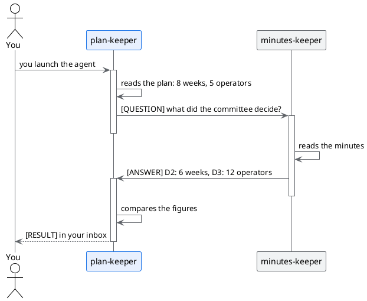

# Trial 4: the dialogue between two agents

## TL;DR

Every agent knows only its own document. To find out whether it says the same as the others, it has to **ask the
colleague** who knows them. This trial lets you launch an agent and watch what they write to each other: the
conversation shows in the «Agent messages» window and the result arrives in your inbox.

- You launch `plan-keeper`, which reads the plan and asks its colleague what the committee decided.
- `minutes-keeper` answers: the messages are two, and that is it.
- The result reaches you as `[RESULT]`: three differences, each with document and place.

## Before you start

You need the city on ([trial 1](01-turn-on-the-city.md)) and the three agents trusted ([trial 2](02-registry-and-trust.md)).
If a colleague is not trusted, `plan-keeper` does not see it in the directory and cannot write to it.

## Launch the agent

1. In the left panel open the `.github` folder and then `agents`.
2. On the row of `plan-keeper.agent.md` click the **robot** icon, «Launch agent». If the panel is narrow the icon
   may be cut off: widen it a little.
3. In the «Launch prompt» box write:

   > Check your plan against the committee decisions.

4. Leave «Work in an isolated workplace» ticked and click **Launch now**.

A message says the agent was started in the background. The whole round takes one or two minutes: every agent has
to read a file and think.

## Watch the conversation

Open «Agent messages» (the speech bubble in the toolbar) and go to the **Conversations** tab. You see a thread with:

- the status, «active»;
- the hop counter, **2/6**: two messages out of a maximum of six;
- the participants, `plan-keeper` and `minutes-keeper`;
- three buttons: **View messages**, **Consolidate** and **End thread**.

Click **View messages**. There are two:

1. `plan-keeper` → `minutes-keeper`, starting with **`[QUESTION]`**: the three figures the plan contains (duration,
   people, ticket data) and the request to tell it what the committee decided.
2. `minutes-keeper` → `plan-keeper`, starting with **`[ANSWER]`**: decisions D2, D3 and D4 with the lines of the minutes.

## Read the result

When the round ends, a number appears on the speech bubble: an unread message. Open it, **Inbox** tab. There is a message
from `plan-keeper` that starts with **`[RESULT]`**. For every difference it says the two figures and the place:

| What does not add up | In the plan | In the minutes |
|---|---|---|
| The duration | 8 weeks | 6 weeks (D2) |
| The people | five in the small group, then «all», no total | 12 operators of the day shift (D3) |
| The ticket data | to be settled with the DPO before phase 3 | no text leaves without anonymisation (D4) |

The words change from one time to the next: it is a model, not a script. The three differences do not.

## Why only two messages

The agents follow a small protocol, written in their card: a **question** is written only when a person has launched
you, you never reply to an **answer**, and the result for you is the **result**. Without these rules two polite
agents would keep thanking each other.

And if that were not enough? Every conversation has a **ceiling of six hops**: at the sixth it stops by itself, the
thread becomes «exhausted» and only you can reopen it, with **Reopen**. **End thread** closes it at once. The ceiling is in
the card, on the `max_hops` line.

## Try the other one

Repeat with `requirements-keeper` and the request «Check your requirements against the committee decisions.». Its
result lists the differences from its point of view: **20 operators against 12** and **requirement R6 against decision
D4**, as well as the duration.

[Trial 5: trust that expires](05-trust-that-expires.md) · [Section index](../README.md)
