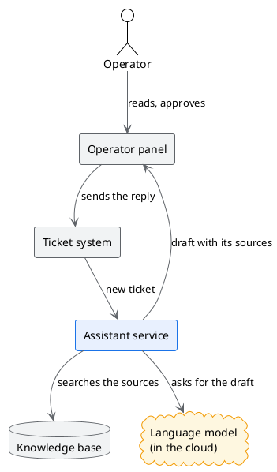
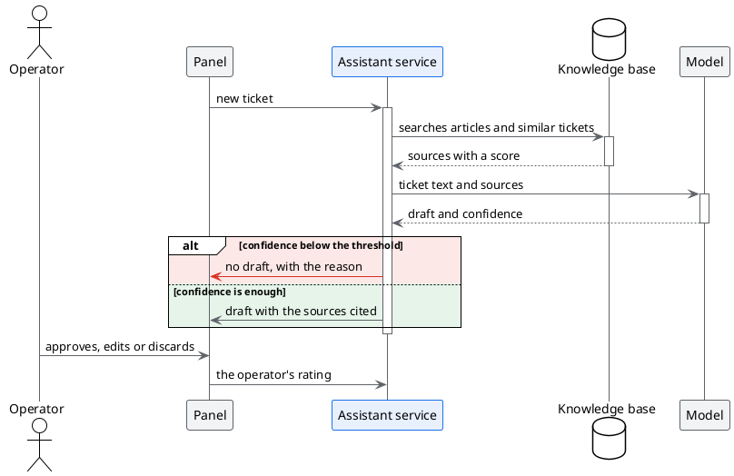
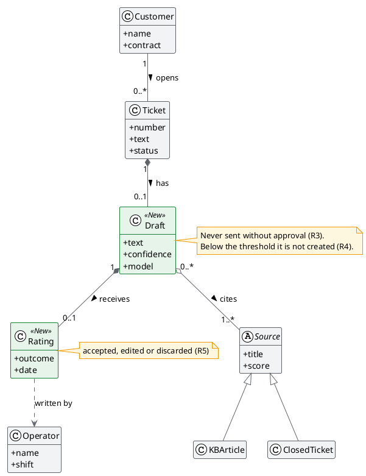

# Architecture of the assistant

## TL;DR

The assistant is a service that sits between the ticket system and a language model. It searches the
knowledge base, builds a draft with its sources and shows it to the operator in the operator's panel.
This document describes the parts, the path of a ticket and the data model.

- Four components: operator panel, assistant service, knowledge base, model.
- Below the confidence threshold the assistant **proposes nothing**: it is the red branch of the diagram.
- The text of the ticket is sent to a model **in the cloud**, as it is.

## The components



In blue, the component to build. In amber, the only part outside the company network.

## The path of a ticket



## The data model

When you click a class, MdExplorer lights up its relations with one colour per type.



In green, the classes the pilot adds to the ticket system.

## The configuration, read from the file

The thresholds are not written here: the diagram is drawn from the file the service uses too.

```plantuml(@json, ./data/target-metrics.json)
#highlight "thresholds"
#highlight "stopCriteria"
```

## The operator panel

The prototype of the screen, to open and try:

```html(./mockup/operator-panel.html)
```

## The open choices

| # | Choice | Status |
|---|---|---|
| A1 | Model in the cloud or model hosted in the company | open: depends on R6 |
| A2 | Keyword search or search by meaning in the knowledge base | decided: both |
| A3 | Where to keep the operators' ratings | decided: in the ticket system |

See also the [requirements](01-goals-and-requirements.md) and the [pilot plan](03-pilot-plan.md).
