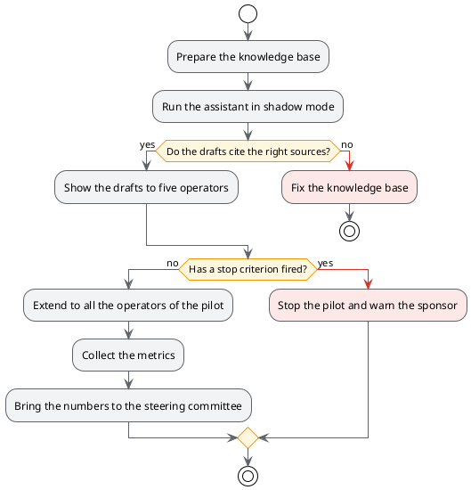
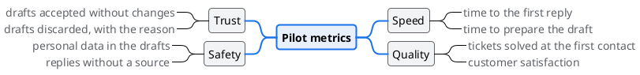

# Pilot plan

## TL;DR

The pilot goes through four phases, from a silent trial to real use with the operators. Every phase has
a condition to move to the next one and a condition to stop. The plan covers eight weeks, from Monday
5 October to Friday 27 November 2026.

- It starts in **shadow** mode: the assistant writes drafts but nobody sees them.
- A phase is left only if the metrics hold; two criteria stop everything.
- The final decision is for the steering committee, on the numbers collected.

## The phases



## The calendar

| Phase | Weeks | What happens | Move on if |
|---|---|---|---|
| 1. Preparation | 1-2 | Knowledge base articles tidied up and indexed | 300 articles ready |
| 2. Shadow | 3 | The assistant writes drafts nobody sees | 8 drafts out of 10 cite the right source |
| 3. Small group | 4-5 | Five operators see and rate the drafts | no stop criterion |
| 4. Whole group | 6-8 | All the operators of the pilot | it closes with the numbers |

## The metrics



## The risks

| Risk | Likelihood | Effect | What we do |
|---|---|---|---|
| The knowledge base is old | high | wrong but convincing drafts | phase 1 dedicated to it, sources always cited |
| Operators do not trust it | medium | the drafts are ignored | small group first, one-click rating |
| Personal data sent outside | medium | breach of R6 | to be settled with the DPO before phase 3 |
| The model changes behaviour | low | metrics cannot be compared | model pinned for the whole duration |

## A check that runs from the document

The block below has a button to run it: it counts the metrics that have a target in the data file.

```bash
echo "Metrics with a target in the data file:"
grep -c '"target"' case-study/data/target-metrics.json
```

See also the [requirements](01-goals-and-requirements.md), the [architecture](02-architecture.md) and the
[minutes of the steering committee](minutes/2026-09-18-steering-committee.md).
