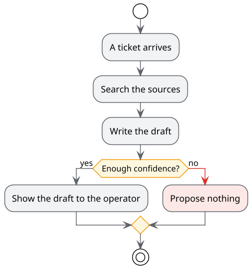

# AI assistant for the help desk

Steering committee · 23 October 2026

Note:
Sample presentation of the case study. It is a markdown file like the others: it is corrected from the page
with "Edit", and MarkAgent can add slides by reading the documents in the folder.

---

## Where we are

- Pilot approved on 18 September
- Knowledge base tidied up: 300 articles
- Assistant at work in shadow mode for a week

Note:
The details are in the pilot plan. The full calendar is in the table of the phases.

---

## The path of a draft

---

## What we decide today

1. Move on to the small group of operators
2. Model in the cloud with anonymisation, or model in the company
3. Date of the next committee

---

## To go deeper

- [Goals and requirements](01-goals-and-requirements.md)
- [Architecture](02-architecture.md)
- [Pilot plan](03-pilot-plan.md)
- [The prototype of the panel](mockup/operator-panel.html)
