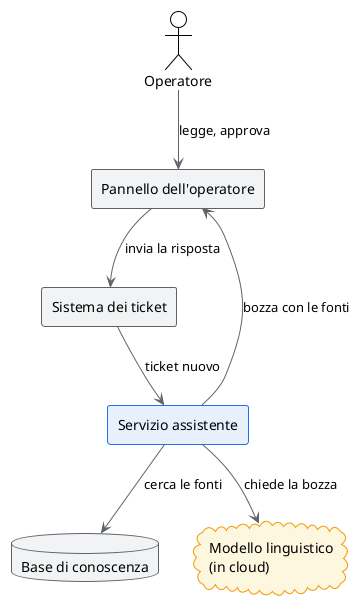
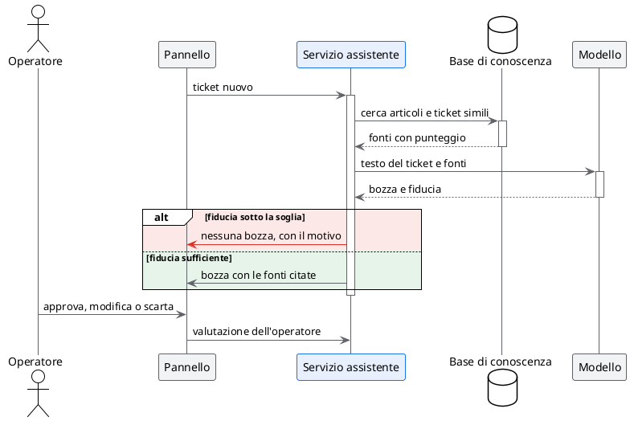
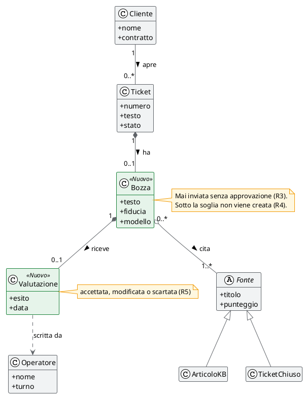

# Architettura dell'assistente

## TL;DR

L'assistente è un servizio che sta fra il sistema dei ticket e un modello linguistico. Cerca nella base di
conoscenza, costruisce una bozza con le fonti e la mostra all'operatore nel suo pannello. Questo documento
descrive i pezzi, il percorso di un ticket e il modello dei dati.

- Quattro componenti: pannello dell'operatore, servizio assistente, base di conoscenza, modello.
- Sotto la soglia di fiducia l'assistente **non propone niente**: è il ramo rosso del diagramma.
- Il testo del ticket viene inviato a un modello **in cloud**, così com'è.

## I componenti



In blu il componente da costruire. In ambra l'unico pezzo che sta fuori dalla rete aziendale.

## Il percorso di un ticket



## Il modello dei dati

Cliccando una classe, MdExplorer accende le sue relazioni con un colore per tipo.



In verde le classi che il pilota aggiunge al sistema dei ticket.

## La configurazione, letta dal file

Le soglie non sono scritte qui: il diagramma è disegnato dal file che usa anche il servizio.

```plantuml(@json, ./dati/metriche-obiettivo.json)
#highlight "soglie"
#highlight "criteriDiArresto"
```

## Il pannello dell'operatore

Il prototipo della schermata, da aprire e provare:

```html(./mockup/pannello-operatore.html)
```

## Le scelte aperte

| # | Scelta | Stato |
|---|---|---|
| A1 | Modello in cloud o modello ospitato in azienda | aperta: dipende da R6 |
| A2 | Ricerca per parole o ricerca per significato nella base di conoscenza | decisa: tutte e due |
| A3 | Dove tenere le valutazioni degli operatori | decisa: nel sistema dei ticket |

Vedi anche i [requisiti](01-obiettivi-e-requisiti.md) e il [piano del pilota](03-piano-del-pilota.md).
