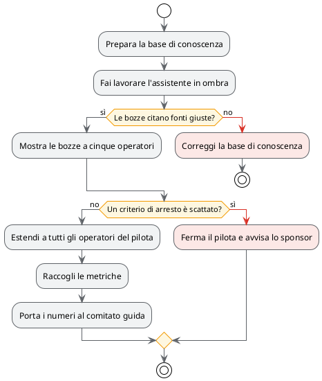

# Piano del pilota

## TL;DR

Il pilota procede in quattro fasi, da una prova silenziosa a un uso vero con gli operatori. Ogni fase ha
una condizione per passare alla successiva e una per fermarsi. Il piano copre otto settimane, da lunedì
5 ottobre a venerdì 27 novembre 2026.

- Si parte in **ombra**: l'assistente scrive le bozze ma nessuno le vede.
- Si passa di fase solo se le metriche tengono; due criteri fermano tutto.
- La decisione finale spetta al comitato guida, sui numeri raccolti.

## Le fasi



## Il calendario

| Fase | Settimane | Cosa succede | Si passa oltre se |
|---|---|---|---|
| 1. Preparazione | 1-2 | Articoli della base di conoscenza riordinati e indicizzati | 300 articoli pronti |
| 2. Ombra | 3 | L'assistente scrive bozze che nessuno vede | 8 bozze su 10 citano la fonte giusta |
| 3. Gruppo ristretto | 4-5 | Cinque operatori vedono e valutano le bozze | nessun criterio di arresto |
| 4. Tutto il gruppo | 6-8 | Tutti gli operatori del pilota | si chiude con i numeri |

## Le metriche


## I rischi

| Rischio | Probabilità | Effetto | Cosa facciamo |
|---|---|---|---|
| La base di conoscenza è vecchia | alta | bozze sbagliate ma convincenti | fase 1 dedicata, fonti sempre citate |
| Gli operatori non si fidano | media | le bozze vengono ignorate | gruppo ristretto prima, valutazione a un clic |
| Dati personali verso l'esterno | media | violazione di R6 | da chiarire con il DPO prima della fase 3 |
| Il modello cambia comportamento | bassa | metriche non confrontabili | modello fissato per tutta la durata |

## Un controllo che si esegue dal documento

Il blocco qui sotto ha un pulsante per eseguirlo: conta le metriche che hanno un obiettivo nel file dei dati.

```bash
echo "Metriche con un obiettivo nel file dei dati:"
grep -c '"obiettivo"' caso-studio/dati/metriche-obiettivo.json
```

Vedi anche i [requisiti](01-obiettivi-e-requisiti.md), l'[architettura](02-architettura.md) e il
[verbale del comitato guida](verbali/2026-09-18-comitato-guida.md).
