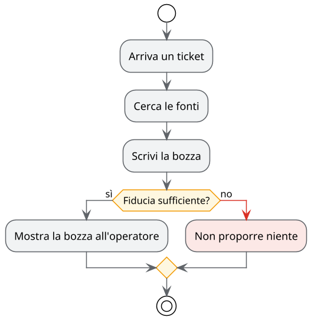

# Assistente AI per l'help desk

Comitato guida · 23 ottobre 2026

Note:
Presentazione di esempio del caso di studio. È un file markdown come gli altri: si corregge dalla pagina
con «Modifica» e MarkAgent può aggiungere slide leggendo i documenti della cartella.

---

## Dove siamo

- Pilota approvato il 18 settembre
- Base di conoscenza riordinata: 300 articoli
- Assistente al lavoro in ombra da una settimana

Note:
I dettagli sono nel piano del pilota. Il calendario completo è nella tabella delle fasi.

---

## Il percorso di una bozza

---

## Cosa decidiamo oggi

1. Passare al gruppo ristretto di operatori
2. Modello in cloud con anonimizzazione, oppure modello in azienda
3. Data del prossimo comitato

---

## Per approfondire

- [Obiettivi e requisiti](01-obiettivi-e-requisiti.md)
- [Architettura](02-architettura.md)
- [Piano del pilota](03-piano-del-pilota.md)
- [Il prototipo del pannello](mockup/pannello-operatore.html)
