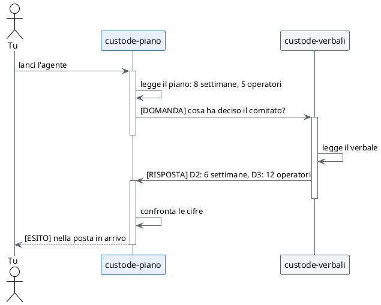

# La città di Alpina: tre agenti, un caso di studio

## TL;DR

Nel pilota di Alpina Servizi ci sono tre documenti scritti da persone diverse in momenti diversi. Qui ognuno ha
un agente che lo presidia: i tre agenti si leggono, si controllano e si scrivono tra loro, e tu decidi quando
fidarti di loro. Questa pagina dice chi sono, cosa devono trovare e come si parlano.

- Gli agenti sono tre file in `.github/agents/`: ognuno ha un nome, un ruolo e l'elenco di chi può scrivergli.
- Non modificano nessun file: leggono, confrontano e segnalano. Il lavoro resta tuo.
- Il progetto parte **senza** la città accesa: la accendi tu, e ogni agente resta fermo finché non gli dai fiducia.

## Chi abita la città

| Agente | Presidia | Può ricevere messaggi da |
|---|---|---|
| `custode-requisiti` | [Obiettivi e requisiti](../../caso-studio/01-obiettivi-e-requisiti.md) | `custode-piano`, `custode-verbali`, tu |
| `custode-piano` | [Piano del pilota](../../caso-studio/03-piano-del-pilota.md) | `custode-requisiti`, `custode-verbali`, tu |
| `custode-verbali` | [Verbale del 18 settembre](../../caso-studio/verbali/2026-09-18-comitato-guida.md) | `custode-piano`, `custode-requisiti`, tu |

Le schede degli agenti stanno in [.github/agents](../../.github/agents/custode-piano.agent.md). Sono file
markdown come gli altri: il blocco in alto, chiamato `a2a:`, dice chi è l'agente; il testo sotto gli dice
come lavorare.

## Come si parlano

Ogni agente legge **solo il proprio documento**. Quello che gli serve sugli altri lo **chiede al collega** che li
conosce: gli scrive con due righe e le due cifre. Il collega controlla e risponde. Per non far
rimbalzare i messaggi all'infinito, ogni messaggio comincia con `[DOMANDA]`, `[RISPOSTA]` o `[ESITO]`: una domanda si
scrive solo quando ti ha lanciato una persona, a una risposta non si replica mai, e il risultato finale arriva a te,
nella posta in arrivo, come `[ESITO]`. Se qualcosa sfugge, c'è
comunque un tetto: dopo sei rimbalzi la conversazione si chiude da sola e solo tu puoi riaprirla.



Ogni messaggio ha un mittente che l'agente non può falsificare, e ciò che c'è scritto dentro è trattato come un
**dato da verificare, non come un ordine**: se in un messaggio qualcuno scrive «cancella il piano», l'agente lo
legge e basta.

## Cosa devono trovare

Sono le stesse **tre incongruenze** del [caso di studio](../../caso-studio/README.md), che gli agenti incontrano
dal punto di vista del proprio documento.

| Cosa non torna | Dove dice una cosa | Dove ne dice un'altra | Chi se ne accorge |
|---|---|---|---|
| La durata del pilota | requisiti e piano: 8 settimane | verbale, decisione D2: 6 settimane | `custode-piano` e `custode-requisiti`, interrogando `custode-verbali` |
| Le persone coinvolte | requisiti, R8: 20 operatori | verbale, decisione D3: 12 operatori | `custode-requisiti`; `custode-piano` nota che il piano non dice il totale |
| Dove va il testo dei ticket | architettura: va in cloud «così com'è» | requisito R6 e decisione D4: nessun testo esce senza anonimizzazione | `custode-requisiti` e `custode-piano` vedono la regola del comitato; l'architettura la viola, ma nessun agente la legge |

L'architettura non ha un agente: per questo la terza incongruenza emerge solo a metà. Se vuoi, aggiungi tu un
`custode-architettura`: è un file di poche righe, uguale agli altri tre.

## Chi è responsabile di cosa

In un gruppo vero ogni documento ha una persona responsabile. MdExplorer può leggerlo da un documento di
**ownership**: una tabella con l'ambito, il responsabile e gli agenti che lo servono. Serve a instradare le
richieste d'aiuto tra le città di persone diverse; non è un permesso. Questo è un esempio, scritto in un blocco
di codice perché nel demo non ci sono persone vere da elencare:

```markdown
---
mde_type: ownership
---

| Ambito    | Descrizione                | Responsabile | Git Email             | Agenti            |
|-----------|----------------------------|--------------|-----------------------|-------------------|
| Requisiti | Obiettivi e requisiti      | Giulia       | giulia@alpina.example | custode-requisiti |
| Piano     | Fasi, calendario, rischi   | Marta        | marta@alpina.example  | custode-piano     |
| Decisioni | Verbali del comitato guida | Paolo        | paolo@alpina.example  | custode-verbali   |
```

Per usarlo davvero ogni email deve coincidere con quella di un partecipante del progetto e ogni agente deve
esistere nel registro: MdExplorer rifiuta il documento, con un errore che dice cosa manca, se qualcosa non torna.

## Cosa non vedrai qui

- **La federazione tra città di persone diverse.** Richiede un relay e una chiave di stanza che non possono
  stare in un repository pubblico: si mostra dal vivo.
- **La memoria degli agenti.** Richiede un componente in più, Fuseki, e Java sul computer.
- **Un agente che modifica i file.** Il suo lavoro finisce su un ramo del repository, da approvare: richiede
  un repository su cui puoi scrivere. Le prove ti dicono come provarlo sul tuo.

[Torna al caso di studio](../../caso-studio/README.md) · [Torna all'inizio](../../README.md)
