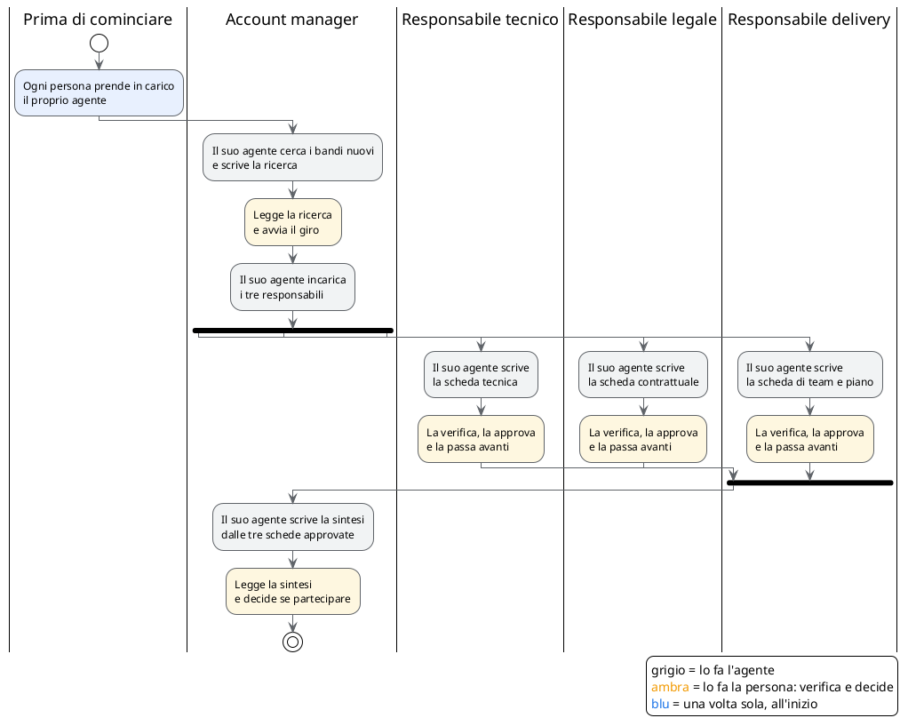

# La gara di Nordica: quattro persone, quattro agenti

## TL;DR

Pentagroup, un'azienda di servizi gestiti, riceve un invito a una gara di Nordica Crediti: un capitolato di molte pagine, da
leggere con occhi diversi (tecnici, legali, di delivery) prima di decidere se partecipare. Ogni persona ha un agente che
prepara la sua scheda; lei la verifica e decide se passarla avanti; alla fine l'account manager ha una sintesi.

- Quattro persone e quattro agenti: l'account manager e tre responsabili (tecnico, legale, delivery).
- **Gli agenti preparano, le persone decidono**: nessun lavoro passa al passo dopo senza l'approvazione di chi ne risponde.
- Tutto è inventato: l'azienda, il committente, la gara (derivata da un capitolato reale, riscritto) e il sito dei bandi.

## Chi c'è

| Persona | Il suo agente | Cosa prepara | Dove |
|---|---|---|---|
| **Account manager** | `account-manager` | cerca i bandi nuovi e archivia la ricerca, avvia il giro, scrive la sintesi finale | `ricerche/ricerca-<data>.md`, `schede/sintesi.md` |
| **Responsabile tecnico** | `responsabile-tecnico` | la fattibilità tecnica: requisiti coperti e non | `schede/tecnica.md` |
| **Responsabile legale** | `responsabile-legale` | le clausole: accettabili, da negoziare, critiche | `schede/contrattuale.md` |
| **Responsabile delivery** | `responsabile-delivery` | il team e le date: se i tempi reggono | `schede/delivery.md` |

Nel demo **le quattro parti le fai tu**, una dopo l'altra: è il modo più rapido per vedere come passa il lavoro. In
un'azienda ciascuna sarebbe una persona diversa, sul proprio computer.

**Ogni agente risponde a una persona.** Lavora solo sul computer di quella persona, ed è lei a valutare ciò che l'agente
scrive; finché un agente non ha un responsabile, non parte. Chi risponde di chi sta scritto in
[Chi risponde di quale agente](responsabilita.md): all'inizio la tabella è vuota, e la riempi tu con «Sono tutti miei».

**Ogni agente produce due cose.** Il **documento** (la colonna «Dove»), che leggi e approvi, e un **messaggio** di poche
righe nella posta, con gli indicatori e il percorso del documento. Il messaggio dice dove guardare, non sostituisce il documento.

## Come gira

**Prima di cominciare**, ogni persona prende in carico il proprio agente: da quel momento ne risponde, e l'agente lavora
solo sul suo computer. Poi:

1. L'agente dell'account manager **legge il sito dei bandi**, fa un primo filtro (la natura del bando e il tempo per
   rispondere) e scrive la **ricerca**: quali bandi sono nuovi, e quali meritano il giro. Non avvia niente da solo.
2. **L'account manager** legge la ricerca e dice al suo agente di avviare il giro: l'agente incarica i tre responsabili.
3. L'agente di ogni responsabile **legge il capitolato con gli occhi del suo responsabile** e scrive la sua scheda.
4. **Ogni responsabile** verifica la scheda del proprio agente, la approva e sceglie di passarla all'account manager: è il suo
   gesto che avvisa, non l'agente.
5. Quando ci sono le tre schede approvate, l'agente dell'account manager scrive la **sintesi**. **L'account manager** la
   legge e decide se partecipare.

Nel grafico non c'è una corsia per «te»: ogni passo ambra è della persona di quella corsia. Nel demo le quattro persone sei
tu, una dopo l'altra, e il passo blu lo fai una volta sola per tutti e quattro gli agenti («Sono tutti miei»).

## I file

| File | Cos'è |
|---|---|
| [capitolato.md](capitolato.md) | la gara di Nordica Crediti (Progetto ATLANTE), riscritta e abbreviata |
| [portale-nordica/bandi.md](portale-nordica/bandi.md) | **simula** il sito dei bandi del committente: tre procedure in corso |
| [registro-bandi.md](registro-bandi.md) | i bandi che Pentagroup ha già visto |
| [profilo-pentagroup.md](profilo-pentagroup.md) | chi è Pentagroup, un capitolo per responsabile, e i criteri per decidere se partecipare |
| `ricerche/` | l'esito di ogni ricerca dell'account manager sul portale |
| `schede/` | le tre schede dei responsabili e la sintesi: le scrivono gli agenti |

Gli agenti stanno in [.github/agents](../../.github/agents/account-manager.agent.md): file markdown come gli altri. Il blocco
`a2a:` in alto dice chi sono, che cosa fanno e a chi possono passare il lavoro; il testo sotto dice come lavorano.

## Cosa non fanno gli agenti

- **Non decidono.** Propongono; ogni passaggio al passo successivo è il gesto di una persona.
- **Non scrivono nel progetto da soli.** Ogni documento resta in una copia a parte dell'agente finché non lo approvi.
- **Non inventano.** Se un'informazione non c'è nel capitolato o nel profilo scrivono «da chiarire»; ogni affermazione
  cita la sezione del capitolato, così puoi controllarla.
- **Non eseguono comandi.** Hanno solo gli strumenti per leggere e per scrivere i propri file.

> **Un'avvertenza onesta.** Il sito dei bandi è un file del progetto: in azienda l'agente lo leggerebbe con uno strumento
> di navigazione, che qui non c'è. Il resto del lavoro (lettura, confronto, schede, sintesi) è quello vero.

[Torna alla sezione](../README.md)
