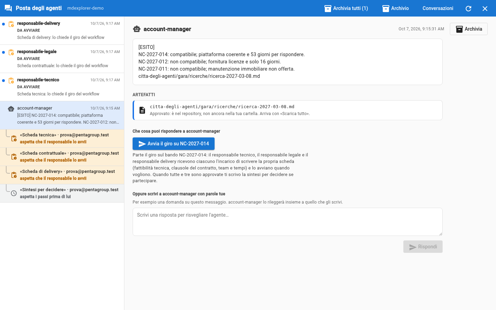

# La posta degli agenti

## TL;DR

Il fumetto nella barra degli strumenti apre la posta degli agenti: una pagina a tutto schermo, sopra il progetto. A sinistra c'è
un elenco solo, con i messaggi degli agenti e i lavori da approvare; a destra il dettaglio di ciò che scegli. Un documento scritto
da un agente si apre lì dentro, anche prima che tu lo approvi.

- **A sinistra**: chi ti ha scritto, quando, e la prima riga. Il pallino blu segna ciò che non hai ancora letto.
- **A destra**: il messaggio intero, gli **artefatti** che cita con il pulsante **Apri**, e la casella per rispondere.
- I lavori da approvare stanno nello stesso elenco, con l'etichetta **Da approvare** e i tre gesti di sempre.

## Le voci dell'elenco

| Icona | Che cos'è | Cosa fai a destra |
|---|---|---|
| il robot | un messaggio di un agente | lo leggi, apri gli artefatti, rispondi con i suoi pulsanti |
| la lista con la spunta, in arancione, rientrata sotto un messaggio | l'artefatto di quel lavoro, **da approvare** | apri i file, poi **Autorizza**, **Ci metto mano** o **Rifiuta** |
| il fermaglio con l'orologio, «Da avviare» | un passo di un giro che è **tuo**: l'incarico che il workflow ha scritto per il tuo agente | **Apri per avviare**, **Non lo avvio** (con il motivo), o **Passa a un collega** del team |
| una riga colorata, rientrata sotto un messaggio | un passo del giro che hai avviato con un pulsante di quel messaggio, che stai **aspettando** | niente: la riga cambia stato da sola |
| il nodo, in viola | la **richiesta di un collega**: il suo agente chiede il lavoro del tuo | **Autorizza** o **Rifiuta**: il tuo agente parte solo se accetti |

Aprire un messaggio lo segna come letto: sparisce il pallino, ma il messaggio resta nell'elenco finché ti serve.

## Un lavoro, una riga

Un agente che lavora lascia due cose: il messaggio che ti scrive e la richiesta di approvazione del suo artefatto. Nell'elenco
non sono due voci slegate: la richiesta sta **sotto** il messaggio dello stesso lavoro, rientrata, con scritto «Da approvare:
l'artefatto». Il legame è l'identificativo del turno di lavoro, non l'ora.

## Rispondere a un agente

Sotto un messaggio trovi **che cosa puoi rispondere**: un pulsante per ogni risposta che l'agente accetta, con scritto che cosa
succede premendolo (chi viene contattato, e per ottenere cosa). Se il progetto ha un workflow e il pulsante fa partire dei
passi (per esempio «Avvia il giro»), premendolo non svegli l'agente: apri un giro, e i passi arrivano «da avviare» a chi ne
risponde. Se uno di quegli agenti ha più responsabili, sotto il pulsante scegli chi lo fa. Le risposte le dichiara la scheda dell'agente, nel blocco coperto
dalla fiducia: un pulsante può inviare solo ciò che hai già visto dando fiducia all'agente.

- **Finché l'artefatto di quel lavoro non è approvato, i pulsanti sono chiusi.** Prima decidi su ciò che l'agente ha prodotto,
  poi gli dici di andare avanti.
- Un agente che non ti chiede niente non ha pulsanti.
- Sotto i pulsanti c'è sempre una **casella per scrivere con parole tue**: per chiedere «perché non vedo i pulsanti?», o per
  dire all'agente una cosa che la sua scheda non prevede. L'agente si sveglia senza ricordi, quindi riceve ciò che scrivi
  insieme al suo messaggio di prima, citato, e ai pulsanti che ti aveva proposto. Anche la casella resta chiusa finché
  l'artefatto non è approvato.
- Un agente che dichiara delle risposte deve dire ogni volta quali valgono, anche «nessuna». Se se ne dimentica, MdExplorer
  rifiuta il messaggio e l'agente lo rimanda corretto: non ti arriva un messaggio senza pulsanti per sbaglio.

## Rifiutare

Il rifiuto è l'eccezione: di solito un artefatto che non convince si corregge nella copia dell'agente e poi si approva.
**Rifiuta** chiede sempre il motivo, e poi ferma tutto: niente riparte da solo.

| Il lavoro l'aveva chiesto | Dopo il rifiuto |
|---|---|
| un altro agente, che lo aspetta | resta nella posta come «Rifiutato: il lavoro è fermo». Quando vuoi premi **Fai ripartire**: l'agente riceve lo stesso incarico e il tuo motivo. Prima, se serve, correggi la sua scheda |
| tu | è un ramo chiuso: i pulsanti di risposta restano bloccati. Per riprovare rilanci l'agente |

## I lavori che aspetti

Quando un tuo agente incarica altri agenti, sotto il suo messaggio compare una riga per ogni lavoro atteso. La riga cambia
stato da sola, e quando cambia lampeggia per qualche secondo.

| Stato | Sfondo |
|---|---|
| sta lavorando, in rilavorazione | azzurro |
| in approvazione (aspetta la decisione di chi ne risponde) | ambra |
| approvato, concluso | verde |
| rifiutato e fermo, non riuscito | rosso |

Oggi queste righe si vedono quando chi aspetta e chi approva lavorano sullo stesso computer, come nel demo.

## Archiviare

Quando un messaggio non ti serve più, **Archivia** (in alto a destra nel dettaglio) lo toglie dall'elenco. Non lo cancella:
**Archivio**, nella barra in alto, mostra i messaggi archiviati, e da lì **Riporta in posta** lo rimette nell'elenco.
**Archivia tutti** svuota la posta in un gesto; i lavori da approvare restano, perché quelli vanno decisi.

## Gli artefatti di un messaggio

Un agente produce sempre due cose: il documento e il messaggio che ti dice dov'è. Sotto il testo del messaggio, la sezione
**Artefatti** elenca i documenti che il messaggio cita, ciascuno con il suo stato.

| Stato | Che cosa vuol dire | Che cosa puoi fare |
|---|---|---|
| Nella copia dell'agente, in attesa della tua approvazione | l'agente l'ha scritto, ma nel progetto non c'è ancora | **Apri** per leggerlo, **Vai alla richiesta** per decidere |
| Approvato: è nel repository, non ancora nella tua cartella | l'hai autorizzato | lo porti nella cartella con «… da pullare» → **Scarica tutto** |
| Nel progetto | è nella tua cartella | **Apri** |
| Non trovato | il messaggio cita un file che non esiste da nessuna parte | chiedi all'agente, o controlla il percorso |

**Apri** mostra il documento nella parte destra della pagina, impaginato, con in alto da dove viene. **Torna** riporta al messaggio.

## Approvare senza uscire dalla posta

1. Scegli nell'elenco una voce **Da approvare**.
2. Su ogni file c'è **Apri**: leggi il documento com'è nella consegna dell'agente.
3. **Autorizza**: il documento entra nel repository e la voce sparisce dall'elenco. Se il lavoro è un passo di un giro,
   l'approvazione va anche nel registro del giro, e il workflow fa partire chi viene dopo.

Senza workflow, se l'agente dichiara a chi passa il lavoro, prima di autorizzare scegli il collega da avvisare (o «nessuno»).

Per leggere un documento non serve più «Ci metto mano»: quello resta il gesto per **correggerlo** tu prima di approvare.

## Le conversazioni

In alto a destra, **Conversazioni** apre l'elenco dei thread fra agenti: chi ha parlato con chi, e come fermare uno scambio che
non finisce.

[Indice della sezione](../README.md)
