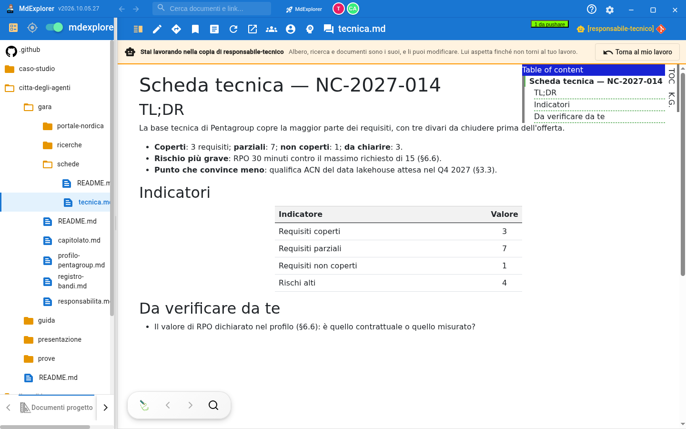
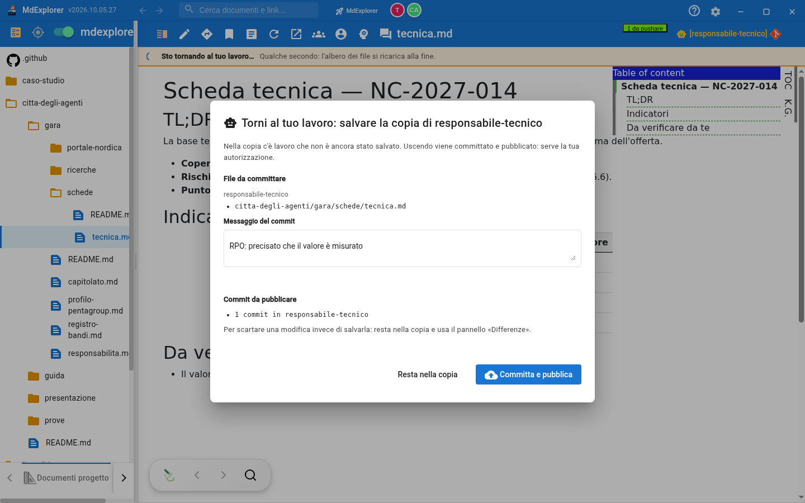

# Lavorare nella copia di un agente

## TL;DR

Ogni agente lavora in una copia sua del progetto, non nella tua cartella. Se quello che ha scritto non ti convince, entri nella
sua copia e lo sistemi tu: per l'app è come un cambio di ramo, con l'albero dei file, la ricerca e i documenti della copia.
Quando torni al tuo lavoro, l'app ti chiede di autorizzare il salvataggio di ciò che hai cambiato.

- Si entra dal selettore del ramo, voce **Worktree**, scegliendo l'agente.
- Mentre sei dentro, l'agente aspetta: nessuno tocca quella copia.
- Per uscire, **Torna al mio lavoro**: se hai cambiato qualcosa, autorizzi commit e pubblicazione in un gesto.

## Quando serve

Un agente ti ha consegnato un documento e c'è qualcosa da correggere: una cifra, una frase, una sezione che manca. Rifiutare è
l'eccezione; la strada normale è **correggere e approvare**. Puoi anche cambiare altre parti del progetto, se la correzione lo
richiede: nella copia puoi fare tutto quello che faresti nella tua cartella.

## Entrare

1. In alto a destra clicca l'etichetta del ramo (di solito `[main]`).
2. Scegli **Worktree**, poi l'agente.

Che cosa cambia:

| Dove | Che cosa vedi |
|---|---|
| L'etichetta del ramo | il nome dell'agente, con il robot, al posto di `main` |
| La striscia sopra il documento | «Stai lavorando nella copia di …», con **Torna al mio lavoro** |
| L'albero dei file | quello della copia: ci sono i file che l'agente ha creato |
| I contatori in alto | i file da committare e da pubblicare **della copia** |

Mentre l'app apre la copia, la striscia mostra una rotella: dura qualche secondo.

Non puoi entrare nella copia di un agente che sta lavorando in quel momento: l'app ti dice di aspettare che finisca.

## Lavorare

Apri i file dall'albero e modificali come sempre. L'agente intanto è **in coda**: se gli arriva un messaggio, aspetta che tu
sia uscito. È il motivo per cui la copia è al sicuro mentre ci lavori.

Se chiudi o ricarichi la finestra mentre sei dentro, alla riapertura l'app ti riporta nella stessa copia.

## Uscire

Clicca **Torna al mio lavoro**.

- **Se non hai cambiato niente**, torni subito al tuo ramo.
- **Se hai cambiato qualcosa**, si apre una finestra con i file modificati e il campo per il messaggio del commit.

| Pulsante | Che cosa fa |
|---|---|
| **Committa e pubblica** | salva le tue modifiche sul ramo dell'agente, le pubblica, e ti riporta al tuo lavoro |
| **Resta nella copia** | non succede niente: continui a lavorare |

Non c'è «esci senza salvare»: una modifica lasciata a metà nella copia non te la ricorderebbe più nessuno. Per buttarne via
una, resta dentro e usa il pannello **Differenze**: lì scarti file per file.

Se il commit o la pubblicazione non riescono (per esempio manca la rete), resti nella copia e l'app ti dice perché.

## Dopo

La tua correzione è sul ramo dell'agente, e la richiesta di approvazione nella posta la comprende: quando premi **Autorizza**
entrano nel progetto sia il lavoro dell'agente sia la tua correzione. La richiesta resta una sola.

## Da sapere

- I posti di lavoro sono due. Mentre sei dentro una copia, agli agenti ne resta uno: lavorano uno alla volta.
- Il selettore elenca gli agenti che hanno una copia in quel momento. Se la copia di un agente è già passata a un altro,
  il suo documento si legge comunque dalla posta, con **Apri**.
- Il commit porta **il tuo nome**, non quello dell'agente: nella storia del progetto si vede chi ha fatto cosa.

[La posta degli agenti](la-posta-degli-agenti.md) · [Indice della sezione](../README.md)
