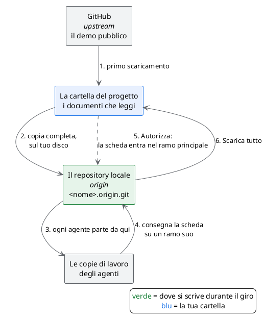

# Nota tecnica: dove finisce il lavoro degli agenti

## TL;DR

Gli agenti del demo scrivono documenti, e per consegnarli hanno bisogno di un repository git su cui scrivere. «Crea progetto
demo» ne prepara uno **sul tuo disco**, accanto al progetto, e da quel momento tutto il giro scrive lì: il demo pubblico su
GitHub non viene mai toccato. Questa pagina spiega cosa succede davvero, per chi vuole capirlo o deve spiegarlo.

- Il progetto ha due collegamenti: **`origin`**, il repository locale, e **`upstream`**, il demo su GitHub.
- Consegne degli agenti, «Autorizza» e «Scarica tutto» lavorano **solo su `origin`**.
- MdExplorer non ha nessun comando che scriva su `upstream`.

## Il problema

Un agente che scrive un documento non lo mette nella tua cartella: lo consegna su un ramo a parte, e tu lo approvi. Per farlo
deve **pubblicare** quel ramo in un repository condiviso, quello che git chiama `origin`.

Appena scaricato, il demo ha come `origin` il repository pubblico su GitHub. Lì chi prova il demo non può scrivere, e chi
può (l'autore) non deve: le schede di prova finirebbero nel demo di tutti.

## La soluzione: un repository locale

Quando crei il progetto con «Crea progetto demo», MdExplorer fa quattro cose, una volta sola:

1. copia il repository appena scaricato in una cartella accanto al progetto, `<nome>.origin.git`;
2. rinomina il collegamento a GitHub da `origin` a **`upstream`**: non si perde, cambia solo nome;
3. crea un collegamento nuovo, **`origin`**, che punta alla copia locale;
4. aggancia il ramo del progetto a quella copia.



Dopo il primo scaricamento, GitHub non compare più in nessun passo.

## Che cos'è la cartella `.origin.git`

È una copia **completa** del demo, con tutta la sua storia: non solo la parte degli agenti. È però una copia «nuda» (in git:
*bare*): contiene i dati di git ma non i documenti in chiaro. Se la apri con Esplora file vedi cartelle tecniche come
`objects` e `refs`. Non si apre in MdExplorer e non si modifica a mano.

| | La cartella del progetto | `<nome>.origin.git` |
|---|---|---|
| Che cosa contiene | i documenti che leggi e modifichi | la stessa storia, senza file leggibili |
| Chi la usa | tu, in MdExplorer | git, quando gli agenti consegnano e quando approvi |
| Fa la parte di | la tua copia di lavoro | il repository condiviso |

Pensala come un piccolo GitHub privato sul tuo disco. È lo stesso schema di chi lavora su un fork: `origin` è la propria copia,
su cui si scrive; `upstream` è l'originale, da cui si prendono gli aggiornamenti.

## Chi scrive dove

| Gesto | Dove legge o scrive |
|---|---|
| Leggere e modificare i documenti | la cartella del progetto |
| Un agente consegna una scheda | un ramo nuovo su `origin` (locale) |
| **Autorizza** | il ramo principale di `origin` (locale) |
| Il registro dei giri del workflow (chi ha avviato, consegnato, approvato) | il ramo `mde/giri` di `origin` (locale), con una copia nascosta nella cartella `.git` |
| **Scarica tutto** | da `origin` (locale) alla cartella del progetto |
| Commit e pubblicazione dalla barra git | `origin` (locale) |
| Aggiornare il demo a una versione nuova | da `upstream` (GitHub), con **Scarica gli aggiornamenti** |

## Quando esce una versione nuova del demo

Il «da pullare» di MdExplorer guarda `origin`, quindi il repository locale: gli aggiornamenti del demo su GitHub lì non compaiono.
Per questo, quando la sorgente ha del nuovo, in alto a destra compare un pulsante azzurro, per esempio **«3 aggiornamenti»**.

1. Passaci sopra con il mouse: si apre «Aggiornamenti dalla sorgente», con l'indirizzo da cui arrivano.
2. Clicca **Scarica gli aggiornamenti**.

MdExplorer porta la versione nuova nella tua cartella e poi la copia anche nel repository locale, così gli agenti ripartono da
quella. Verso GitHub non manda mai niente. Se gli aggiornamenti toccano un file che hai cambiato anche tu, non scarica niente, lascia
il progetto com'era e ti dice quale file è: committa o annulla la tua modifica e riprova.

## Come controllarlo

Da un terminale, nella cartella del progetto:

```text
git remote -v
```

Devi vedere `origin` che punta a una cartella del tuo disco che finisce per `.origin.git`, e `upstream` che punta a GitHub.

## Cosa sapere

- **Vale solo per il demo.** MdExplorer prepara il repository locale solo quando il progetto è il clone del demo e lo crei con
  «Crea progetto demo». I tuoi progetti non vengono toccati.
- **Se cloni il demo a mano**, `origin` resta GitHub: per la maggior parte delle persone la consegna degli agenti viene
  rifiutata, e l'app lo dice con un messaggio nella posta. Chi ha il permesso di scrittura sul demo deve evitarlo: gli agenti
  pubblicherebbero sul repository pubblico.
- **Contiene il ramo che hai scaricato**, cioè la lingua di MdExplorer. L'altra lingua resta su GitHub.
- **Se cancelli il progetto**, cancella a mano anche `<nome>.origin.git`: MdExplorer non lo fa.
- **`.development.yml` non va committato**: accendendo la città ci finisce una chiave. Con il repository locale non
  arriverebbe comunque su GitHub, ma è una buona abitudine.

[Verifica 1: il progetto demo è aperto](verifica-1-progetto-demo.md) · [Torna alla guida](../presentazione/guida-passo-passo.md#/1)
