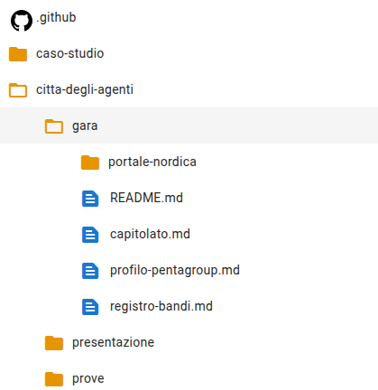
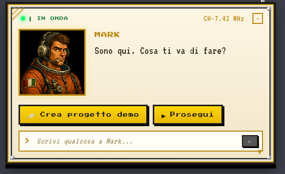

# Verifica 1: il progetto demo è aperto

## TL;DR

Il giro della gara si fa sul progetto demo di MdExplorer, creato con «Crea progetto demo». Questa pagina dice come controllare,
in un minuto, che il progetto aperto sia quello giusto e che gli agenti abbiano un posto dove consegnare il loro lavoro.
Se un controllo non torna, in fondo c'è cosa fare.

- Nell'albero deve esserci la cartella `citta-degli-agenti/gara` con il capitolato.
- Accanto alla cartella del progetto deve esserci una cartella `<nome>.origin.git`.
- Il progetto deve avere un motore AI: Copilot, Claude Code o opencode.

## Controllo 1: c'è la gara

Nel pannello di sinistra apri `citta-degli-agenti` e poi `gara`. Devi vedere questo:



| Cosa | A cosa serve |
|---|---|
| `portale-nordica` | il sito dei bandi, simulato |
| `capitolato.md` | la gara da valutare |
| `profilo-pentagroup.md` | chi è l'azienda e con quali criteri sceglie un bando |
| `registro-bandi.md` | i bandi già visti |

**Non c'è la cartella `gara`?** Il demo è una versione vecchia: aggiornalo con il pull dalla barra git, oppure ricrealo.

## Controllo 2: gli agenti hanno un posto dove consegnare

Gli agenti di questo caso scrivono documenti e li consegnano in un repository su cui possono scrivere. «Crea progetto demo» lo
prepara da solo, **accanto** alla cartella del progetto.

Apri la cartella che contiene il progetto (di solito `Documenti`) con Esplora file. Devi vedere due cartelle:

```text
mdexplorer-demo
mdexplorer-demo.origin.git
```

Che cosa sia quella cartella e perché protegge il demo pubblico è spiegato nella
[nota tecnica sul repository locale](nota-tecnica-repository-locale.md).

**Manca la seconda?** Hai clonato il demo a mano, oppure l'app è più vecchia del 3 ottobre 2026. Gli agenti lavoreranno, ma la
consegna non riuscirà e nella posta ti arriverà un messaggio che lo dice. Ricrea il progetto con «Crea progetto demo».

## Controllo 3: c'è un motore AI

1. Vai alla pagina dei progetti recenti e clicca la rotella sulla scheda del progetto.
2. Nella scheda **AI & RAG** guarda «Ambiente agentico»: deve esserci Copilot, Claude Code oppure opencode.

Il giro è stato provato con **Copilot**. Con «nessuno» gli agenti non partono e l'app dice che manca il motore.

## Se devi creare il progetto

1. In alto a destra clicca il punto interrogativo, «Apri la guida di Mark».
2. Nel riquadro di Mark clicca **Crea progetto demo**.



Mark controlla quali motori AI ci sono sul computer, scarica il demo nella lingua di MdExplorer e lo apre già configurato.
Alla fine dice «Il progetto demo è aperto e configurato per …».

[Verifica 2: la città è accesa](verifica-2-citta-accesa.md) · [Torna alla guida](../presentazione/guida-passo-passo.md#/1)
