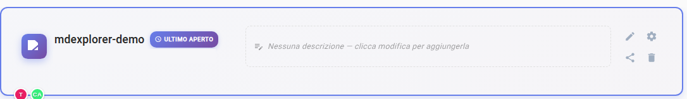
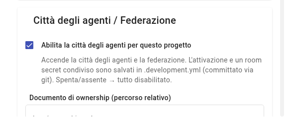

# Verifica 2: la città è accesa

## TL;DR

La città degli agenti è spenta in ogni progetto finché non la accendi tu. Questa pagina dice come vedere a colpo d'occhio se è
accesa e, se non lo è, come accenderla con una casella nelle impostazioni del progetto.
Accenderla cambia un solo file, che in questo demo non va committato.

- Accesa, la barra degli strumenti ha **quattro icone in più**.
- Si accende da «Impostazioni Progetto», sezione «Città degli agenti / Federazione», dove c'è anche il documento del workflow.
- Dopo averla accesa il progetto dice «1 da committare»: **non fare il commit**.

## Il controllo: quattro icone nella barra

Guarda la barra degli strumenti, in alto. Con la città accesa le ultime quattro icone a destra sono queste:

| Icona | Si chiama | A cosa serve nel giro |
|---|---|---|
| le due persone | «Città degli agenti» | il registro: chi sono gli agenti e chi hai abilitato |
| la persona in un cerchio | l'identità | non serve in questo caso |
| la testa con la lampadina | la memoria degli agenti | non serve in questo caso |
| il fumetto | «Messaggi degli agenti» | la posta e il lavoro da rivedere: lo userai sempre |

**Non vedi le due persone e il fumetto?** La città è spenta: accendila.

## Come accenderla

1. Torna alla pagina dei **progetti recenti**: è quella che vedi quando avvii MdExplorer.
2. Sulla scheda del progetto clicca la **rotella**, a destra.

   

3. Scorri fino alla sezione **Città degli agenti / Federazione** e spunta «Abilita la città degli agenti per questo progetto».

   

4. Nella stessa sezione controlla due campi, che il demo ha già compilati:
   - **Documento delle responsabilità**: `citta-degli-agenti/gara/responsabilita.md`;
   - **Documento del workflow (percorso relativo)**: `citta-degli-agenti/gara/workflow.md`. È il piano del giro: senza,
     «Avvia il giro» sveglia l'account manager e basta, invece di far partire le tre schede.
5. Clicca **Chiudi** e riapri il progetto cliccando sulla sua scheda.

## Cosa cambia nel progetto

In alto a destra compare «1 da committare». Il file cambiato è `.development.yml`, con due righe nuove: l'interruttore e una
chiave casuale generata sul tuo computer.

> **Non fare il commit di `.development.yml` in questo demo.** La chiave è una credenziale e il repository del demo è pubblico.

[Verifica 3: gli agenti sono abilitati](verifica-3-agenti-abilitati.md) · [Verifica 1](verifica-1-progetto-demo.md) · [Torna alla guida](../presentazione/guida-passo-passo.md#/1)
