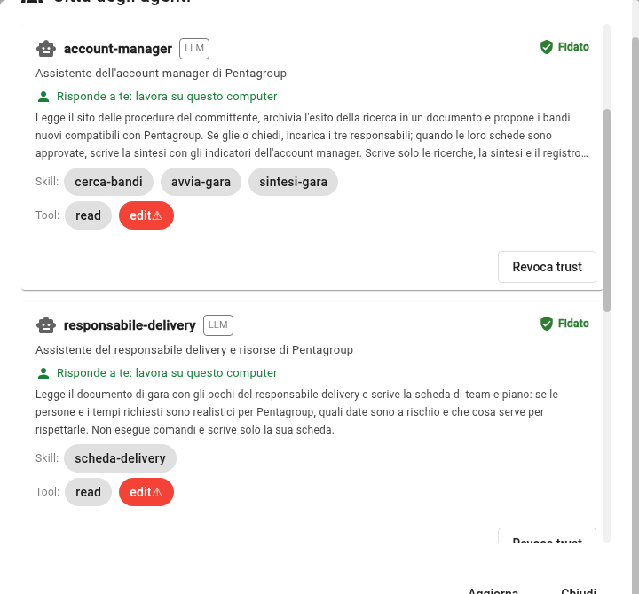

# Verifica 3: i quattro agenti sono abilitati

## TL;DR

Un agente parte solo se ha un responsabile e se quel responsabile lo ha abilitato. Questa pagina dice come controllare nel
registro che i quattro agenti della gara siano tuoi e «Fidato» e, se non lo sono, come sistemarli.
Se la scheda di un agente cambia dopo il tuo sì, l'abilitazione decade e va rifatta.

- Il registro si apre dall'icona delle **due persone**.
- Sotto ogni nome deve esserci **«Risponde a te»**, e in alto a destra il segno verde **Fidato**.
- `a2a-ping` può restare «Non fidato»: in questo caso non serve.

## Il controllo: quattro «Fidato»

Clicca l'icona delle due persone, «Città degli agenti». Scorri l'elenco: questi quattro devono avere **Fidato**, in verde, in
alto a destra della loro scheda.

| Agente | Di chi è l'assistente |
|---|---|
| `account-manager` | dell'account manager |
| `responsabile-tecnico` | del responsabile tecnico |
| `responsabile-legale` | del responsabile legale e commerciale |
| `responsabile-delivery` | del responsabile delivery |

Nell'immagine `account-manager` e `responsabile-delivery` rispondono a te e sono abilitati: sotto il nome c'è «Risponde a te: lavora su
questo computer», a destra «Fidato».

## Se un agente dice «Senza responsabile: non parte»

Nessuno ha ancora detto di chi è. In cima al registro clicca **Sono tutti miei** (oppure **È mio** sulla singola scheda): MdExplorer
scrive il tuo nome nel documento [Chi risponde di quale agente](../gara/responsabilita.md) e sotto il nome compare, in verde,
«Risponde a te: lavora su questo computer». Solo a quel punto l'agente si può abilitare.

In cima al registro leggi anche chi sei per questo progetto: è la tua email git. Se manca, impostala con
`git config user.email` nella cartella del progetto.

## Se un agente dice «Non fidato»

1. Sulla sua scheda clicca **Concedi trust**.
2. Si apre una finestra con due blocchi. Leggili:
   - **«Che cosa fa»** lo ha scritto l'autore dell'agente: nessuno lo verifica.
   - **«Cosa può fare sul tuo computer»** lo calcola l'app: questa parte è garantita.

   

3. Clicca **Mi fido**.

Gli agenti della gara possono leggere e scrivere file, e **non possono eseguire comandi**. Ciò che scrivono resta in una copia a
parte finché non lo approvi tu.

## Se un agente dice «Trust decaduto»

La sua scheda è cambiata dopo il tuo sì: per esempio dopo un aggiornamento del demo. Rileggi la finestra e abilitalo di nuovo.

## Se non vedi i quattro agenti

- Aspetta qualche secondo che il progetto finisca di indicizzare, poi clicca **Aggiorna**.
- Se un agente compare sotto «Esclusi», la sua scheda ha un errore: il motivo è scritto lì accanto.

[Torna alla guida](../presentazione/guida-passo-passo.md#/1) · [Verifica 2](verifica-2-citta-accesa.md)
