# Gli asset della presentazione sulla città degli agenti

## TL;DR

Sfondi e personaggi della presentazione sulla città degli agenti sono file a sé, in questa cartella. Le slide li
richiamano per nome: per cambiare un'illustrazione basta sostituire il file con uno nuovo dallo stesso nome, senza
toccare le slide. Qui c'è l'elenco, con le misure da rispettare e dove ogni file è usato.

- Nove file SVG: tre custodi, una busta, la scena della città, due sfondi e i due astronauti.
- Le animazioni stanno **dentro** ogni file, quindi viaggiano con lui.
- Stesso nome e stesse proporzioni: la sostituzione non richiede altro.

## I personaggi

| File | Misure | Cosa fa |
|---|---|---|
| `custode-piano.svg` | 180 × 290 | fluttua, ammicca, la lucina dell'antenna lampeggia, le righe del foglio si scrivono |
| `custode-requisiti.svg` | 180 × 290 | come sopra, in viola |
| `custode-verbali.svg` | 180 × 290 | come sopra, in verde |
| `busta.svg` | 200 × 130 | un messaggio in volo, con la scia |
| `astronauta.svg`, `astronauta-ok.svg` | 290 × 255 | gli stessi della presentazione su MdExplorer |


## La scena e gli sfondi

| File | Cosa mostra | Misure | Dove è usato |
|---|---|---|---|
| `citta-agenti.svg` | tre edifici con i loro custodi, la posta e i messaggi che volano (domanda, risposta, esito) | 1100 × 470 | la slide «Un custode per documento» |
| `citta-sfondo.svg` | la città di notte, con le finestre che si accendono e le buste che attraversano il cielo | 1280 × 720 | apertura, divisori e chiusura |
| `citta-sfondo-chiaro.svg` | la skyline appena accennata, per le slide di contenuto | 1280 × 720 | tutte le altre slide |




## Come le slide li richiamano

Un personaggio è un'immagine dentro la slide:

```markdown

```

Uno sfondo è un commento sulla prima riga della slide:

```markdown
<!-- .slide: data-background-color="#0f1b2d" data-background-image="assets/citta-sfondo.svg" -->
```

## Come sono nati

Un programma Python, `citta.py`, scrive i sette file nuovi (gli astronauti vengono dalla presentazione su MdExplorer).
Serve solo a chi vuole ritoccarli partendo da come sono nati: le slide usano i file SVG, non il programma, e un
asset si può sostituire con qualunque altro strumento. Sta in `docs-internal/pitch/asset-generatori/` del repository
di sviluppo di MdExplorer. L'unico file con testo, `citta-agenti.svg`, cambia con la lingua.

[Torna alla sezione](../../README.md)
