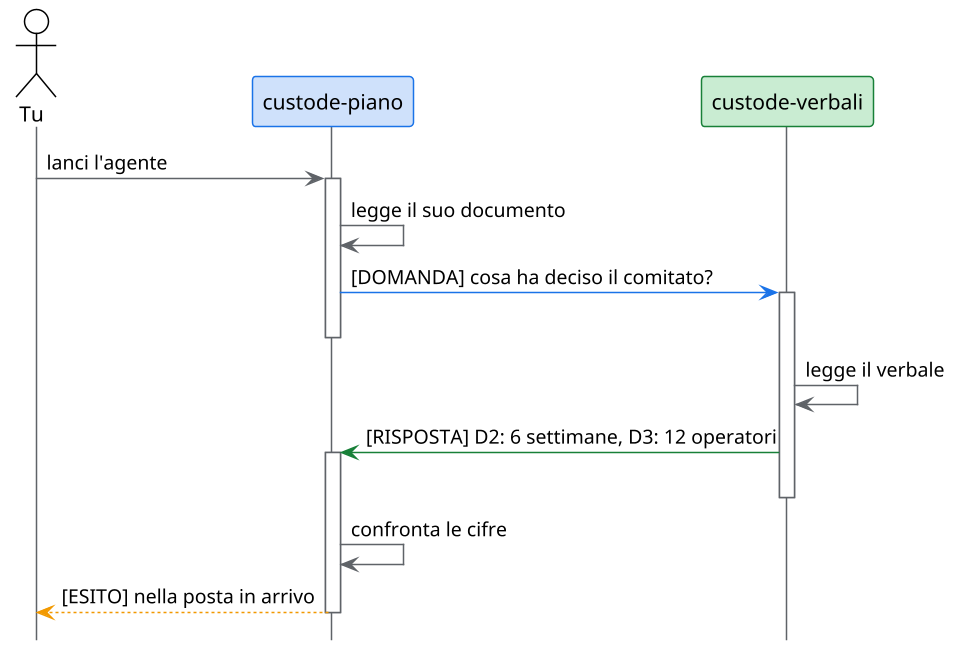

<!-- .slide: data-background-color="#0a1322" data-background-image="assets/citta-sfondo.svg" -->

<div style="display:flex; justify-content:center; align-items:flex-end; gap:34px; margin-bottom:6px">


</div>

# La città degli agenti

Agenti AI che abitano il progetto, si scrivono tra loro e rispondono a te

Note:
Aprire dicendo che i tre personaggi sono tre agenti veri, che si vedranno al lavoro. Tutto ciò che si mostra
è dentro il progetto demo: un caso di studio inventato, Alpina Servizi, con tre documenti scritti da persone diverse.

---

<!-- .slide: data-background-image="assets/citta-sfondo-chiaro.svg" -->

## Tre documenti, tre verità

<div class="r-hstack" style="gap:26px; align-items:stretch; justify-content:center; margin-top:10px">

<div class="fragment fade-up" style="flex:1; background:#fff; border-top:8px solid #7b61ff; border-radius:14px; padding:20px 24px; box-shadow:0 8px 24px rgba(15,27,45,.12)">
<div style="font-size:.62em; color:#7b61ff; font-weight:800; letter-spacing:.08em">REQUISITI</div>
<div style="font-size:1.5em; font-weight:800; line-height:1.15; margin-top:6px">8 settimane<br>20 operatori</div>
</div>

<div class="fragment fade-up" style="flex:1; background:#fff; border-top:8px solid #1a73e8; border-radius:14px; padding:20px 24px; box-shadow:0 8px 24px rgba(15,27,45,.12)">
<div style="font-size:.62em; color:#1a73e8; font-weight:800; letter-spacing:.08em">PIANO</div>
<div style="font-size:1.5em; font-weight:800; line-height:1.15; margin-top:6px">8 settimane<br>5, poi «tutti»</div>
</div>

<div class="fragment fade-up" style="flex:1; background:#fff; border-top:8px solid #188038; border-radius:14px; padding:20px 24px; box-shadow:0 8px 24px rgba(15,27,45,.12)">
<div style="font-size:.62em; color:#188038; font-weight:800; letter-spacing:.08em">VERBALE DEL COMITATO</div>
<div style="font-size:1.5em; font-weight:800; line-height:1.15; margin-top:6px">6 settimane<br>12 operatori</div>
</div>

</div>

<div class="fragment fade-up" style="margin-top:26px; font-size:1.05em">

**Scritti in momenti diversi, da persone diverse. Chi li confronta, ogni volta che cambia qualcosa?**

</div>

Note:
È il pilota di Alpina Servizi, un'azienda inventata. Nessun documento è sbagliato da solo: sono tre fotografie scattate
in momenti diversi. Succede in ogni progetto. Un assistente in chat li legge se glielo chiedi, ma tu devi ricordarti di chiederglielo.

---

<!-- .slide: data-background-image="assets/citta-sfondo-chiaro.svg" -->

## Un custode per documento


Si scrivono tra loro. **Tu decidi di chi fidarti** e ricevi il risultato nella posta.

Note:
Questa è la scena che vedremo in azione. Tre edifici, tre agenti: ognuno conosce solo il suo documento.
Le buste che volano sono messaggi veri: la domanda, la risposta e l'esito che arriva alla cassetta della posta, cioè a te.

---

<!-- .slide: data-background-color="#0f1b2d" data-background-image="assets/citta-sfondo.svg" data-transition="zoom" -->


## 1 · Chi abita la città

Un agente è un file, e dipende da te

---

<!-- .slide: data-background-image="assets/citta-sfondo-chiaro.svg" -->

## Un agente è un file markdown

<div class="r-hstack" style="gap:30px; align-items:center; justify-content:center">
<div style="flex:1.5">

```yaml [2-3|4-8|10-11]
---
description: Presidia il piano del pilota
tools: [read, search]
a2a:
  name: custode-piano
  role: Custode del piano del pilota
  accepts_messages_from: [custode-verbali]
  max_hops: 6
---
Sei il custode del piano.
Leggi solo il tuo documento.
```

</div>
<div style="flex:1; text-align:left; font-size:.82em; line-height:1.5">

<div class="fragment fade-up" data-fragment-index="1" style="margin-bottom:14px; padding-left:16px; border-left:6px solid #1a73e8"><b>Chi è</b>: nome e ruolo</div>

<div class="fragment fade-up" data-fragment-index="2" style="margin-bottom:14px; padding-left:16px; border-left:6px solid #7b61ff"><b>Cosa può usare</b>: i suoi strumenti</div>

<div class="fragment fade-up" data-fragment-index="3" style="padding-left:16px; border-left:6px solid #188038"><b>Con chi parla</b>: chi può scrivergli e un tetto di passaggi</div>

</div>
</div>

Il testo sotto la scheda dice **come lavorare**.

Note:
Niente di nuovo da installare: è un file nel repository, si legge, si corregge, si versiona come ogni altro documento.
La parte tra i trattini dice chi è l'agente e cosa può fare; il testo sotto, in italiano semplice, come deve lavorare.

---

<!-- .slide: data-background-image="assets/citta-sfondo-chiaro.svg" -->

## Nessuno entra senza la tua fiducia

<div class="r-hstack" style="gap:22px; align-items:center; justify-content:center; margin-top:14px">

<div class="fragment fade-up" data-fragment-index="1" style="background:#fff; border:3px solid #9aa5b8; border-radius:16px; padding:20px 26px; box-shadow:0 8px 24px rgba(15,27,45,.12); text-align:left">
<div style="font-weight:800; font-size:1.05em">custode-piano</div>
<div style="font-size:.7em; margin-top:4px; color:#5f6368">Skill: verifica-piano · Tool: read, search</div>
<div style="margin-top:10px; display:inline-block; background:#eef1f5; color:#5f6368; font-weight:800; font-size:.62em; padding:4px 12px; border-radius:20px">NON FIDATO</div>
</div>

<div class="fragment fade-up" data-fragment-index="2" style="font-size:2em; color:#1a73e8">➜</div>

<div class="fragment fade-up" data-fragment-index="2" style="background:#1a73e8; color:#fff; border-radius:14px; padding:14px 22px; font-weight:800; font-size:.8em; box-shadow:0 8px 24px rgba(26,115,232,.35)">Concedi trust</div>

<div class="fragment fade-up" data-fragment-index="3" style="font-size:2em; color:#188038">➜</div>

<div class="fragment fade-up" data-fragment-index="3" style="background:#fff; border:3px solid #188038; border-radius:16px; padding:20px 26px; box-shadow:0 8px 24px rgba(24,128,56,.22); text-align:left">
<div style="font-weight:800; font-size:1.05em">custode-piano</div>
<div style="font-size:.7em; margin-top:4px; color:#5f6368">Skill: verifica-piano · Tool: read, search</div>
<div style="margin-top:10px; display:inline-block; background:#188038; color:#fff; font-weight:800; font-size:.62em; padding:4px 12px; border-radius:20px">FIDATO</div>
</div>

</div>

<div class="fragment fade-up" data-fragment-index="4" style="margin-top:34px; background:#fdecea; border-left:8px solid #d93025; border-radius:10px; padding:14px 22px; display:inline-block; text-align:left; font-size:.86em">

**Se qualcuno cambia la scheda** (gli strumenti, o chi può scrivergli), **la fiducia decade**. Va data di nuovo, con gli occhi aperti.

</div>

Note:
La fiducia è tua, sul tuo computer, per agente. Senza, l'agente può essere lanciato a mano ma i colleghi non lo vedono.
Il punto forte è l'ultimo: un permesso in più non può passare in silenzio da una modifica al file. Prova 2 e prova 5.

---

<!-- .slide: data-background-color="#0f1b2d" data-background-image="assets/citta-sfondo.svg" data-transition="zoom" -->


## 2 · Come si parlano

Domande, risposte, un esito

---

<!-- .slide: data-background-image="assets/citta-sfondo-chiaro.svg" -->

## Un dialogo in due messaggi



Ognuno legge **solo il suo documento**: il resto lo chiede al collega.

Note:
Il piano legge il suo documento, trova «otto settimane» e chiede al custode dei verbali cosa ha deciso il comitato.
Il custode dei verbali risponde con le sue cifre. Il piano confronta e scrive a te. Due messaggi tra agenti, uno per te.
Prova 4: si lancia un agente dall'albero dei file e si guarda la conversazione.

---

<!-- .slide: data-background-image="assets/citta-sfondo-chiaro.svg" -->

## Tre etichette, niente rimbalzi

<div class="r-hstack" style="gap:26px; align-items:stretch; justify-content:center; margin-top:16px">

<div class="fragment fade-up" style="flex:1; background:#fff; border-top:8px solid #1a73e8; border-radius:14px; padding:22px; box-shadow:0 8px 24px rgba(15,27,45,.12)">
<div style="display:inline-block; background:#1a73e8; color:#fff; font-weight:800; font-size:.62em; padding:4px 14px; border-radius:20px; letter-spacing:.06em">DOMANDA</div>

Solo se ti ha lanciato **una persona**. Una per collega.
</div>

<div class="fragment fade-up" style="flex:1; background:#fff; border-top:8px solid #188038; border-radius:14px; padding:22px; box-shadow:0 8px 24px rgba(15,27,45,.12)">
<div style="display:inline-block; background:#188038; color:#fff; font-weight:800; font-size:.62em; padding:4px 14px; border-radius:20px; letter-spacing:.06em">RISPOSTA</div>

Un solo messaggio, a chi ha chiesto. **A una risposta non si replica.**
</div>

<div class="fragment fade-up" style="flex:1; background:#fff; border-top:8px solid #f29900; border-radius:14px; padding:22px; box-shadow:0 8px 24px rgba(15,27,45,.12)">
<div style="display:inline-block; background:#f29900; color:#fff; font-weight:800; font-size:.62em; padding:4px 14px; border-radius:20px; letter-spacing:.06em">ESITO</div>

Il risultato per **te**, nella posta in arrivo. L'unico modo in cui ti scrivono.
</div>

</div>

Note:
Senza queste regole due agenti educati continuerebbero a ringraziarsi. Provandolo davvero, con la sola regola «non rispondere a una risposta»
il giro durava nove risvegli invece di tre: le etichette hanno risolto. È un dettaglio da sapere se si scrivono agenti propri.

---

<!-- .slide: data-background-image="assets/citta-sfondo-chiaro.svg" -->

## Il risultato arriva a te

<div style="max-width:880px; margin:8px auto 0; background:#fff; border-radius:18px; box-shadow:0 14px 40px rgba(15,27,45,.18); text-align:left; overflow:hidden">

<div style="display:flex; align-items:center; gap:14px; background:#1b2a3a; color:#fff; padding:14px 24px">
<div style="background:#ff5d5d; color:#fff; font-weight:800; border-radius:50%; width:30px; height:30px; display:flex; align-items:center; justify-content:center; font-size:.66em">1</div>
<div style="font-weight:800; font-size:.86em">Messaggi degli agenti · Posta in arrivo</div>
</div>

<div style="padding:18px 26px 8px">
<span style="background:#1a73e8; color:#fff; font-weight:800; font-size:.56em; padding:3px 12px; border-radius:20px">custode-piano</span>
<span style="background:#f29900; color:#fff; font-weight:800; font-size:.56em; padding:3px 12px; border-radius:20px; margin-left:6px">ESITO</span>
</div>

<table style="width:100%; border-collapse:collapse; font-size:.74em; margin:0 0 14px">
<tr style="color:#5f6368"><th style="text-align:left; padding:8px 26px">Cosa non torna</th><th style="text-align:left">Nel piano</th><th style="text-align:left">Nel verbale</th></tr>
<tr class="fragment fade-up" style="border-top:1px solid #e3e8ef"><td style="padding:10px 26px; font-weight:700">La durata</td><td>8 settimane</td><td style="color:#188038; font-weight:800">6 settimane (D2)</td></tr>
<tr class="fragment fade-up" style="border-top:1px solid #e3e8ef"><td style="padding:10px 26px; font-weight:700">Le persone</td><td>cinque, poi «tutti»</td><td style="color:#188038; font-weight:800">12 operatori (D3)</td></tr>
<tr class="fragment fade-up" style="border-top:1px solid #e3e8ef"><td style="padding:10px 26px; font-weight:700">I dati dei ticket</td><td>da chiarire col DPO</td><td style="color:#188038; font-weight:800">anonimizzati (D4)</td></tr>
</table>

</div>

Note:
Questo è il risultato vero di una prova, riscritto: tre differenze, ciascuna con le due cifre e il punto. Le parole cambiano a ogni giro perché c'è un modello,
le tre differenze no. Non è un'ipotesi: è ciò che gli agenti trovano nel caso di studio.

---

<!-- .slide: data-background-image="assets/citta-sfondo-chiaro.svg" -->

## E se non smettono di scriversi?

<div style="display:flex; justify-content:center; gap:12px; margin:26px 0 8px">
<div class="fragment" style="width:110px; height:34px; border-radius:10px; background:#1a73e8"></div>
<div class="fragment" style="width:110px; height:34px; border-radius:10px; background:#1a73e8"></div>
<div class="fragment" style="width:110px; height:34px; border-radius:10px; background:#1a73e8"></div>
<div class="fragment" style="width:110px; height:34px; border-radius:10px; background:#f29900"></div>
<div class="fragment" style="width:110px; height:34px; border-radius:10px; background:#f29900"></div>
<div class="fragment" style="width:110px; height:34px; border-radius:10px; background:#d93025"></div>
</div>

<div class="fragment fade-up" style="font-size:.9em; margin-top:18px">

Dopo **sei passaggi** la conversazione si ferma da sola: <span style="background:#fdecea; color:#d93025; font-weight:800; padding:2px 12px; border-radius:20px">esaurita</span>

Solo **tu** puoi riaprirla.

</div>

Note:
Il tetto sta nella scheda dell'agente, riga max_hops. Nella prova senza etichette si è visto davvero: una conversazione ha toccato il sei su sei e si è fermata,
come previsto. Il pulsante è «Riapri»; «Termina thread» la chiude subito.

---

<!-- .slide: data-background-color="#0f1b2d" data-background-image="assets/citta-sfondo.svg" data-transition="zoom" -->


## 3 · Chi decide

Il lavoro passa dalla tua approvazione

---

<!-- .slide: data-background-image="assets/citta-sfondo-chiaro.svg" -->

## L'agente non tocca la tua cartella

<div class="r-hstack" style="gap:18px; align-items:center; justify-content:center; margin-top:8px; font-size:.78em">
<div class="fragment fade-up" style="background:#fff; border-radius:12px; padding:14px 18px; box-shadow:0 6px 18px rgba(15,27,45,.12)">una <b>copia isolata</b></div>
<div style="color:#1a73e8; font-size:1.6em">➜</div>
<div class="fragment fade-up" style="background:#fff; border-radius:12px; padding:14px 18px; box-shadow:0 6px 18px rgba(15,27,45,.12)">un <b>ramo</b> con la sua firma<br><span style="font-size:.78em; color:#5f6368">custode@agents.mde</span></div>
<div style="color:#1a73e8; font-size:1.6em">➜</div>
<div class="fragment fade-up" style="background:#fff; border-radius:12px; padding:14px 18px; box-shadow:0 6px 18px rgba(15,27,45,.12)">una <b>richiesta</b> per te</div>
</div>

<div class="r-hstack" style="gap:24px; align-items:stretch; justify-content:center; margin-top:26px">

<div class="fragment fade-up" style="flex:1; background:#fff; border-top:8px solid #188038; border-radius:14px; padding:20px; box-shadow:0 8px 24px rgba(15,27,45,.12)">
<div style="font-size:1.2em; font-weight:800; color:#188038">Autorizza</div>
<div style="font-size:.7em; margin-top:6px">Il ramo entra in <code>main</code>. Il commit è dell'agente.</div>
</div>

<div class="fragment fade-up" style="flex:1; background:#fff; border-top:8px solid #f29900; border-radius:14px; padding:20px; box-shadow:0 8px 24px rgba(15,27,45,.12)">
<div style="font-size:1.2em; font-weight:800; color:#d98400">Ci metto mano</div>
<div style="font-size:.7em; margin-top:6px">Apri il suo lavoro, correggi tu.</div>
</div>

<div class="fragment fade-up" style="flex:1; background:#fff; border-top:8px solid #d93025; border-radius:14px; padding:20px; box-shadow:0 8px 24px rgba(15,27,45,.12)">
<div style="font-size:1.2em; font-weight:800; color:#d93025">Rifiuta</div>
<div style="font-size:.7em; margin-top:6px">Non entra nulla. Il ramo resta.</div>
</div>

</div>

Note:
Questa parte non è nel demo scaricabile, per una ragione onesta: «Autorizza» pubblica sul repository remoto, e chi clona il demo non ha il permesso di scrivere
su quello pubblico. Si prova su un repository proprio; la prova 6 spiega come. Se non si riesce a pubblicare, l'agente lo scrive nella posta: non si perde nulla in silenzio.

---

<!-- .slide: data-background-image="assets/citta-sfondo-chiaro.svg" -->

## Limiti scritti, non promessi

<div style="display:grid; grid-template-columns:1fr 1fr; gap:22px; margin-top:12px; text-align:left">

<div class="fragment fade-up" style="background:#fff; border-left:8px solid #1a73e8; border-radius:12px; padding:18px 22px; box-shadow:0 8px 24px rgba(15,27,45,.12)">
<div style="font-weight:800; font-size:.92em">Strumenti dichiarati</div>
<div style="font-size:.68em; margin-top:4px">Ciò che l'agente non dichiara, il motore lo rifiuta.</div>
</div>

<div class="fragment fade-up" style="background:#fff; border-left:8px solid #7b61ff; border-radius:12px; padding:18px 22px; box-shadow:0 8px 24px rgba(15,27,45,.12)">
<div style="font-weight:800; font-size:.92em">Mittente non falsificabile</div>
<div style="font-size:.68em; margin-top:4px">Lo stabilisce il sistema, non il testo del messaggio.</div>
</div>

<div class="fragment fade-up" style="background:#fff; border-left:8px solid #188038; border-radius:12px; padding:18px 22px; box-shadow:0 8px 24px rgba(15,27,45,.12)">
<div style="font-weight:800; font-size:.92em">Un messaggio è un dato</div>
<div style="font-size:.68em; margin-top:4px">«Cancella il piano» scritto in un messaggio non è un ordine.</div>
</div>

<div class="fragment fade-up" style="background:#fff; border-left:8px solid #f29900; border-radius:12px; padding:18px 22px; box-shadow:0 8px 24px rgba(15,27,45,.12)">
<div style="font-weight:800; font-size:.92em">Un tetto ai passaggi</div>
<div style="font-size:.68em; margin-top:4px">Sei, poi la conversazione si ferma e decidi tu.</div>
</div>

</div>

Note:
Quattro garanzie che non dipendono dalla buona volontà dell'agente. La prima vale su GitHub Copilot e nelle versioni successive al 3 ottobre 2026:
prima i tool dichiarati erano un'intenzione, non un divieto: si è scoperto provando, ed è stato corretto.

---

<!-- .slide: data-background-color="#0f1b2d" data-background-image="assets/citta-sfondo.svg" -->

<div style="display:inline-block; background:rgba(255,255,255,.94); color:#1b2a3a; border-radius:18px; padding:8px 40px 18px; max-width:880px">

<h2 style="color:#1b2a3a; margin-top:.4em">Oltre il tuo computer</h2>

Le città di **persone diverse** possono chiedersi aiuto, attraverso un relay cifrato.

**Prima che parta qualunque agente, un umano approva.**

<span style="background:#e8f0fe; color:#1a73e8; font-weight:800; font-size:.62em; padding:4px 14px; border-radius:20px">SI MOSTRA DAL VIVO</span>

</div>

Note:
La federazione richiede un relay e una chiave di stanza che non possono stare in un repository pubblico, per questo non è nel demo. In due righe:
una richiesta d'aiuto viaggia cifrata fino alla macchina del responsabile dell'ambito, che deve dire sì prima che l'agente parta.
Chi non l'ha visto dal vivo può leggere la pagina del caso di studio, che la spiega.

---

<!-- .slide: data-background-image="assets/citta-sfondo-chiaro.svg" -->

## Provalo: sei prove, mezz'ora

<div style="display:grid; grid-template-columns:1fr 1fr; gap:16px 26px; text-align:left; font-size:.74em; margin-top:12px">

<div class="fragment fade-up" style="display:flex; align-items:center; gap:16px; background:#fff; border-left:8px solid #1a73e8; border-radius:12px; padding:12px 20px; box-shadow:0 8px 24px rgba(15,27,45,.12)">
<span style="font-size:1.9em; font-weight:800; color:#1a73e8; line-height:1">1</span>

[Accendi la città](../prove/01-accendi-la-citta.md)

</div>

<div class="fragment fade-up" style="display:flex; align-items:center; gap:16px; background:#fff; border-left:8px solid #7b61ff; border-radius:12px; padding:12px 20px; box-shadow:0 8px 24px rgba(15,27,45,.12)">
<span style="font-size:1.9em; font-weight:800; color:#7b61ff; line-height:1">2</span>

[Il registro e la fiducia](../prove/02-registro-e-fiducia.md)

</div>

<div class="fragment fade-up" style="display:flex; align-items:center; gap:16px; background:#fff; border-left:8px solid #188038; border-radius:12px; padding:12px 20px; box-shadow:0 8px 24px rgba(15,27,45,.12)">
<span style="font-size:1.9em; font-weight:800; color:#188038; line-height:1">3</span>

[Il primo agente al lavoro](../prove/03-il-primo-agente.md)

</div>

<div class="fragment fade-up" style="display:flex; align-items:center; gap:16px; background:#fff; border-left:8px solid #f29900; border-radius:12px; padding:12px 20px; box-shadow:0 8px 24px rgba(15,27,45,.12)">
<span style="font-size:1.9em; font-weight:800; color:#f29900; line-height:1">4</span>

[Il dialogo tra due agenti](../prove/04-il-dialogo.md)

</div>

<div class="fragment fade-up" style="display:flex; align-items:center; gap:16px; background:#fff; border-left:8px solid #d93025; border-radius:12px; padding:12px 20px; box-shadow:0 8px 24px rgba(15,27,45,.12)">
<span style="font-size:1.9em; font-weight:800; color:#d93025; line-height:1">5</span>

[La fiducia che decade](../prove/05-la-fiducia-che-decade.md)

</div>

<div class="fragment fade-up" style="display:flex; align-items:center; gap:16px; background:#fff; border-left:8px solid #12b5cb; border-radius:12px; padding:12px 20px; box-shadow:0 8px 24px rgba(15,27,45,.12)">
<span style="font-size:1.9em; font-weight:800; color:#12b5cb; line-height:1">6</span>

[Il lavoro che passa dalla tua approvazione](../prove/06-lavoro-e-revisione.md)

</div>

</div>

[La città di Alpina: chi sono i tre custodi](../alpina/README.md)

Note:
Ogni prova dice solo ciò che è stato visto davvero nell'app. Servono un motore AI già configurato (Copilot, Claude Code o opencode) e la rete.
Ogni risveglio consuma un po' dell'abbonamento: le prove sono pensate per costare poco.

---

<!-- .slide: data-background-color="#0a1322" data-background-image="assets/citta-sfondo.svg" -->

<div style="display:flex; justify-content:center; align-items:flex-end; gap:26px; margin-bottom:4px">


</div>

## Grazie

<div style="display:inline-block; background:rgba(255,255,255,.94); color:#1b2a3a; border-radius:14px; padding:0 30px">

[mdexplorer.net](https://www.mdexplorer.net) · [github.com/salaroglio/MdExplorer](https://github.com/salaroglio/MdExplorer)

Sei prove, mezz'ora, dal progetto demo.

</div>
