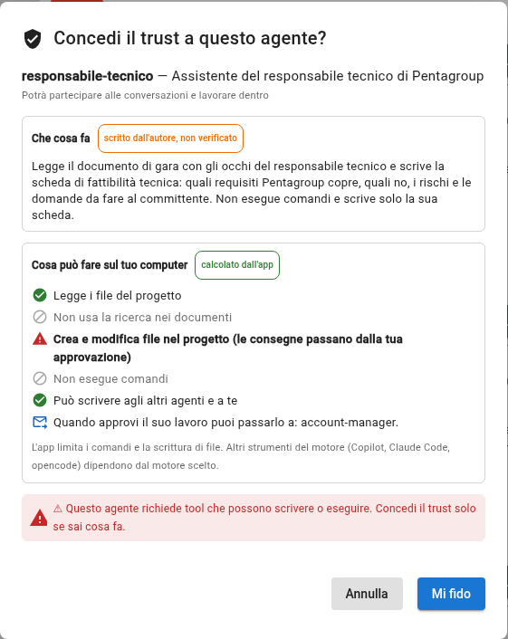
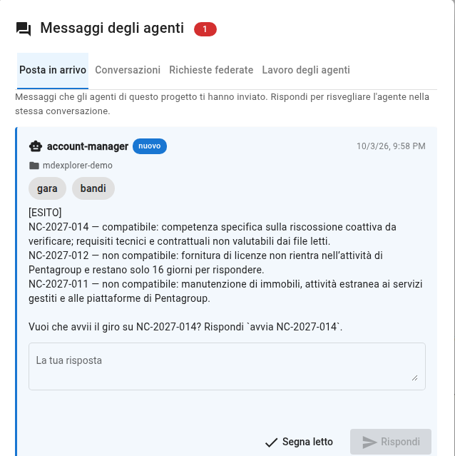
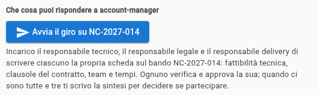
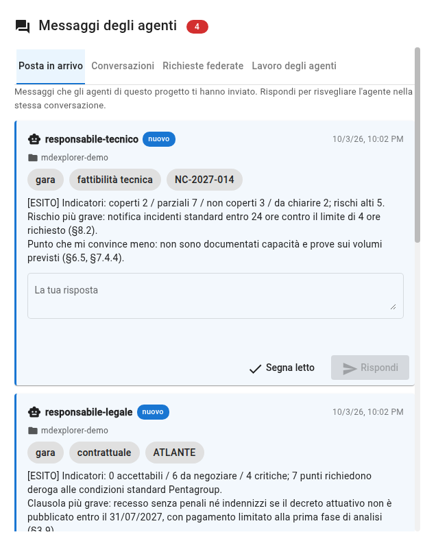
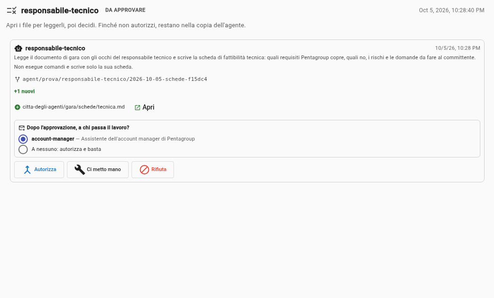
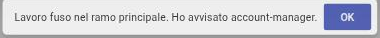
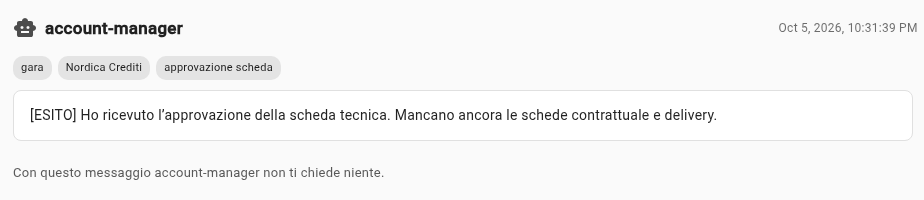

<!-- .slide: data-background-color="#0a1322" data-background-image="assets/citta-sfondo.svg" -->

# Un assistente per ogni persona

Lui prepara. **Tu verifichi. Tu decidi.**

Note:
Aprire dicendo cosa si vedrà: una gara d'appalto vera nella forma, inventata nei nomi. Quattro persone, ognuna con un assistente
AI. Il messaggio da portare a casa è uno: gli assistenti preparano il lavoro, ma nessun lavoro passa al passo successivo
senza un gesto di una persona.

---

<!-- .slide: data-background-image="assets/citta-sfondo-chiaro.svg" -->

## Una gara. Quattro sguardi. Una decisione.

TECNICO

Reggiamo i requisiti?

LEGALE

Possiamo firmare queste clausole?

DELIVERY

I tempi e le persone bastano?

ACCOUNT MANAGER

Partecipiamo o no?

Un capitolato lungo, da leggere quattro volte con occhi diversi. **Chi ne ha il tempo?**

Note:
Pentagroup, un'azienda inventata di servizi gestiti, riceve un invito a una gara di un committente. Il capitolato è lungo e
ogni responsabile deve leggerlo cercando cose diverse. In pratica ognuno legge le sue parti e spera che gli altri leggano le loro.

---

<!-- .slide: data-background-image="assets/citta-sfondo-chiaro.svg" -->

## L'idea: ogni persona ha il suo assistente

L'ASSISTENTE

PREPARA

legge, confronta, scrive una scheda e <b>cita la fonte</b>

→

TU

VERIFICHI

leggi la scheda, controlli i punti dubbi, approvi o rifiuti

→

TU

DECIDI

a chi passare il lavoro, e se partecipare alla gara

**L'assistente non decide e non passa il lavoro da solo.**

Note:
Questa è la slide da ricordare. Tre verbi. L'assistente prepara e porta le fonti; la persona verifica e decide. Non si chiede
alla persona di fidarsi: si chiede di controllare, e le schede sono scritte per rendere il controllo facile.

---

<!-- .slide: data-background-image="assets/citta-sfondo-chiaro.svg" -->

## I quattro, in un colpo d'occhio

ACCOUNT MANAGER

cerca i bandi, avvia il giro, scrive la <b>sintesi</b>

TECNICO

la scheda di <b>fattibilità</b>: cosa copriamo e cosa no

LEGALE

la scheda delle <b>clausole</b>: accettabili, da negoziare, critiche

DELIVERY

la scheda di <b>team e date</b>: i tempi reggono?

Nel demo **le quattro parti le fai tu**, una dopo l'altra.

Note:
Quattro assistenti, ognuno con un file di testo nel progetto che dice chi è e cosa può fare. In un'azienda vera sarebbero quattro
persone su quattro computer. Nel demo le interpreti tutte tu, ed è il modo più rapido per vedere come passa il lavoro.

---

<!-- .slide: data-background-image="assets/citta-sfondo-chiaro.svg" -->

## Prima li abiliti tu, uno per uno

<b>«Che cosa fa»</b> Lo scrive l'autore dell'agente. <b>Nessuno lo verifica</b>: lo leggi con la testa.

<b>«Cosa può fare sul tuo computer»</b> Lo calcola l'app dagli strumenti. <b>Questa parte è garantita.</b>

<b>Questo agente non può eseguire comandi.</b> Tutto ciò che scrive resta in una copia a parte finché non lo approvi.

Note:
Un agente è un file di testo, e un file si può modificare. Per questo nessun agente parte finché non lo abiliti, dopo aver letto
questa finestra. Distinguere le due parti è importante: sopra c'è ciò che qualcuno ha scritto, sotto c'è ciò che l'app può
garantire. Se cambia la scheda dopo il tuo sì, l'abilitazione decade e va rifatta.

---

<!-- .slide: data-background-image="assets/citta-sfondo-chiaro.svg" -->

## Passo 1: l'account manager cerca il bando

1. Legge il **sito dei bandi** e il registro di quelli già visti.
2. Li confronta con i **criteri di Pentagroup**.
3. Ti scrive **un messaggio**: uno compatibile, due scartati, con il motivo.

Chiude con una <b>domanda</b>, non con un'azione: <i>«Vuoi che avvii il giro?»</i>

Il sito dei bandi è un file di esempio: nel demo <b>simula</b> quello del committente.

Note:
Il primo assistente fa il lavoro noioso: guardare ogni giorno cosa c'è di nuovo. Scarta due procedure con un motivo che si può
controllare (una è fuori dall'attività, una ha pochi giorni per rispondere) e ne propone una. Non avvia niente: aspetta te.
Onestà: il sito è un file nel progetto, in azienda l'assistente lo leggerebbe con uno strumento di navigazione.

---

<!-- .slide: data-background-image="assets/citta-sfondo-chiaro.svg" -->

## Passo 2: premi «Avvia il giro»

account manager

→ incarico a →

tecnico

legale

delivery

Note:
Un pulsante sotto il messaggio, con scritto chi viene incaricato e per fare cosa: è il tuo gesto, e si apre solo dopo che hai approvato la ricerca. L'assistente si risveglia nella stessa conversazione e incarica i tre
responsabili. Da qui in poi lavorano per conto loro, in parallelo, ognuno nella propria copia del progetto.

---

<!-- .slide: data-background-image="assets/citta-sfondo-chiaro.svg" -->

## Lo stesso capitolato, tre sguardi diversi

<b>Il tecnico trova</b> La notifica degli incidenti: noi 24 ore, il capitolato ne chiede 4 <i>(§8.2)</i>.

<b>Il legale trova</b> Se il decreto non esce entro il 31/07/2027, il committente può recedere senza indennizzo <i>(§3.9)</i>.

<b>Il delivery trova</b> Nove mesi di lavoro: per attivare entro il 01/01/2028 la firma dovrebbe essere entro il 01/04/2027 <i>(§7.4.7)</i>.

Note:
Hanno letto lo stesso documento, ma ognuno ha letto il proprio capitolo del profilo di Pentagroup. Per questo trovano cose
diverse. Notare che ogni affermazione cita la sezione del capitolato: la persona può andare a controllare.

---

<!-- .slide: data-background-image="assets/citta-sfondo-chiaro.svg" -->

## Ti arrivano tre richieste da rivedere

- **Una richiesta per scheda**, ciascuna col suo file e un riassunto di chi è l'agente.
- Nessuna scheda è ancora nel progetto: sono **rami da approvare**.
- **Autorizza**, **Ci metto mano**, o (l'eccezione) **Rifiuta** con il motivo.

<b>«A chi passa il lavoro?»</b> Sei <b>tu</b> a scegliere. L'agente non lo fa da solo.

Note:
Questo è il momento in cui la scheda entra o non entra nel progetto. Ogni agente ha lavorato nella sua copia, quindi le richieste
sono tre e distinte. Il blocco «a chi passa il lavoro» mostra il destinatario dichiarato nella scheda dell'agente: se fossero due,
sceglieresti; se non vuoi avvisare nessuno, scegli «a nessuno».

---

<!-- .slide: data-background-image="assets/citta-sfondo-chiaro.svg" -->

## Leggi, non fidarti

DALLA SCHEDA DELIVERY, «DA VERIFICARE DA TE»

<b>La percentuale senior:</b> il 20% è raggiunto solo con una squadra di 20 persone e tutti e quattro i senior <i>(§7.2)</i>.  
<b>La fattibilità delle date:</b> il 30/04/2027 è uno scenario ottimistico, non una data scritta nel capitolato <i>(§9)</i>.  
<b>La copertura delle prime fasi:</b> l'architetto è libero solo da settembre <i>(§7.2, §7.4.2)</i>.

<b>1.</b> L'assistente <b>ti dice dove è meno sicuro</b>: parti da lì.

<b>2.</b> Ogni frase cita la <b>sezione</b>: aprila e controlla che dica quello che la scheda dice.

<b>3.</b> Rifai il <b>calcolo</b>: 9 mesi prima del 01/01/2028 è il 01/04/2027.

Note:
Il punto che distingue un assistente utile da uno pericoloso: non ti chiede di fidarti. Ti dice dove è meno sicuro, cita
la fonte per ogni affermazione e scrive il calcolo accanto al risultato, così lo puoi rifare a mano. Se non trova un'informazione,
scrive «da chiarire» e non la inventa.

---

<!-- .slide: data-background-image="assets/citta-sfondo-chiaro.svg" -->

## Approvare è passare il lavoro

<b>1. Autorizza</b> la scheda entra nel progetto

→

<b>2. L'app avvisa</b> l'account manager, <b>a nome tuo</b>

→

<b>3. Lui controlla</b> cosa ha già e cosa manca

Note:
Un solo clic fa tre cose. Il punto è il passaggio due: è l'app che avvisa il collega, a nome della persona che ha premuto. Un
agente non può passare il lavoro a un altro da solo. Dopo la prima approvazione l'account manager risponde «mancano le altre due»:
non scrive una sintesi su un lavoro incompleto.

---

<!-- .slide: data-background-image="assets/citta-sfondo-chiaro.svg" -->

## La sintesi: cinque indicatori, e dove le schede si parlano

I CINQUE INDICATORI

<b>1. Andare o non andare:</b> <b style="color:#c62828">non andare</b>

<b>2. Rischi aperti per area:</b> tecnica 5 · contratto 5 · delivery 5

<b>3. Punti da chiarire con il committente:</b> sette, ognuno con area e sezione

<b>4. Scadenze:</b> offerta 53 giorni · decreto 145 · attivazione 299

<b>5. Cosa serve da ciascuno:</b> un elenco per persona

DOVE LE SCHEDE SI SOMMANO

<b>Timeline e recesso:</b> la firma dovrebbe essere entro il 01/04, prima della scadenza dell'offerta; e se il decreto non arriva entro il 31/07 il committente può recedere.

<b>Servizio ed uscita:</b> il divario tecnico sugli incidenti è anche un divario contrattuale.

Note:
Con le tre schede approvate, l'account manager scrive la sintesi, con gli indicatori che interessano a lui. La parte più utile
è «dove le schede si sommano»: un punto che compare in due schede con due nomi diversi, o due punti che da soli sembrano
piccoli e insieme sono un problema. Anche la sintesi arriva da approvare: la leggi prima, come le altre.

---

<!-- .slide: data-background-image="assets/citta-sfondo-chiaro.svg" -->

## Nessuna scheda da sola dice «non andare»

08/03/2027

oggi

01/04/2027

firma-limite per 9 mesi di lavoro <i>(delivery)</i>

30/04/2027

scade l'offerta <i>(portale)</i>

31/07/2027

senza decreto, recesso senza indennizzo <i>(legale)</i>

01/01/2028

attivazione richiesta <i>(capitolato)</i>

**La firma servirebbe prima ancora di poter presentare l'offerta.** La sintesi lo mette in fila: *non andare*.

Note:
Questo è un esempio reale uscito da una prova: le parole cambiano a ogni esecuzione, ma questo incrocio c'è sempre. Il delivery
calcola che per attivare entro l'anno nuovo la firma dovrebbe essere ad aprile; il portale dice che l'offerta si presenta fino
a fine aprile; il legale segnala il recesso se il decreto ritarda. Ognuno ha una tessera, la sintesi le mette in fila.

---

<!-- .slide: data-background-image="assets/citta-sfondo-chiaro.svg" -->

## Chi fa cosa

L'ASSISTENTE

✔ legge e confronta 
✔ scrive la scheda 
✔ cita la sezione di ogni affermazione 
✔ scrive «da chiarire» quando non sa 
✔ ti dice dove è meno sicuro

TU

✔ abiliti ogni agente 
✔ leggi e verifichi ogni scheda 
✔ approvi o rifiuti 
✔ scegli a chi passare il lavoro 
✔ decidi se partecipare

<b>Non fa mai da solo:</b> eseguire comandi sul tuo computer · inserire una scheda nel progetto · passare il lavoro a un altro · decidere

Note:
Riepilogo senza giri di parole. Il confine è netto: l'assistente produce e documenta, la persona verifica e decide. E ci sono
tre cose che non fa mai da solo, qualunque cosa sia scritta in un messaggio: non esegue comandi, non fa entrare una scheda nel
progetto, non passa il lavoro. Un messaggio ricevuto da un altro agente è un dato da controllare, non un ordine.

---

<!-- .slide: data-background-image="assets/citta-sfondo-chiaro.svg" -->

## Cosa è vero e cosa è simulato

È VERO

Gli agenti e i modelli AI che li muovono 
La lettura, il confronto e le schede 
Le citazioni, i calcoli e gli errori che si trovano 
La tua approvazione e l'avviso al collega 
La sintesi (cambia nelle parole a ogni prova)

È SIMULATO O INVENTATO

Il sito dei bandi: è un file del progetto 
Pentagroup, il committente e tutti i dati 
Il capitolato: derivato da uno reale e riscritto 
Le quattro persone: le interpreti tutte tu

Un assistente reale leggerebbe il sito con uno strumento di navigazione. **Il resto è così come lo vedi.**

Note:
Chi presenta deve dirlo senza imbarazzo: i clienti apprezzano che si dica cosa è finto. Il sito dei bandi è un file; la gara
e le aziende sono inventate. Tutto il resto, cioè la lettura, le schede, le citazioni e il giro di approvazioni, è quello che
succederebbe con i tuoi documenti.

---

<!-- .slide: data-background-color="#0f1b2d" data-background-image="assets/citta-sfondo.svg" -->

# Provalo con le tue mani

Sei prove, circa un'ora: **abiliti, cerchi, avvii, verifichi, approvi, decidi.**

Note:
Chiusura: rimandare alle sei prove nella stessa sezione. Ricordare che ogni prova consuma un po' dell'abbonamento al motore AI,
che servono circa dieci chiamate in tutto e che il percorso più semplice parte da «Crea progetto demo».
