<!-- .slide: data-background-color="#0a1322" data-background-image="assets/citta-sfondo.svg" -->

# La gara, passo per passo

Parte 1: **l'account manager cerca il bando**

Note:
Questa presentazione è una guida operativa: dice cosa fare, dove cliccare e cosa aspettarsi. Si legge con MdExplorer aperto
accanto. La parte 1 arriva fino al messaggio dell'account manager; le parti successive seguono il giro.

---

<!-- .slide: data-background-image="assets/citta-sfondo-chiaro.svg" -->

## Prima di partire: tre cose già fatte

1

Il progetto demo è aperto

Creato con <b>«Crea progetto demo»</b>: prepara anche il posto dove gli agenti consegnano.

[Come lo verifico →](../guida/verifica-1-progetto-demo.md)

2

La città è accesa

Nella barra in alto ci sono le due persone e il fumetto.

[Come lo verifico →](../guida/verifica-2-citta-accesa.md)

3

I quattro agenti sono abilitati

Nel registro, ciascuno dei quattro «risponde a te» e ha il segno verde «Fidato».

[Come lo verifico →](../guida/verifica-3-agenti-abilitati.md)

Ogni riquadro porta a una pagina con le schermate: **cosa guardare, e cosa fare se manca**.

Note:
I tre link aprono tre pagine di verifica, con le schermate di ciò che si deve vedere e i passi da fare se qualcosa manca.
Dalla pagina si torna alla guida con il link in fondo o con la freccia indietro di MdExplorer.

---

<!-- .slide: data-background-image="assets/citta-sfondo-chiaro.svg" -->

## La scena

Sei **l'account manager di Pentagroup**.

Ogni mattina qualcuno dovrebbe guardare il sito dei bandi di Nordica Crediti, per vedere se c'è qualcosa di nuovo e se fa per voi.

Da oggi lo fa <b>il tuo assistente</b>. Tu gli dici di controllare; lui ti riferisce.

Note:
Mettere la persona nel ruolo. Non «un agente fa», ma «tu sei l'account manager e hai un assistente». Tutto il giro si capisce
meglio se chi guarda si sente quella persona.

---

<!-- .slide: data-background-image="assets/citta-sfondo-chiaro.svg" -->

## Cosa guarda l'assistente

IL SITO DEI BANDI

Tre procedure in corso: <b>NC-2027-014</b> piattaforma ATLANTE <b>NC-2027-012</b> licenze software <b>NC-2027-011</b> manutenzione immobili

gara/portale-nordica/bandi.md

IL REGISTRO

I bandi che Pentagroup <b>ha già visto</b>. Se un bando non è qui, è nuovo.

gara/registro-bandi.md

I CRITERI DI PENTAGROUP

Cinque criteri per decidere se un bando fa per noi: attività, competenza, tempi, contratto, <b>almeno 21 giorni</b> per rispondere.

gara/profilo-pentagroup.md

Il sito è un **file del progetto che lo simula**. In azienda sarebbe il sito vero.

Note:
Tre documenti, tutti nel progetto, tutti apribili. Vale la pena aprirne uno prima di lanciare l'agente, per esempio il sito dei
bandi: così chi guarda sa cosa c'è dentro e potrà giudicare il risultato. Dire subito che il sito è simulato.

---

<!-- .slide: data-background-image="assets/citta-sfondo-chiaro.svg" -->

## Gesto 1: trova il robot

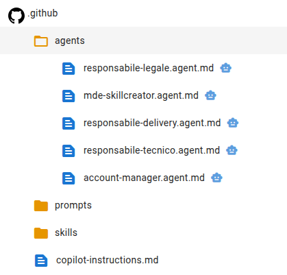

1. Nel pannello di sinistra apri **`.github`**
2. poi **`agents`**
3. sulla riga di **`account-manager.agent.md`** clicca il **robot**

Non vedi il robot? Il pannello è stretto: <b>allargalo</b> trascinando il bordo.

Note:
Ogni agente è un file, e il robot accanto al file è il modo per lanciarlo. Se il pannello è stretto l'icona è tagliata: è la
cosa su cui ci si blocca più spesso.

---

<!-- .slide: data-background-image="assets/citta-sfondo-chiaro.svg" -->

## Gesto 2: dì cosa vuoi e lancia

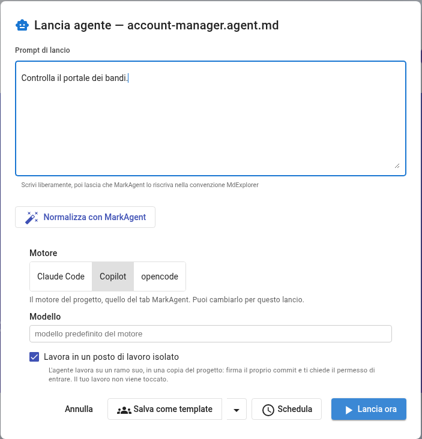

1. Scrivi:

<b>Controlla il portale dei bandi.</b>

2. **Non toccare il resto**: motore, modello e la spunta restano come sono.
3. Clicca **Lancia ora**.

La spunta «posto di lavoro isolato» vuol dire: lavora in una copia, non nella tua cartella.

Note:
Una frase in italiano, non un comando. Le opzioni sotto servono a chi vuole cambiare motore: per la demo si lasciano così.
La finestra si chiude e compare «Agente avviato in background».

---

<!-- .slide: data-background-image="assets/citta-sfondo-chiaro.svg" -->

## Aspetta un minuto

INTANTO LUI

legge il sito dei bandi 
lo confronta con il registro 
applica i cinque criteri 
conta i giorni alla scadenza

TU VEDI

<b>1.</b> un avviso in basso: «🤖 Agente … completato» 
<b>2.</b> un <b>numero rosso sul fumetto</b>, nella barra in alto 
<b>3.</b> clicca il fumetto: si apre la <b>Posta in arrivo</b>

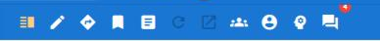

Dopo due minuti niente? Il motore AI non risponde: controlla che sia installato e con l'accesso fatto.

Note:
Circa un minuto. Mentre lavora si può dire cosa sta facendo: non è magia, sono quattro passi che la sua scheda gli chiede.
Il fumetto è l'icona «Messaggi degli agenti» nella barra degli strumenti.

---

<!-- .slide: data-background-image="assets/citta-sfondo-chiaro.svg" -->

## Leggi cosa ti ha scritto

<b>Uno compatibile</b> NC-2027-014, con i suoi dubbi.

<b>Due scartati, con il motivo</b> Licenze: fuori attività e solo 16 giorni. Immobili: fuori attività.

<b>Una domanda per te</b> «Vuoi che avvii il giro?»

Note:
Le parole cambiano a ogni prova, perché dietro c'è un modello; la struttura no: una riga per bando, il verdetto, il motivo,
e in fondo una domanda. Le due procedure già nel registro non compaiono: non sono nuove.

---

<!-- .slide: data-background-image="assets/citta-sfondo-chiaro.svg" -->

## Controlla tu: due minuti

<b>1. I bandi ci sono tutti?</b> Apri il sito dei bandi: tre procedure in corso, tre righe nel messaggio.

<b>2. I giorni tornano?</b> Oggi, nella storia, è l'<b>8 marzo 2027</b>. Le licenze scadono il 24 marzo: <b>16 giorni</b>, meno dei 21 richiesti.

<b>3. Perché due bandi non compaiono?</b> Apri il registro: sono già stati visti.

**Non ti fidi: verifichi.** È il gesto che ti viene chiesto in tutto il giro.

Note:
Questo è il momento più importante della parte 1, e si fa in fretta. Tre controlli che chiunque può fare aprendo tre file.
La «Data di lavoro» sta nel profilo di Pentagroup: è l'oggi della storia, e serve perché i conti tornino in qualunque giorno
si faccia la demo.

---

<!-- .slide: data-background-image="assets/citta-sfondo-chiaro.svg" -->

## Cosa è successo, e cosa no

HA FATTO

✔ letto tre documenti 
✔ scartato due bandi, dicendo perché 
✔ proposto un bando 
✔ chiuso con una domanda

NON HA FATTO

✘ non ha avviato niente 
✘ non ha scritto ai colleghi 
✘ non ha modificato nessun file 
✘ non ha deciso al posto tuo

Note:
La colonna di destra è quella che rassicura. L'assistente ha gli strumenti per scrivere, ma la sua scheda dice di proporre e
aspettare. L'avvio del giro è una risposta tua.

---

<!-- .slide: data-background-color="#0f1b2d" data-background-image="assets/citta-sfondo.svg" -->

# Parte 2

**Avvia il giro** e leggi una scheda prima di approvarla

Note:
La parte 1 è finita con una domanda dell'account manager: «Vuoi che avvii il giro?». La parte 2 comincia dalla risposta e
arriva fino alla lettura di una scheda. L'approvazione è nella parte 3.

---

<!-- .slide: data-background-image="assets/citta-sfondo-chiaro.svg" -->

## Gesto 3: rispondi «avvia»

1. Sei ancora nella **Posta in arrivo**, sul messaggio dell'account manager.
2. Nella casella **La tua risposta** scrivi:

<b>avvia NC-2027-014</b>

3. Clicca **Rispondi**.

Note:
La risposta va scritta nello stesso messaggio: così l'assistente si risveglia nella stessa conversazione. Il codice del bando
è quello che lui stesso ha proposto.

---

<!-- .slide: data-background-image="assets/citta-sfondo-chiaro.svg" -->

## Lui conferma: il giro è partito

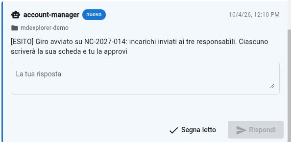

account manager

→ un incarico a ciascuno →

tecnico

legale

delivery

Note:
Dopo circa mezzo minuto arriva questo messaggio. Dietro le quinte l'account manager ha scritto ai tre colleghi un messaggio
che comincia con [INCARICO]: il bando, la scadenza, dove sta il capitolato e dove scrivere la scheda.

---

<!-- .slide: data-background-image="assets/citta-sfondo-chiaro.svg" -->

## Aspetta quattro o cinque minuti

TECNICO

legge il capitolato e il capitolo <b>Tecnica</b> di Pentagroup scrive <code>schede/tecnica.md</code>

LEGALE

legge il capitolato e il capitolo <b>Contratti</b> scrive <code>schede/contrattuale.md</code>

DELIVERY

legge il capitolato e il capitolo <b>Delivery e persone</b> scrive <code>schede/delivery.md</code>

Lavorano **due alla volta**: il terzo parte quando uno dei primi due ha finito.

Note:
Lo stesso capitolato, tre capitoli diversi del profilo dell'azienda: per questo le tre schede dicono cose diverse. I posti di
lavoro sono due, quindi il terzo assistente aspetta il suo turno. Intanto non c'è niente da fare: è il momento di spiegare.

---

<!-- .slide: data-background-image="assets/citta-sfondo-chiaro.svg" -->

## Arrivano tre messaggi

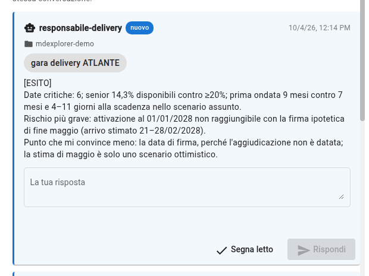

Ogni assistente ti scrive **tre righe**:

<b>1. Gli indicatori</b> i numeri della sua scheda

<b>2. Il rischio più grave</b> con la sezione del capitolato

<b>3. Il punto che lo convince meno</b> dove dovrai guardare tu

Note:
I tre messaggi arrivano nella Posta in arrivo, uno per assistente. Sono un riassunto: la scheda vera è un documento, e arriva
come richiesta da approvare. Le parole cambiano a ogni prova.

---

<!-- .slide: data-background-image="assets/citta-sfondo-chiaro.svg" -->

## E tre richieste da rivedere

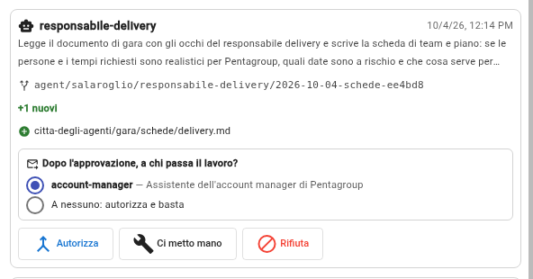

Nel fumetto, apri la scheda **Lavoro degli agenti**. Ogni richiesta dice:

- **chi** ha lavorato e che cosa fa;
- **quale file** ha scritto;
- **a chi passa** il lavoro dopo l'approvazione.

<b>Non premere ancora «Autorizza».</b> Prima si legge.

Note:
Una richiesta per scheda. Nessuna scheda è ancora nel progetto: ognuna sta su un ramo a parte, in attesa. Il blocco «a chi passa
il lavoro» si usa nella parte 3.

---

<!-- .slide: data-background-image="assets/citta-sfondo-chiaro.svg" -->

## Gesto 4: «Ci metto mano»

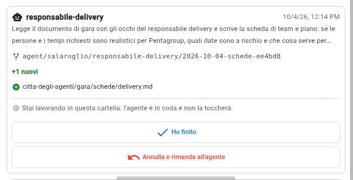

1. Sulla richiesta di **responsabile-delivery** clicca **Ci metto mano**.
2. La richiesta cambia: «Stai lavorando in questa cartella: l'agente è in coda».
3. Clicca **Chiudi**, in basso.

Si apre anche una finestra del computer con la cartella dell'assistente: puoi chiuderla.

Note:
«Ci metto mano» vuol dire: voglio guardare, e magari correggere, quello che ha scritto. Finché non chiudi, l'assistente non
tocca quella cartella. Scegliamo la scheda delivery perché ha un calcolo facile da controllare.

---

<!-- .slide: data-background-image="assets/citta-sfondo-chiaro.svg" -->

## Gesto 5: apri «Differenze» e clicca il file

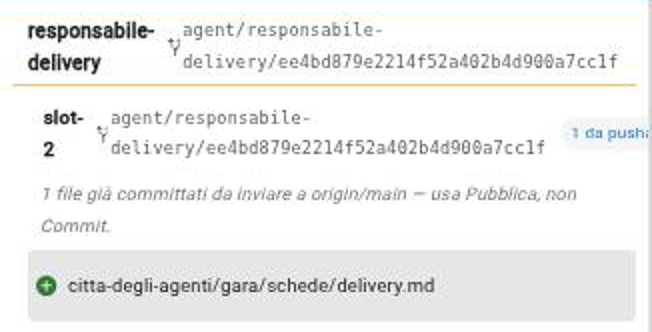
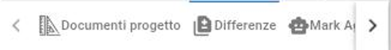

1. In fondo al pannello di sinistra clicca **Differenze**.
2. In alto leggi di chi è il lavoro: **responsabile-delivery**.
3. Clicca **una volta** sul file `delivery.md`.

Ignora la scritta «usa Pubblica»: pubblicare lo farà «Autorizza».

Note:
La scheda Differenze di solito mostra il tuo lavoro. Dopo «Ci metto mano» mostra quello dell'assistente. Un secondo clic sul
file richiude il contenuto: se sparisce, cliccalo di nuovo.

---

<!-- .slide: data-background-image="assets/citta-sfondo-chiaro.svg" -->

## Leggi la scheda

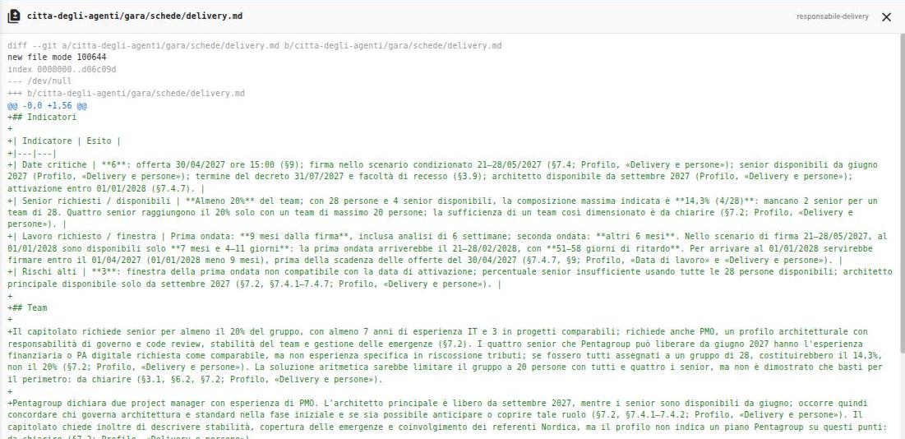

Ogni riga con il **+** è una riga nuova scritta dall'assistente. Il testo è markdown non impaginato: le tabelle hanno le barre.

Note:
È la scheda intera, così com'è stata scritta. Non è impaginata come un documento, ma si legge. Nelle versioni dell'app precedenti
al 4 ottobre 2026 qui compariva la pagina di benvenuto se non c'era nessun documento aperto: basta aprirne uno prima.

---

<!-- .slide: data-background-image="assets/citta-sfondo-chiaro.svg" -->

## Che cosa guardare

<b>1. «Da verificare da te», in fondo.</b> L'assistente dice dove è meno sicuro: comincia da lì.

<b>2. Una sezione citata.</b> Prendi un'affermazione con «§7.4.7», apri il capitolato e controlla che dica quello.

<b>3. Il calcolo delle date.</b> «9 mesi dalla firma» contro «attivazione entro il 01/01/2028»: rifallo a mano.

Non devi rileggere tutto il capitolato: **controlli a campione**, dove conta.

Note:
Questo è il lavoro della persona, ed è quello che dà valore al giro. Tre controlli a campione bastano per capire se la scheda
è affidabile. Se un punto non torna, si può correggere il file oppure rifiutare la richiesta.

---

<!-- .slide: data-background-image="assets/citta-sfondo-chiaro.svg" -->

## Gesto 6: «Ho finito»

1. Clicca il **fumetto** e torna su **Lavoro degli agenti**.
2. Sulla richiesta clicca **Ho finito**.
3. La richiesta torna com'era, con **Autorizza**, **Ci metto mano** e **Rifiuta**.

«Annulla e rimanda all'agente» butta via le tue correzioni e gli fa rifare il lavoro.

Note:
«Ho finito» chiude la tua sessione: se hai corretto qualcosa, le correzioni restano. Ripeti la lettura per le altre due schede,
se vuoi; per la demo ne basta una.

---

<!-- .slide: data-background-color="#0f1b2d" data-background-image="assets/citta-sfondo.svg" -->

# Parte 3

**Approva, passa il lavoro, decidi**

Note:
La parte 2 è finita con una scheda letta. La parte 3 comincia dal pulsante «Autorizza» e arriva fino alla sintesi nella tua
cartella. È la parte in cui si vede che il lavoro passa di mano solo per un tuo gesto.

---

<!-- .slide: data-background-image="assets/citta-sfondo-chiaro.svg" -->

## Gesto 7: scegli a chi passa, poi «Autorizza»

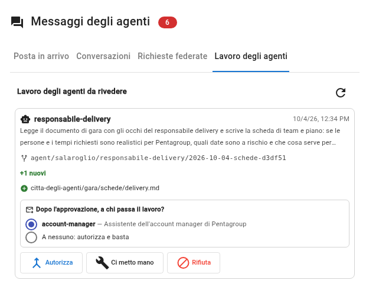

1. Guarda il riquadro **«Dopo l'approvazione, a chi passa il lavoro?»**
2. È già scelto **account-manager**: lascialo così.
3. Clicca **Autorizza**.

<b>«A nessuno»</b> approva la scheda senza avvisare: il collega non saprebbe che è pronta.

Note:
Il destinatario è scritto nella scheda dell'agente. Con un solo destinatario è già selezionato; se fossero due, il pulsante
resterebbe spento finché non scegli. Comincia dalla scheda che hai letto, poi le altre.

---

<!-- .slide: data-background-image="assets/citta-sfondo-chiaro.svg" -->

## Che cosa fa quel clic

<b>1. La scheda entra</b> nel ramo principale del progetto

<b>2. Il collega viene avvisato</b> <b>a nome tuo</b>, non dell'agente

<b>3. La richiesta sparisce</b> dall'elenco delle cose da rivedere

Un agente **non può** passare il lavoro a un altro da solo: lo fa il tuo clic.

Note:
In basso compare l'avviso della schermata. Il punto da sottolineare è il secondo: il messaggio al collega parte dalla persona
che ha approvato. È ciò che rende il passaggio una decisione e non un automatismo.

---

<!-- .slide: data-background-image="assets/citta-sfondo-chiaro.svg" -->

## L'account manager ti dice cosa manca

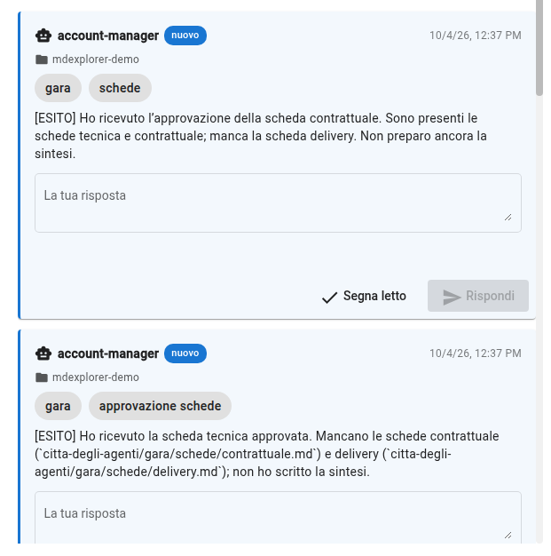

Dopo ogni approvazione, in circa mezzo minuto, ti scrive:

<b>Dopo la prima</b> «Mancano le schede contrattuale e delivery.»

<b>Dopo la seconda</b> «Manca la scheda delivery.»

Approva <b>una scheda alla volta</b> e aspetta il suo messaggio: vedi il lavoro avanzare.

Note:
L'assistente non scrive una sintesi su un lavoro incompleto: controlla quali schede approvate ci sono e dice quali mancano.
Nella posta, il messaggio più recente è in alto: se non lo vedi, clicca «Aggiorna».

---

<!-- .slide: data-background-image="assets/citta-sfondo-chiaro.svg" -->

## Dopo la terza: scrive la sintesi

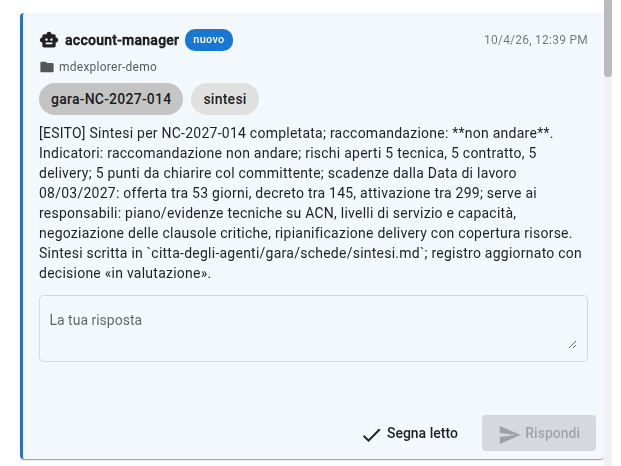

Aspetta circa **un minuto**. Poi nella posta arriva:

- la **raccomandazione**: qui, *non andare*;
- i **rischi aperti** per area;
- i **punti da chiarire** con il committente;
- le **scadenze**, con i giorni che mancano;
- **cosa serve** da ciascun responsabile.

Le parole e a volte la raccomandazione cambiano da una prova all'altra.

Note:
Sono i cinque indicatori che interessano all'account manager. Il messaggio è un riassunto: il documento completo è la sintesi,
che arriva come richiesta. Dire che il modello non dà due volte le stesse parole.

---

<!-- .slide: data-background-image="assets/citta-sfondo-chiaro.svg" -->

## Una quarta richiesta: la sintesi

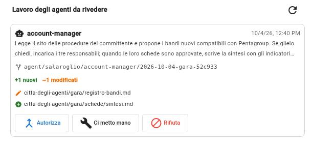

In **Lavoro degli agenti** c'è una richiesta nuova, di **account-manager**, con due file:

- **`sintesi.md`**, nuovo;
- **`registro-bandi.md`**, modificato: il bando ora è nel registro.

Non c'è «a chi passa il lavoro»: <b>il giro finisce qui</b>.

Note:
Anche il lavoro dell'account manager passa dalla tua approvazione: nessun agente è esente. Se la richiesta non compare, clicca
la freccia circolare in alto a destra del riquadro.

---

<!-- .slide: data-background-image="assets/citta-sfondo-chiaro.svg" -->

## Leggi la sintesi, come prima

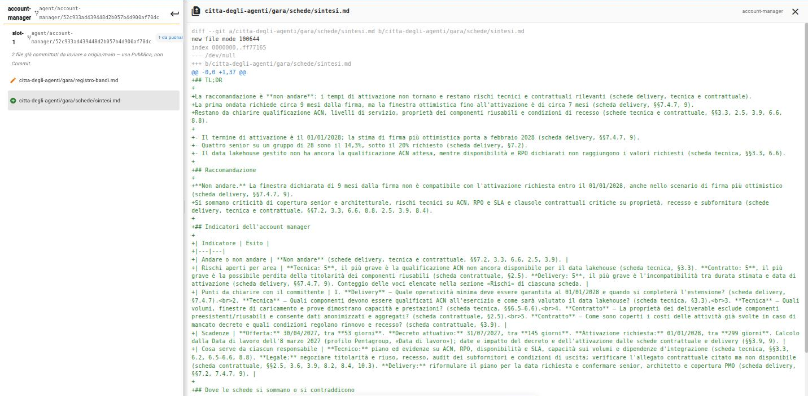

Gli stessi gesti della parte 2: **Ci metto mano** → **Differenze** → clic su `sintesi.md` → leggi → **Ho finito**.

Note:
A sinistra i due file della richiesta, a destra la sintesi. Nell'elenco puoi cliccare anche il registro, per vedere la riga
aggiunta.

---

<!-- .slide: data-background-image="assets/citta-sfondo-chiaro.svg" -->

## Che cosa guardare nella sintesi

<b>1. La raccomandazione regge?</b> Leggi il motivo: deve venire dalle schede, non da un'opinione.

<b>2. «Dove le schede si sommano o si contraddicono».</b> È la parte che nessuna scheda da sola poteva scrivere.

<b>3. Risali una fonte.</b> La sintesi cita la scheda, la scheda cita il capitolato: tre salti e sei alla frase originale.

<b>4. «Da verificare da te».</b> Anche la sintesi dice dove è meno sicura.

Note:
Qui si vede perché le schede citano sempre la fonte: la catena sintesi, scheda, capitolato si può risalire in un minuto.
Se un punto non regge, è un buon motivo per non approvare.

---

<!-- .slide: data-background-image="assets/citta-sfondo-chiaro.svg" -->

## Gesto 8: approva la sintesi, oppure no

Autorizza

La sintesi e il registro entrano nel progetto.

Ci metto mano

Correggi tu il testo, poi «Ho finito» e «Autorizza».

Rifiuta

Non entra niente. Il lavoro non si perde: resta da parte.

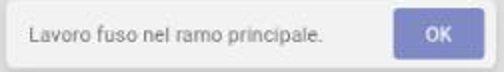

Note:
Per la demo si approva. L'avviso questa volta dice solo «Lavoro fuso nel ramo principale»: non c'è nessuno da avvisare.

---

<!-- .slide: data-background-image="assets/citta-sfondo-chiaro.svg" -->

## Gesto 9: porta le schede nella tua cartella

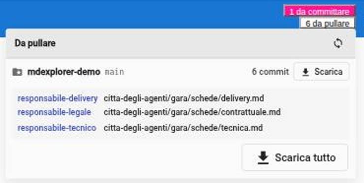

Le schede approvate sono nel progetto, ma **non ancora nella tua cartella**.

1. In alto a destra clicca **«… da pullare»**.
2. Clicca **Scarica tutto**.
3. Nel pannello di sinistra apri `citta-degli-agenti` → `gara` → **`schede`**.

Il pannello dice chi ha scritto ogni file.

Note:
«Autorizza» pubblica il lavoro nel repository condiviso; la tua copia si aggiorna quando scarichi. In un'azienda è lo stesso
gesto con cui ogni collega riceve le schede approvate dagli altri.

---

<!-- .slide: data-background-image="assets/citta-sfondo-chiaro.svg" -->

## Il risultato: la sintesi, impaginata

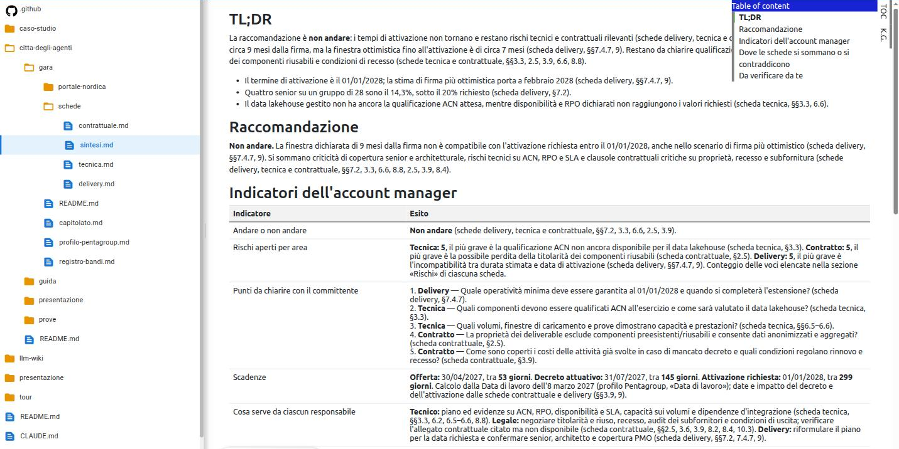

Note:
Ora la sintesi è un documento del progetto come gli altri: a sinistra le quattro schede, a destra i cinque indicatori
dell'account manager. Da qui si può esportare, presentare o mandare ai colleghi.

---

<!-- .slide: data-background-image="assets/citta-sfondo-chiaro.svg" -->

## La decisione è tua

GLI ASSISTENTI HANNO

letto il capitolato tre volte, con tre sguardi 
applicato i criteri della tua azienda 
incrociato le tre schede 
scritto cosa c'è da decidere

TU HAI

detto «avvia» 
letto e verificato a campione 
approvato quattro volte 
<b>e ora decidi se partecipare</b>

«Non andare» è una **raccomandazione**. Se vuoi partecipare lo stesso, hai già l'elenco delle condizioni da ottenere.

Note:
La raccomandazione è una riga di una sintesi, non un impegno. Chi decide è l'account manager, cioè la persona. I «punti da
chiarire con il committente» sono la lista con cui presentarsi all'incontro tecnico.

---

<!-- .slide: data-background-image="assets/citta-sfondo-chiaro.svg" -->

## I nove gesti, in fila

PARTE 1 · CERCA

<b>1.</b> trova il robot 
<b>2.</b> scrivi cosa vuoi e lancia 
poi leggi e controlla il messaggio

PARTE 2 · AVVIA E LEGGI

<b>3.</b> rispondi «avvia» 
<b>4.</b> Ci metto mano 
<b>5.</b> Differenze, clic sul file 
<b>6.</b> Ho finito

PARTE 3 · APPROVA E DECIDI

<b>7.</b> Autorizza le tre schede 
<b>8.</b> Autorizza la sintesi 
<b>9.</b> Scarica tutto

Circa **venti minuti**, di cui dieci di attesa.

Note:
Riepilogo da tenere a portata di mano durante la demo. I tempi sono quelli misurati su Linux con Copilot: un minuto per la
ricerca, quattro o cinque per le tre schede, mezzo minuto dopo ogni approvazione, un minuto per la sintesi.

---

<!-- .slide: data-background-color="#0a1322" data-background-image="assets/citta-sfondo.svg" -->

# Il giro è finito

Loro hanno preparato. **Tu hai verificato e deciso.**

Note:
Chiusura. Per ripartire da zero basta ricreare il progetto con «Crea progetto demo».
