<!-- .slide: data-background-color="#0a1322" data-background-image="assets/citta-sfondo.svg" -->

# La gara, passo per passo

Parte 1: **l'account manager cerca il bando**

Note:
Questa presentazione è una guida operativa: dice cosa fare, dove cliccare e cosa aspettarsi. Si legge con MdExplorer aperto
accanto. La parte 1 arriva fino al messaggio dell'account manager; le parti successive seguono il giro.

---

<!-- .slide: data-background-image="assets/citta-sfondo-chiaro.svg" -->

## Prima di partire: tre cose già fatte

1

Il progetto demo è aperto

Creato con <b>«Crea progetto demo»</b>: prepara anche il posto dove gli agenti consegnano.

[Come lo verifico →](../guida/verifica-1-progetto-demo.md)

2

La città è accesa

Nella barra in alto ci sono le due persone e il fumetto.

[Come lo verifico →](../guida/verifica-2-citta-accesa.md)

3

I quattro agenti sono abilitati

Nel registro, ciascuno dei quattro «risponde a te» e ha il segno verde «Fidato».

[Come lo verifico →](../guida/verifica-3-agenti-abilitati.md)

Ogni riquadro porta a una pagina con le schermate: **cosa guardare, e cosa fare se manca**.

Note:
I tre link aprono tre pagine di verifica, con le schermate di ciò che si deve vedere e i passi da fare se qualcosa manca.
Dalla pagina si torna alla guida con il link in fondo o con la freccia indietro di MdExplorer.

---

<!-- .slide: data-background-image="assets/citta-sfondo-chiaro.svg" -->

## Prima di tutto: gli agenti sono tuoi

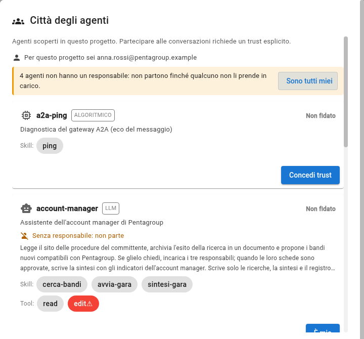

<b>Un agente lavora per una persona</b> Finché non ha un responsabile non parte. Nel registro leggi «Senza responsabile: non parte».

<b>1. Sono tutti miei</b> Apri il registro (le due persone nella barra) e clicca il pulsante in alto: i quattro agenti rispondono a te.

<b>2. Concedi trust</b> Ora su ogni agente c'è «Concedi trust»: leggi cosa fa e abilitalo. Vale per i tuoi agenti, non per quelli degli altri.

Note:
In un'azienda vera i quattro agenti sarebbero di quattro persone, e ognuna farebbe questo gesto dal proprio computer sul proprio
agente. Qui le parti le fa una persona sola. In cima al registro c'è scritto chi sei per il progetto: è l'email git.
Il gesto scrive quattro righe nel documento «Chi risponde di quale agente», che si apre dietro la finestra.

---

<!-- .slide: data-background-image="assets/citta-sfondo-chiaro.svg" -->

## La scena

Sei **l'account manager di Pentagroup**.

Ogni mattina qualcuno dovrebbe guardare il sito dei bandi di Nordica Crediti, per vedere se c'è qualcosa di nuovo e se fa per voi.

Da oggi lo fa <b>il tuo assistente</b>. Tu gli dici di controllare; lui ti riferisce.

Note:
Mettere la persona nel ruolo. Non «un agente fa», ma «tu sei l'account manager e hai un assistente». Tutto il giro si capisce
meglio se chi guarda si sente quella persona.

---

<!-- .slide: data-background-image="assets/citta-sfondo-chiaro.svg" -->

## Cosa guarda l'assistente

IL SITO DEI BANDI

Tre procedure in corso: <b>NC-2027-014</b> piattaforma ATLANTE <b>NC-2027-012</b> licenze software <b>NC-2027-011</b> manutenzione immobili

gara/portale-nordica/bandi.md

IL REGISTRO

I bandi che Pentagroup <b>ha già visto</b>. Se un bando non è qui, è nuovo.

gara/registro-bandi.md

I CRITERI DI PENTAGROUP

Cinque criteri per decidere se un bando fa per noi: attività, competenza, tempi, contratto, <b>almeno 21 giorni</b> per rispondere.

gara/profilo-pentagroup.md

Il sito è un **file del progetto che lo simula**. In azienda sarebbe il sito vero.

Note:
Tre documenti, tutti nel progetto, tutti apribili. Vale la pena aprirne uno prima di lanciare l'agente, per esempio il sito dei
bandi: così chi guarda sa cosa c'è dentro e potrà giudicare il risultato. Dire subito che il sito è simulato.

---

<!-- .slide: data-background-image="assets/citta-sfondo-chiaro.svg" -->

## Gesto 1: trova il robot

1. Nel pannello di sinistra apri **`.github`**
2. poi **`agents`**
3. sulla riga di **`account-manager.agent.md`** clicca il **robot**

Non vedi il robot? Il pannello è stretto: <b>allargalo</b> trascinando il bordo.

Note:
Ogni agente è un file, e il robot accanto al file è il modo per lanciarlo. Se il pannello è stretto l'icona è tagliata: è la
cosa su cui ci si blocca più spesso.

---

<!-- .slide: data-background-image="assets/citta-sfondo-chiaro.svg" -->

## Gesto 2: dì cosa vuoi e lancia

1. Scrivi:

<b>Controlla il portale dei bandi.</b>

2. **Non toccare il resto**: motore, modello e la spunta restano come sono.
3. Clicca **Lancia ora**.

La spunta «posto di lavoro isolato» vuol dire: lavora in una copia, non nella tua cartella.

Note:
Una frase in italiano, non un comando. Le opzioni sotto servono a chi vuole cambiare motore: per la demo si lasciano così.
La finestra si chiude e compare «Agente avviato in background».

---

<!-- .slide: data-background-image="assets/citta-sfondo-chiaro.svg" -->

## Aspetta un minuto

INTANTO LUI

legge il sito dei bandi 
lo confronta con il registro 
applica il primo filtro: natura e tempo 
scrive la ricerca e ti manda il messaggio

TU VEDI

<b>1.</b> nella barra un <b>robot giallo</b> con un anello che gira: qualcuno lavora 
<b>2.</b> un avviso in basso: «🤖 Agente … completato» 
<b>3.</b> il robot sparisce e sul <b>fumetto</b> compare un numero rosso

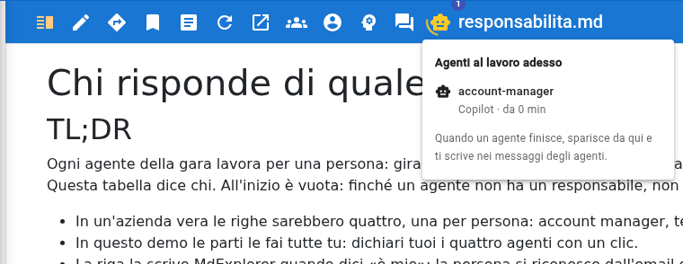

Dopo due minuti niente? Il motore AI non risponde: controlla che sia installato e con l'accesso fatto.

Note:
Circa un minuto. Cliccando il robot giallo si vede chi sta lavorando, su quale motore e da quanti minuti. Quando l'agente
finisce il robot sparisce: se è ancora lì, sta ancora lavorando.

---

<!-- .slide: data-background-image="assets/citta-sfondo-chiaro.svg" -->

## Apri la posta degli agenti

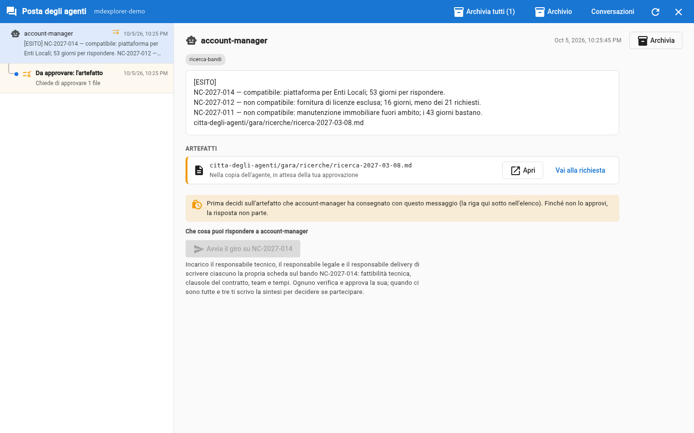

<b>Clicca il fumetto</b> Si apre la posta, a tutto schermo, sopra il progetto. Si chiude con la ✕ in alto a destra.

<b>A sinistra: l'elenco</b> Chi ti ha scritto e quando. Il pallino blu segna ciò che non hai letto; «Da approvare» è un lavoro che aspetta te.

<b>A destra: il dettaglio</b> Il messaggio intero, gli <b>artefatti</b> che cita e la casella per rispondere.

Note:
La posta è un elenco solo: i messaggi degli agenti e i lavori da approvare stanno insieme. Dopo la ricerca le voci sono due,
tutte e due dell'account manager: il messaggio e il suo documento da approvare.

---

<!-- .slide: data-background-image="assets/citta-sfondo-chiaro.svg" -->

## Leggi cosa ti ha scritto

<b>Uno compatibile</b> NC-2027-014: supera il primo filtro, merita il giro dei tre responsabili.

<b>Due scartati, con il motivo</b> Licenze: fuori attività e solo 16 giorni. Immobili: fuori attività.

<b>Dove sta il documento, e una domanda</b> L'ultima riga è il percorso della ricerca. Poi: «Vuoi che avvii il giro?»

L'assistente produce sempre **due cose**: il messaggio, breve, e il documento con il ragionamento.

Note:
Le parole cambiano a ogni prova, perché dietro c'è un modello; la struttura no: una riga per bando, il verdetto, il motivo, il
percorso del documento e una domanda. «Compatibile» qui vuol dire «merita il giro», non «conviene partecipare»: quello lo
diranno le schede dei responsabili. Le due procedure già nel registro non compaiono: non sono nuove.

---

<!-- .slide: data-background-image="assets/citta-sfondo-chiaro.svg" -->

## Gesto 3: apri il documento

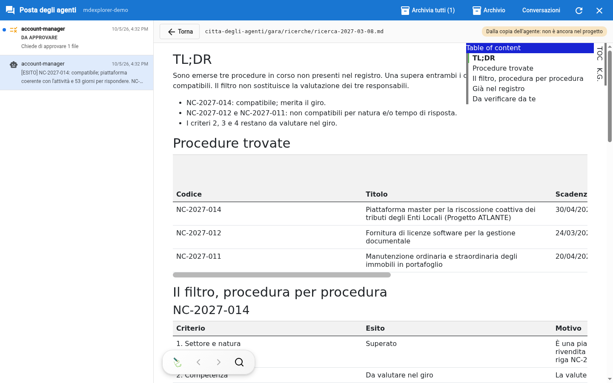

<b>1. Clicca «Apri»</b> Sotto il messaggio, in <b>Artefatti</b>, c'è il file della ricerca. Si apre lì accanto, impaginato.

<b>2. Guarda l'etichetta in alto</b> «Dalla copia dell'agente: non è ancora nel progetto». Lo stai leggendo prima di approvarlo.

<b>3. Clicca «Torna», poi approva</b> Sotto il messaggio c'è la riga «Da approvare: l'artefatto»: cliccala e premi «Autorizza». Finché non lo fai, la risposta è chiusa.

Note:
Il documento sta in una copia a parte dell'agente: nel progetto entra solo con «Autorizza». Dentro: la tabella delle procedure
con i giorni che mancano, e per ogni procedura i cinque criteri. I due che bloccano li giudica l'account manager; gli altri tre
dicono «da valutare nel giro» e da chi.

---

<!-- .slide: data-background-image="assets/citta-sfondo-chiaro.svg" -->

## Controlla tu: due minuti

<b>1. I bandi ci sono tutti?</b> Apri il sito dei bandi: tre procedure in corso, tre righe nel messaggio.

<b>2. I giorni tornano?</b> Oggi, nella storia, è l'<b>8 marzo 2027</b>. Le licenze scadono il 24 marzo: <b>16 giorni</b>, meno dei 21 richiesti.

<b>3. Perché due bandi non compaiono?</b> Apri il registro: sono già stati visti.

**Non ti fidi: verifichi.** È il gesto che ti viene chiesto in tutto il giro.

Note:
Questo è il momento più importante della parte 1, e si fa in fretta. Tre controlli che chiunque può fare aprendo tre file.
La «Data di lavoro» sta nel profilo di Pentagroup: è l'oggi della storia, e serve perché i conti tornino in qualunque giorno
si faccia la demo.

---

<!-- .slide: data-background-image="assets/citta-sfondo-chiaro.svg" -->

## Cosa è successo, e cosa no

HA FATTO

✔ letto tre documenti 
✔ scartato due bandi, dicendo perché 
✔ scritto la ricerca in un documento 
✔ chiuso con una domanda

NON HA FATTO

✘ non ha avviato niente 
✘ non ha scritto ai colleghi 
✘ non ha messo niente nel progetto: il documento aspetta la tua approvazione 
✘ non ha deciso al posto tuo

Note:
La colonna di destra è quella che rassicura. L'assistente scrive la sua ricerca, ma in una copia a parte: nel progetto entra
solo quando la approvi. E la sua scheda dice di proporre e aspettare: l'avvio del giro è una risposta tua.

---

<!-- .slide: data-background-color="#0f1b2d" data-background-image="assets/citta-sfondo.svg" -->

# Parte 2

**Avvia il giro** e leggi una scheda prima di approvarla

Note:
La parte 1 è finita con la ricerca approvata e con un pulsante sotto il messaggio dell'account manager. La parte 2 comincia da quel pulsante e
arriva fino alla lettura di una scheda. L'approvazione è nella parte 3.

---

<!-- .slide: data-background-image="assets/citta-sfondo-chiaro.svg" -->

## Gesto 4: premi «Avvia il giro»

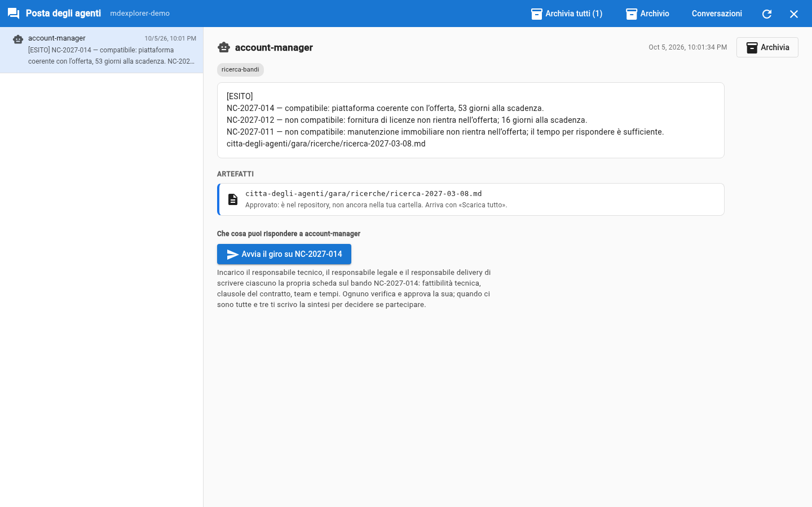

<b>1. Resta sul messaggio</b> Quello dell'account manager. Sotto il testo c'è «Che cosa puoi rispondere».

<b>2. Leggi che cosa fa il pulsante</b> Incarica il responsabile tecnico, il legale e il delivery di scrivere ciascuno la sua scheda.

<b>3. Premi «Avvia il giro su NC-2027-014»</b> L'assistente si sveglia, incarica i tre responsabili e te lo conferma con un messaggio.

Note:
Le risposte possibili le dichiara la scheda dell'agente e diventano pulsanti: la persona legge chi verrà contattato e per fare
cosa, invece di indovinare che cosa scrivere. Il pulsante resta chiuso finché la ricerca non è approvata. Dopo mezzo minuto arriva
la conferma, «Giro avviato su NC-2027-014», e sotto quel messaggio compare una riga per ogni scheda attesa, che cambia stato da sola.

---

<!-- .slide: data-background-image="assets/citta-sfondo-chiaro.svg" -->

## Intanto: a che punto sono le schede

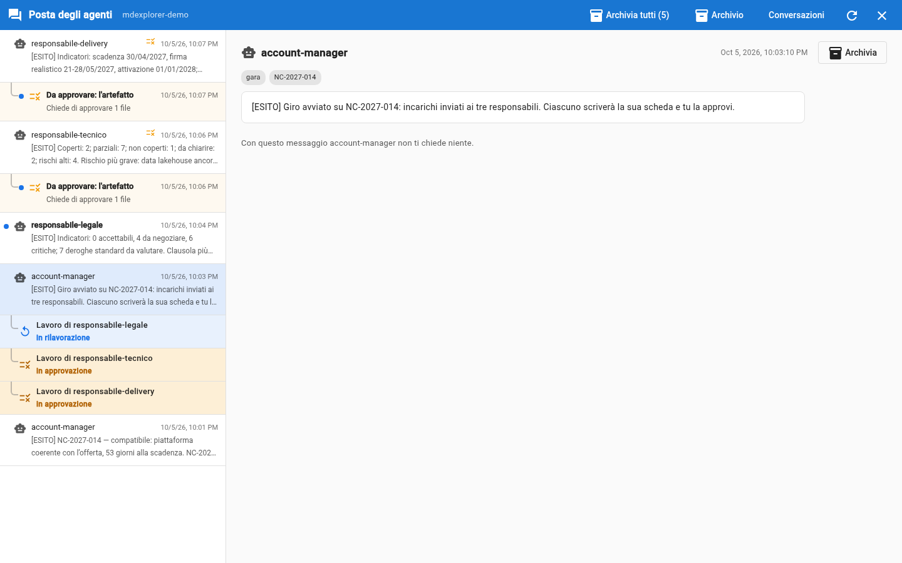

<b>Una riga per scheda attesa</b> Sta sotto il messaggio «Giro avviato», e cambia stato da sola.

<b>Il colore dice lo stato</b> Azzurro: sta lavorando. Ambra: in approvazione. Verde: approvata. Rosso: rifiutata, ferma.

<b>È per chi aspetta</b> L'account manager vede a che punto è ogni collega, senza chiederglielo.

Note:
Una scheda rifiutata non riparte da sola: resta ferma, in rosso, finché chi ne risponde non preme «Fai ripartire». Nel frattempo
può correggere la scheda dell'agente, se l'errore viene da lì.

---

<!-- .slide: data-background-image="assets/citta-sfondo-chiaro.svg" -->

## Aspetta cinque minuti

INTANTO LORO

il <b>tecnico</b> legge i requisiti 
il <b>legale</b> legge le clausole 
il <b>delivery</b> legge persone e date 
ognuno scrive <b>la sua scheda</b>, senza guardare le altre

TU VEDI

<b>1.</b> il <b>robot giallo</b> nella barra: cliccalo per sapere chi sta lavorando 
<b>2.</b> la posta che si riempie, una voce alla volta 
<b>3.</b> il robot che sparisce: hanno finito tutti

Lavorano **uno alla volta**: è normale che la prima scheda arrivi dopo due minuti e l'ultima dopo cinque.

Note:
Circa cinque minuti in tutto. Ogni assistente legge solo il capitolato e il suo capitolo del profilo: non vede le schede dei
colleghi. È voluto: tre punti di vista indipendenti, che poi la sintesi mette a confronto.

---

<!-- .slide: data-background-image="assets/citta-sfondo-chiaro.svg" -->

## La posta si riempie

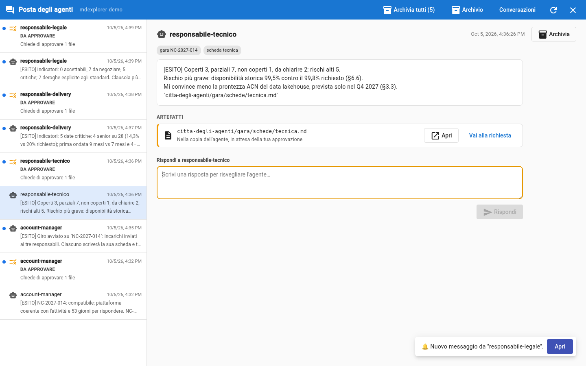

<b>Tre messaggi</b> Uno per responsabile: gli indicatori, il rischio più grave, il punto che lo convince meno, il percorso della scheda.

<b>Tre voci «Da approvare»</b> Una per scheda. Sono i documenti veri: aspettano la tua decisione.

<b>Più le voci di prima</b> La conferma dell'account manager, e la sua ricerca ancora da approvare.

Note:
Ogni responsabile produce due cose, come l'account manager: il messaggio e la scheda. Il messaggio è di quattro righe e dice
dove guardare; la scheda è il documento. Nell'elenco stanno insieme, in ordine di arrivo.

---

<!-- .slide: data-background-image="assets/citta-sfondo-chiaro.svg" -->

## Gesto 5: apri una scheda

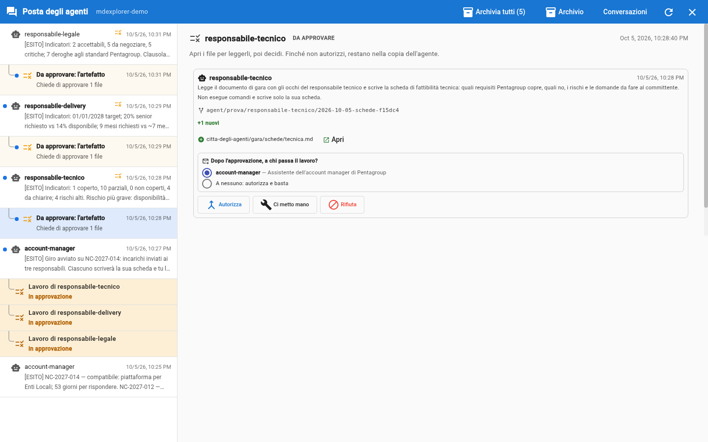

<b>1. Scegli una voce «Da approvare»</b> Per esempio quella di <code>responsabile-tecnico</code>.

<b>2. Leggi chi l'ha scritta</b> In alto il riassunto dell'agente; sotto il file che ha consegnato.

<b>3. Clicca «Apri» sul file</b> La scheda si apre lì accanto, com'è nella consegna dell'agente.

Note:
Per leggere non serve più «Ci metto mano»: quello resta il gesto per correggere tu il documento prima di approvarlo. Sotto
il file c'è già la scelta di chi riceverà il lavoro dopo l'approvazione: la si usa nel gesto successivo.

---

<!-- .slide: data-background-image="assets/citta-sfondo-chiaro.svg" -->

## Leggi la scheda

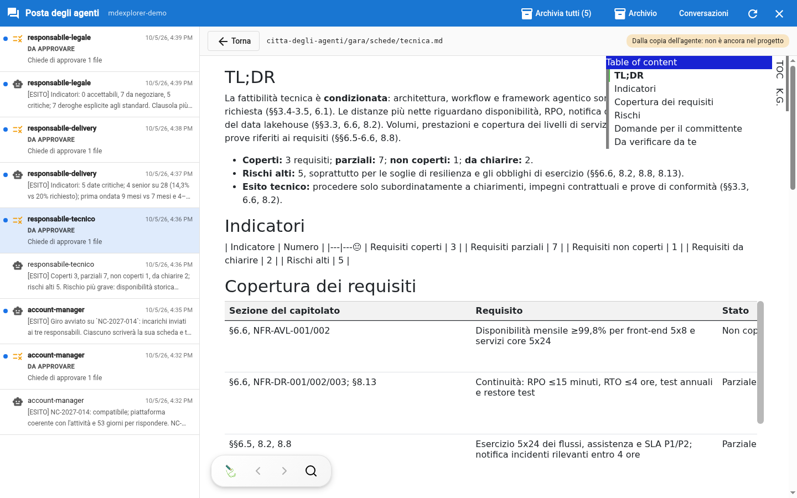

In alto: il percorso del file e «Dalla copia dell'agente: non è ancora nel progetto». **Torna** riporta alla richiesta.

Note:
La scheda è un documento vero, impaginato come gli altri: riassunto, indicatori, tabella dei requisiti, rischi, domande per il
committente e, in fondo, i tre punti in cui l'agente è meno sicuro.

---

<!-- .slide: data-background-image="assets/citta-sfondo-chiaro.svg" -->

## Che cosa guardare

<b>1. «Da verificare da te», in fondo.</b> L'assistente dice dove è meno sicuro: comincia da lì.

<b>2. Una sezione citata.</b> Prendi un'affermazione con «§7.4.7», apri il capitolato e controlla che dica quello.

<b>3. Il calcolo delle date.</b> «9 mesi dalla firma» contro «attivazione entro il 01/01/2028»: rifallo a mano.

Non devi rileggere tutto il capitolato: **controlli a campione**, dove conta.

Note:
Questo è il lavoro della persona, ed è quello che dà valore al giro. Tre controlli a campione bastano per capire se la scheda
è affidabile. Se un punto non torna, la strada normale è correggere il file nella copia dell'agente; rifiutare è l'eccezione, chiede il motivo e ferma il lavoro finché non lo si fa ripartire.

---

<!-- .slide: data-background-color="#0f1b2d" data-background-image="assets/citta-sfondo.svg" -->

# Parte 3

**Approva, passa il lavoro, decidi**

Note:
La parte 2 è finita con una scheda letta. La parte 3 comincia dal pulsante «Autorizza» e arriva fino alla sintesi nella tua
cartella. È la parte in cui si vede che il lavoro passa di mano solo per un tuo gesto.

---

<!-- .slide: data-background-image="assets/citta-sfondo-chiaro.svg" -->

## Gesto 6: scegli a chi passa, poi «Autorizza»

<b>1. Guarda «Dopo l'approvazione, a chi passa il lavoro?»</b> La scheda dell'agente dichiara a chi: qui all'account manager. Puoi anche scegliere «nessuno».

<b>2. Clicca «Autorizza»</b> La scheda entra nel repository e il collega viene avvisato, a nome tuo.

<b>3. Oppure</b> La correggi tu nella copia dell'agente. «Rifiuta» è l'eccezione: chiede il motivo e ferma il lavoro.

Note:
Con un solo destinatario la scelta è già fatta; con più di uno la persona deve scegliere, e il pulsante resta spento finché
non lo fa. L'agente del collega non si sveglia mai da solo: lo sveglia questo clic.

---

<!-- .slide: data-background-image="assets/citta-sfondo-chiaro.svg" -->

## Che cosa fa quel clic

<b>1. La scheda entra</b> nel ramo principale del progetto

<b>2. Il collega viene avvisato</b> <b>a nome tuo</b>, non dell'agente

<b>3. La richiesta sparisce</b> dall'elenco delle cose da rivedere

Un agente **non può** passare il lavoro a un altro da solo: lo fa il tuo clic.

Note:
In basso compare l'avviso della schermata. Il punto da sottolineare è il secondo: il messaggio al collega parte dalla persona
che ha approvato. È ciò che rende il passaggio una decisione e non un automatismo.

---

<!-- .slide: data-background-image="assets/citta-sfondo-chiaro.svg" -->

## L'account manager ti dice cosa manca

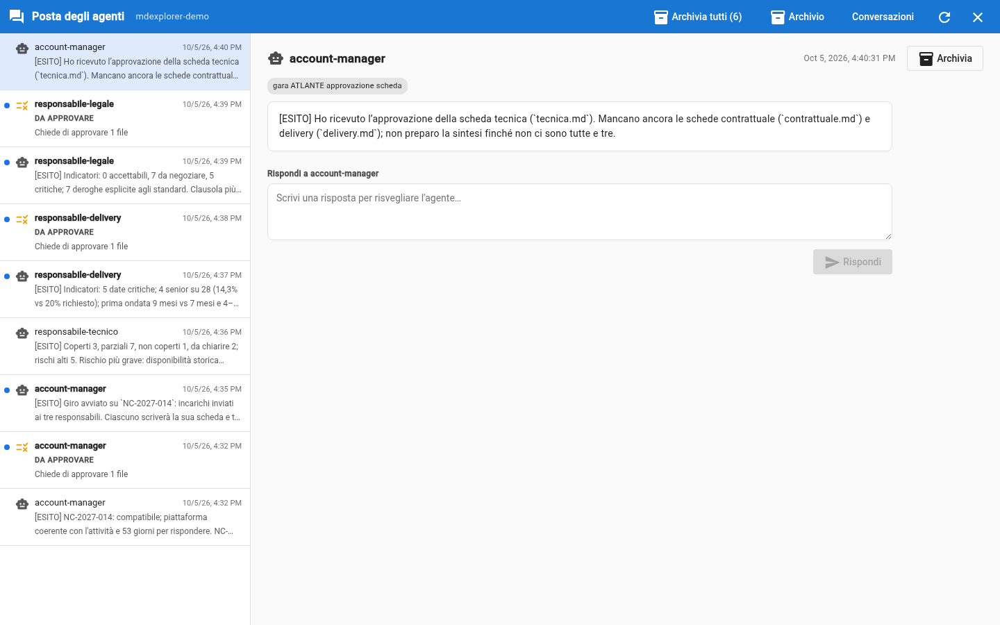

<b>Dopo la prima</b> «Ho ricevuto la scheda tecnica. Mancano contrattuale e delivery.»

<b>Dopo la seconda</b> «Manca la scheda delivery.»

<b>Tu</b> Approva <b>una scheda alla volta</b> e aspetta il suo messaggio, circa mezzo minuto: vedi il lavoro avanzare.

Note:
A ogni approvazione l'assistente dell'account manager si sveglia, guarda quali schede ci sono e risponde. Non ricorda le volte
precedenti: lo stato sta nei file, ed è per questo che la risposta è sempre giusta.

---

<!-- .slide: data-background-image="assets/citta-sfondo-chiaro.svg" -->

## Dopo la terza: scrive la sintesi

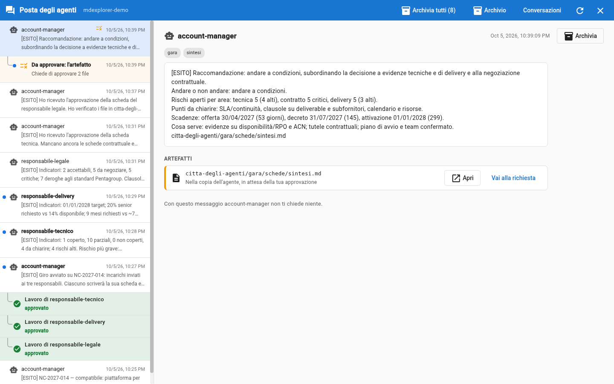

<b>Un messaggio</b> La raccomandazione e i cinque indicatori, una riga ciascuno.

<b>Un artefatto</b> <code>gara/schede/sintesi.md</code>, in attesa della tua approvazione.

<b>Una voce «Da approvare»</b> Con due file: la sintesi e il registro dei bandi, con la riga nuova.

Note:
Circa un minuto dopo la terza approvazione. La raccomandazione può essere «andare», «andare a condizioni» o «non andare»:
dipende da ciò che hanno scritto i tre responsabili, e cambia da una prova all'altra.

---

<!-- .slide: data-background-image="assets/citta-sfondo-chiaro.svg" -->

## Leggi la sintesi

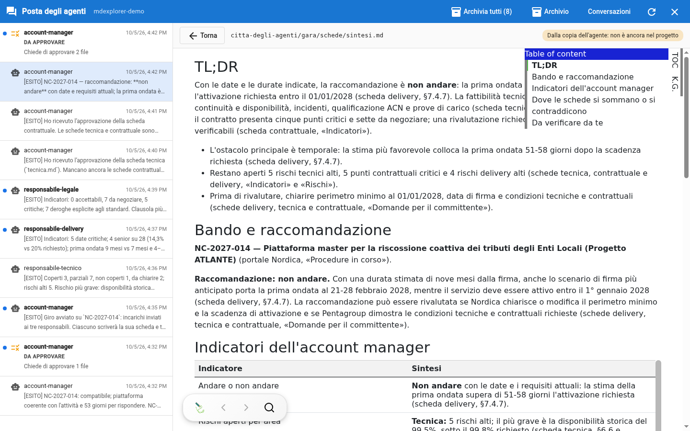

Stesso gesto di prima: **Apri** sull'artefatto, oppure sul file dentro la voce «Da approvare».

Note:
La sintesi usa solo ciò che c'è nelle tre schede, e ogni dato cita la scheda da cui viene. La parte che vale di più è «Dove le
schede si sommano o si contraddicono»: è lì che tre punti di vista indipendenti diventano una decisione.

---

<!-- .slide: data-background-image="assets/citta-sfondo-chiaro.svg" -->

## Che cosa guardare nella sintesi

<b>1. La raccomandazione regge?</b> Leggi il motivo: deve venire dalle schede, non da un'opinione.

<b>2. «Dove le schede si sommano o si contraddicono».</b> È la parte che nessuna scheda da sola poteva scrivere.

<b>3. Risali una fonte.</b> La sintesi cita la scheda, la scheda cita il capitolato: tre salti e sei alla frase originale.

<b>4. «Da verificare da te».</b> Anche la sintesi dice dove è meno sicura.

Note:
Qui si vede perché le schede citano sempre la fonte: la catena sintesi, scheda, capitolato si può risalire in un minuto.
Se un punto non regge, è un buon motivo per non approvare.

---

<!-- .slide: data-background-image="assets/citta-sfondo-chiaro.svg" -->

## Gesto 7: approva la sintesi, oppure no

Autorizza

La sintesi e il registro entrano nel progetto.

Ci metto mano

Correggi tu il testo, poi «Ho finito» e «Autorizza».

Rifiuta

Non entra niente. Il lavoro non si perde: resta da parte.

Note:
Per la demo si approva. L'avviso questa volta dice solo «Lavoro fuso nel ramo principale»: non c'è nessuno da avvisare.

---

<!-- .slide: data-background-image="assets/citta-sfondo-chiaro.svg" -->

## Gesto 8: porta le schede nella tua cartella

Le schede approvate sono nel progetto, ma **non ancora nella tua cartella**.

1. In alto a destra clicca **«… da pullare»**.
2. Clicca **Scarica tutto**.
3. Nel pannello di sinistra apri `citta-degli-agenti` → `gara` → **`schede`**.

Il pannello dice chi ha scritto ogni file.

Note:
«Autorizza» pubblica il lavoro nel repository condiviso; la tua copia si aggiorna quando scarichi. In un'azienda è lo stesso
gesto con cui ogni collega riceve le schede approvate dagli altri.

---

<!-- .slide: data-background-image="assets/citta-sfondo-chiaro.svg" -->

## Il risultato: la sintesi, impaginata

Note:
Ora la sintesi è un documento del progetto come gli altri: a sinistra le quattro schede, a destra i cinque indicatori
dell'account manager. Da qui si può esportare, presentare o mandare ai colleghi.

---

<!-- .slide: data-background-image="assets/citta-sfondo-chiaro.svg" -->

## Metti in ordine: archivia

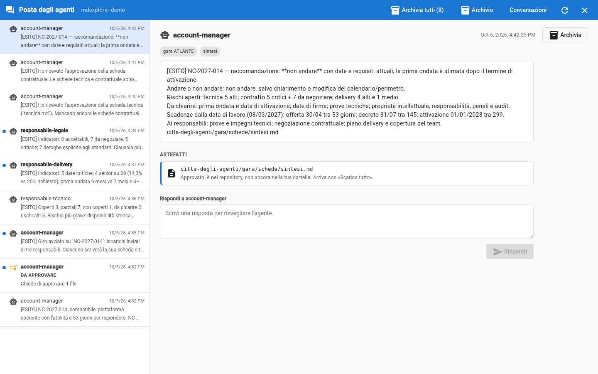

<b>Archivia</b> Nel dettaglio di un messaggio, in alto a destra: il messaggio esce dall'elenco.

<b>Archivia tutti</b> Nella barra in alto: svuota la posta. I lavori da approvare restano, perché vanno decisi.

<b>Non cancella niente</b> «Archivio» mostra ciò che hai archiviato; «Riporta in posta» lo rimette nell'elenco.

Note:
Un messaggio letto resta in elenco finché serve: leggere toglie solo il pallino. Archiviare è il gesto con cui dici «questo
è a posto». Dopo «Autorizza» un artefatto dice «approvato: arriva con Scarica tutto».

---

<!-- .slide: data-background-image="assets/citta-sfondo-chiaro.svg" -->

## La decisione è tua

GLI ASSISTENTI HANNO

letto il capitolato tre volte, con tre sguardi 
applicato i criteri della tua azienda 
incrociato le tre schede 
scritto cosa c'è da decidere

TU HAI

premuto «Avvia il giro» 
letto e verificato a campione 
approvato quattro volte 
<b>e ora decidi se partecipare</b>

«Non andare» è una **raccomandazione**. Se vuoi partecipare lo stesso, hai già l'elenco delle condizioni da ottenere.

Note:
La raccomandazione è una riga di una sintesi, non un impegno. Chi decide è l'account manager, cioè la persona. I «punti da
chiarire con il committente» sono la lista con cui presentarsi all'incontro tecnico.

---

<!-- .slide: data-background-image="assets/citta-sfondo-chiaro.svg" -->

## Gli otto gesti, in fila

PARTE 1 · CERCA

<b>1.</b> trova il robot 
<b>2.</b> scrivi cosa vuoi e lancia 
<b>3.</b> Apri il documento della ricerca 
poi controlla tu: due minuti

PARTE 2 · AVVIA E LEGGI

<b>4.</b> premi «Avvia il giro» 
<b>5.</b> Apri una scheda 
cinque minuti di attesa, col robot giallo nella barra

PARTE 3 · APPROVA E DECIDI

<b>6.</b> Autorizza le tre schede 
<b>7.</b> Autorizza la sintesi 
<b>8.</b> Scarica tutto

Prima di cominciare, una volta sola: **Sono tutti miei** e **Concedi trust**.

Note:
Otto gesti, quasi tutti dentro la posta degli agenti. Circa venti minuti, di cui una decina di attesa. I gesti si ripetono: Apri
e Autorizza sono gli stessi per la ricerca, per le schede e per la sintesi.

---

<!-- .slide: data-background-color="#0a1322" data-background-image="assets/citta-sfondo.svg" -->

# Il giro è finito

Loro hanno preparato. **Tu hai verificato e deciso.**

Note:
Chiusura. Per ripartire da zero basta ricreare il progetto con «Crea progetto demo».
