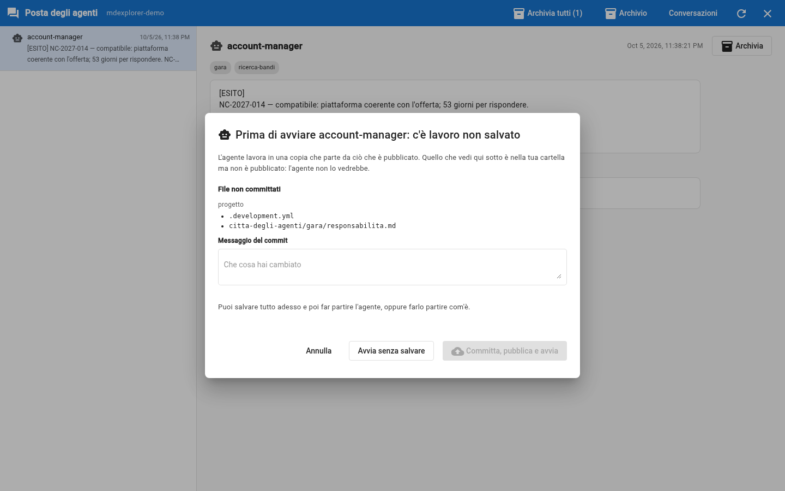
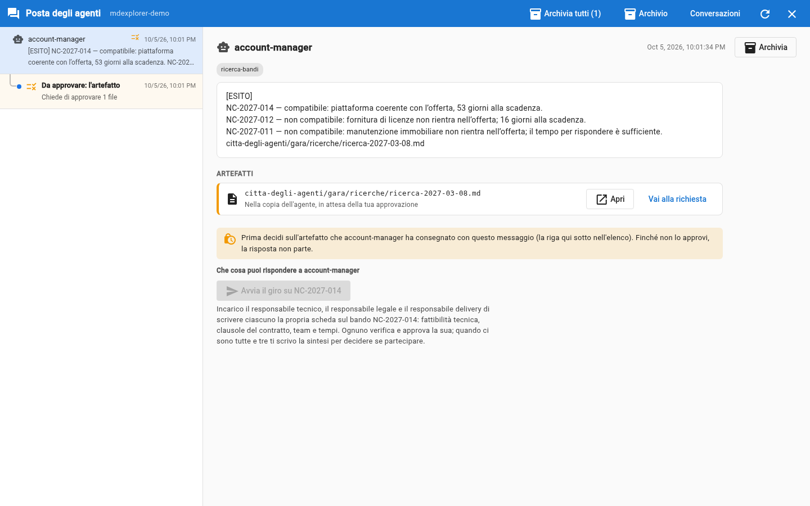

# Prova 3: l'account manager cerca il bando

## TL;DR

Sei l'account manager di Pentagroup e hai un agente che controlla per te il sito dei bandi di Nordica. Lo lanci, lui legge
le procedure in corso, le confronta con quelle già viste e con i criteri di Pentagroup, e produce **due cose**: un documento
con l'esito della ricerca e un messaggio breve che ti dice cosa propone. Non avvia niente da solo.

- Si lancia con l'icona del robot sul suo file, nel pannello di sinistra.
- **Il documento** va in `gara/ricerche/`: è il ragionamento completo, e lo approvi tu come ogni cosa scritta da un agente.
- **Il messaggio** arriva nella posta: poche righe che cominciano con `[ESITO]`, con il percorso del documento.

## Lancialo

1. Nel pannello di sinistra apri `.github` e poi `agents`. Sulla riga di `account-manager.agent.md` clicca l'icona del
   robot, «Lancia agente». Se il pannello è stretto, l'icona può essere tagliata: allargalo un po'.
2. Nella casella «Prompt di lancio» scrivi:

   > Controlla il portale dei bandi.

3. Lascia le altre opzioni come sono (motore del progetto, modello vuoto, «Lavora in un posto di lavoro isolato»
   spuntato) e clicca **Lancia ora**.

**La prima volta compare una finestra: «Prima di avviare account-manager: c'è lavoro non salvato».** È giusto così. Accendendo
la città e assegnandoti gli agenti hai modificato due file (`.development.yml` e `gara/responsabilita.md`), e l'agente
lavora in una copia che parte da ciò che è **pubblicato**: quei due file non li vedrebbe. Scrivi un messaggio, per esempio
«città accesa», e clicca **Committa, pubblica e avvia**. Va tutto nel tuo repository locale, non su quello pubblico del demo.



Dopo circa un minuto compare «🤖 Agente "account-manager.agent.md" completato.» e sul fumetto «Messaggi degli agenti»
nella barra degli strumenti compare un numero.

## Leggi il messaggio

Clicca il fumetto: si apre la posta degli agenti, a tutto schermo. Nell'elenco a sinistra c'è un messaggio di `account-manager`: cliccalo. Le parole cambiano, perché dietro c'è
un modello, ma il contenuto è questo:

```text
[ESITO]
NC-2027-014 — compatibile: piattaforma per tributi degli Enti Locali, con 53 giorni per rispondere.
NC-2027-012 — non compatibile: fornitura di licenze esclusa; mancano solo 16 giorni.
NC-2027-011 — non compatibile: manutenzione immobiliare, non servizi gestiti o piattaforme.
citta-degli-agenti/gara/ricerche/ricerca-2027-03-08.md
```

Sotto il messaggio c'è un **pulsante**: «Avvia il giro su NC-2027-014», con scritto che cosa succede premendolo (chi viene
incaricato, e per fare cosa). Le risposte possibili le dichiara la scheda dell'agente: tu non devi indovinare che cosa scrivere.
Sotto il pulsante c'è anche una casella, per scrivere all'agente con parole tue se qualcosa non ti torna. Per ora sono
**chiusi** tutti e due: prima devi decidere sulla ricerca.



## Leggi il documento

Il messaggio è il riassunto; il ragionamento sta nel documento. Sotto il testo del messaggio, nella sezione **Artefatti**, c'è
`gara/ricerche/ricerca-2027-03-08.md` con lo stato «nella copia dell'agente, in attesa della tua approvazione». Clicca **Apri**: il
documento si apre lì accanto. Dentro trovi:

- la tabella delle procedure trovate, con i giorni che mancano alla scadenza;
- per ogni procedura i cinque criteri: i due che bloccano (la natura del bando e il tempo per rispondere) li giudica
  l'account manager; gli altri tre dicono «da valutare nel giro», e da chi;
- le procedure già nel registro, che non ha valutato.

**Compatibile** qui vuol dire «merita il giro dei tre responsabili», non «conviene partecipare»: quello lo diranno le loro schede.

Clicca **Torna**. Nell'elenco a sinistra, **sotto** il messaggio dell'account manager, c'è la riga rientrata «Da approvare:
l'artefatto»: è la richiesta di approvazione di questa ricerca. Cliccala e premi **Autorizza**: la ricerca entra nel progetto.

Solo adesso il pulsante «Avvia il giro» si apre. È una regola dell'app, non una cortesia dell'agente: un lavoro non passa
avanti finché non hai approvato quello che lo giustifica.

## Controllalo

Questo è il gesto che ti viene chiesto in tutto il caso: **verifichi**, non ti fidi. Tre controlli, due minuti:

1. Apri il [sito dei bandi](../gara/portale-nordica/bandi.md): le tre procedure in corso ci sono tutte? I codici sono giusti?
2. Apri il [profilo di Pentagroup](../gara/profilo-pentagroup.md), in fondo: i criteri sono quelli che l'agente cita? La
   «Data di lavoro» è l'8 marzo 2027: da lì alla scadenza di NC-2027-012 (24 marzo) sono **16 giorni**, e a quella di
   NC-2027-014 (30 aprile) sono **53**. Tornano?
3. Apri il [registro](../gara/registro-bandi.md): le due procedure già viste **non** sono nel messaggio. Perché?

## Cosa è successo

- L'agente ha letto tre file, e solo quelli: sono i suoi documenti.
- Ha **scartato** due procedure con un motivo che puoi controllare, e ne ha proposta una.
- Ha prodotto **due output**: il documento della ricerca e il messaggio. Il messaggio non contiene il documento, dice dov'è.
- Ha chiuso con una **domanda** e non con un'azione: l'avvio del giro lo decidi tu, con una risposta.
- Nella tua cartella non è cambiato niente: il documento sta in una copia a parte finché non lo approvi.

## E se non succede niente

- **Nessun avviso dopo due minuti.** Il motore AI non risponde: controlla che la riga di comando (`copilot`, `claude` o
  `opencode`) sia installata e con l'accesso fatto, o scegli un altro motore nella finestra di lancio.
- **Il fumetto non ha il numero.** Apri la posta e clicca la freccia circolare in alto a destra.
- **L'agente dice che non trova i file.** Controlla di aver aperto la cartella giusta: gli agenti cercano i documenti in
  `citta-degli-agenti/gara/`.

[Prova 4: avvia il giro](04-avvia-il-giro.md) · [Prova 2](02-abilita-gli-agenti.md) · [Indice della sezione](../README.md)
