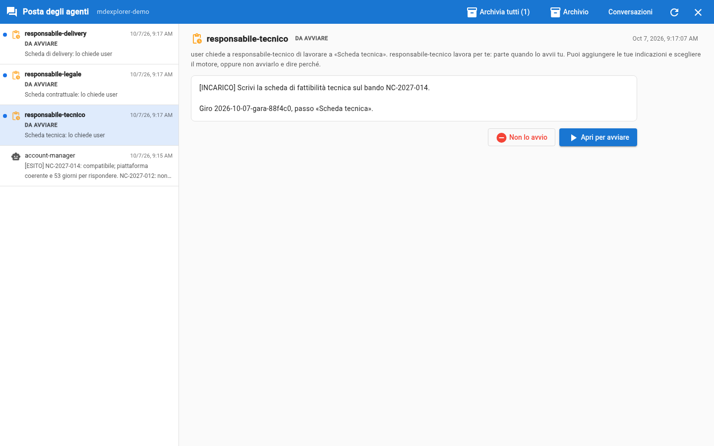
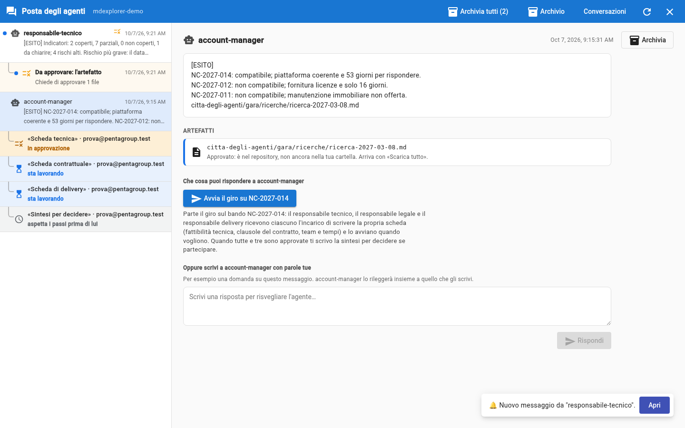
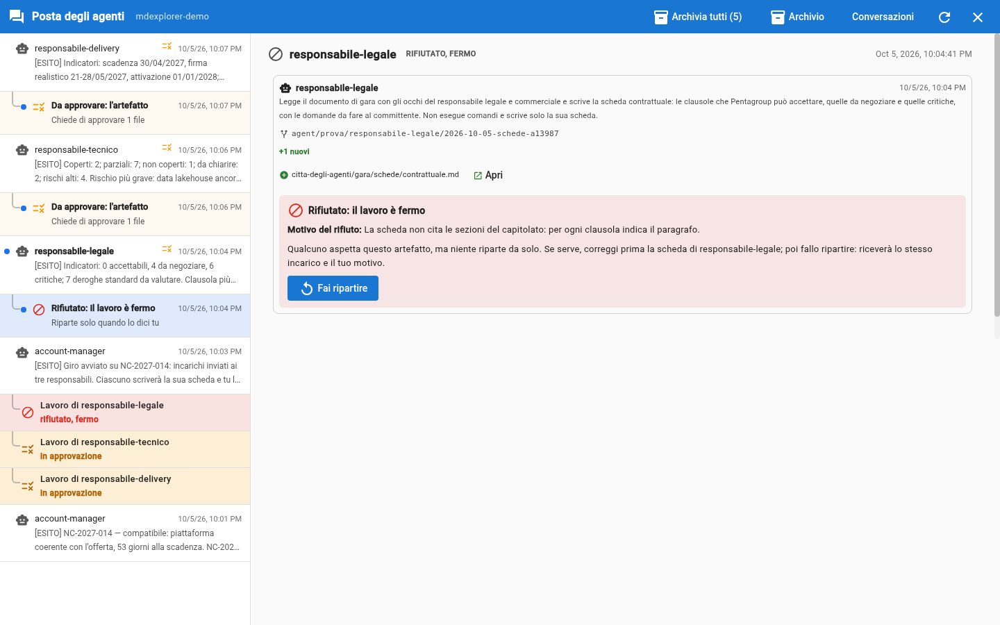

# Prova 4: avvia il giro e leggi le schede

## TL;DR

Approvata la ricerca, premi il pulsante «Avvia il giro» sotto il messaggio dell'account manager. Da lì i passaggi li fa
MdExplorer, seguendo il [workflow della gara](../gara/workflow.md): ogni responsabile trova nella posta la sua scheda «da
avviare», la avvia, e il suo agente legge lo stesso capitolato con i **suoi** occhi. Tu segui il giro dal messaggio da cui
l'hai avviato, e leggi ogni scheda prima di approvarla.

- Il pulsante non sveglia l'account manager: apre il giro, e le tre schede compaiono «da avviare».
- Sotto il messaggio c'è una riga per ogni passo del giro, che cambia stato da sola.
- Le tre schede arrivano in circa 3-5 minuti; una scheda si legge con **Apri**, prima di approvarla.

## Premi «Avvia il giro»

1. Clicca il fumetto e, nell'elenco, il messaggio di `account-manager` della prova 3.
2. Sotto il testo c'è **Che cosa puoi rispondere a account-manager**, con il pulsante **Avvia il giro su NC-2027-014** e la
   sua descrizione: il responsabile tecnico, il legale e il delivery ricevono ciascuno l'incarico di scrivere la propria
   scheda, e la avviano quando vogliono.
3. Premilo.

Se il pulsante è chiuso e c'è scritto «Prima decidi sull'artefatto», non hai ancora approvato la ricerca: è il passo
finale della prova 3. Se un agente avesse più responsabili (un team), sotto il pulsante comparirebbe «Chi lo fa?» con
l'elenco delle persone: si sceglie lì, prima di avviare il giro.

Nell'elenco compaiono subito tre righe nuove, **Da avviare**: una per scheda, con l'incarico che il workflow ha scritto per
quel responsabile e il bando a cui si riferisce. Lo chiede «il giro del workflow»: nessun agente ha scritto agli altri.



## Avvia le tre schede

Per ogni riga **Da avviare**:

1. Cliccala: leggi l'incarico.
2. **Apri per avviare** apre la finestra di lancio dell'agente con l'incarico dentro. Puoi aggiungere le tue indicazioni
   («guarda prima il capitolo 6») e scegliere motore e modello; poi **Avvia**.
3. Se compare «Prima di avviare…: c'è lavoro non salvato», è per i due file che hai cambiato nelle prove 1 e 2
   (`.development.yml` e `responsabilita.md`): non servono all'agente, quindi scegli **Avvia senza salvare**.

Se una scheda non vuoi farla, **Non lo avvio** ti chiede il perché: il passo si chiude, e chi segue il giro legge il motivo.
In un team c'è anche **Passa a un collega**, per darla a chi risponde dello stesso agente.

## Segui il giro

Clicca il messaggio dell'account manager da cui hai premuto il pulsante. Nell'elenco, **sotto** di lui, c'è una riga per
ogni passo del giro, con il suo titolo e chi ne risponde:

| Riga | Che cosa vuol dire | Sfondo |
|---|---|---|
| aspetta che il responsabile lo avvii | la scheda è «da avviare» nella posta di chi ne risponde | ambra |
| sta lavorando | l'agente sta scrivendo la scheda | azzurro |
| in approvazione | la scheda c'è: aspetta la decisione del suo responsabile | ambra |
| approvato | la scheda è nel progetto | verde |
| rifiutato, fermo | il responsabile l'ha rifiutata: non riparte da sola | rosso |
| aspetta i passi prima di lui | la sintesi: parte quando le tre schede sono approvate | grigio |



Le righe cambiano da sole, e quando una cambia lampeggia per qualche secondo. È quello che vede **chi ha avviato il giro**:
qui l'account manager. Nel demo le quattro persone sei tu; in azienda queste righe gli dicono a che punto è ciascun
collega, senza chiederglielo, anche se i colleghi lavorano su altri computer.

Ci vogliono circa **3-5 minuti**. Ogni responsabile ti scrive un messaggio `[ESITO]` di poche righe, per esempio:

```text
[ESITO]
Indicatori: 2 coperti, 7 parziali, 0 non coperti, 1 da chiarire; 4 rischi alti.
Rischio più grave: il data lakehouse non ha ancora la qualifica ACN (§3.3).
citta-degli-agenti/gara/schede/tecnica.md
```

Sotto ognuno di questi messaggi c'è la sua riga «Da approvare: l'artefatto».

## Leggi una scheda prima di approvarla

Prendi il messaggio di `responsabile-delivery`: è quello con il calcolo più facile da controllare.

1. Clicca la riga «Da approvare: l'artefatto» sotto il suo messaggio.
2. Sul file `citta-degli-agenti/gara/schede/delivery.md` clicca **Apri**: lo leggi impaginato, com'è nella consegna dell'agente.
3. **Torna** riporta alla richiesta. Non approvare ancora: lo fai nella prova 5.

Cosa guardare, in ordine:

- **«Da verificare da te»**, in fondo. L'agente ti dice dove è meno sicuro: controlla lì per primo.
- **Ogni affermazione cita la sezione del capitolato** (per esempio «§7.4.7»). Aprila nel [capitolato](../gara/capitolato.md)
  e controlla che dica quello che la scheda dice.
- **Il calcolo delle date.** La scheda delivery scrive il calcolo accanto al risultato: «9 mesi dalla firma» contro
  «attivazione entro il 01/01/2028». Rifallo a mano.

## Se una scheda non ti convince

La strada normale è **correggerla tu**: dal selettore del ramo scegli «Worktree» e l'agente, e lavori nella sua copia come dopo
un cambio di ramo. Sistemi la scheda, torni al tuo lavoro (l'app ti chiede di committare e pubblicare) e poi la approvi.
È spiegato in [Lavorare nella copia di un agente](../guida/lavorare-nella-copia-di-un-agente.md).

**Rifiuta** è l'eccezione, per quando la scheda è così sbagliata che conviene rifarla. Ti chiede il motivo, e poi **ferma**:

- la scheda resta nella posta come «Rifiutato: il lavoro è fermo», e la sua riga nel giro diventa rossa;
- **niente riparte da solo**: se l'errore viene dalla scheda dell'agente (il file `.agent.md`), hai il tempo di correggerla;
- quando sei pronto premi **Fai ripartire**: l'agente riceve lo stesso incarico, più il tuo motivo. Il workflow della gara
  non mette un limite alle volte.



## Cosa è successo

- Il pulsante ha aperto un **giro**: MdExplorer ha letto nel workflow che «Avvia il giro» fa partire le tre schede, e le ha
  messe «da avviare» nella posta di chi ne risponde. Se la ricerca avesse trovato due bandi, ci sarebbero stati due
  pulsanti, e ogni pulsante avrebbe aperto il suo giro.
- I tre agenti hanno letto **lo stesso capitolato** ma ognuno ha letto **il suo capitolo del profilo di Pentagroup**: il
  tecnico quello tecnico, il legale quello dei contratti, il delivery quello delle persone. Per questo le tre schede
  dicono cose diverse.
- Hanno lavorato ciascuno nella **sua copia** del progetto, in parallelo, e consegnato un file diverso: per questo le
  richieste sono tre e non una.
- Nessuna scheda è nel progetto: sono rami da approvare. Il lavoro è tuo finché non lo approvi.

## E se non succede niente

- **Dopo il pulsante non compare nessun «Da avviare».** Controlla che in «Impostazioni Progetto» la città abbia il
  documento del workflow (`citta-degli-agenti/gara/workflow.md`): senza, il pulsante sveglia l'account manager e basta.
- **Dopo cinque minuti una riga dice ancora «sta lavorando».** Aspetta: il robot nella barra in alto gira finché
  qualcuno lavora.
- **Un responsabile dice di non trovare i documenti.** Non inventa la scheda: te lo scrive. Controlla di aver aperto
  la cartella giusta.
- **Il numero degli indicatori è diverso dal mio.** Normale: un modello non dà due volte le stesse parole. Cambiano le
  parole e qualche conteggio; i divari veri (RPO, qualifica ACN, date) no.

[Prova 5: approva, e il giro va avanti](05-approva-e-passa-il-lavoro.md) · [Prova 3](03-l-account-manager-cerca-il-bando.md) · [Indice della sezione](../README.md)
