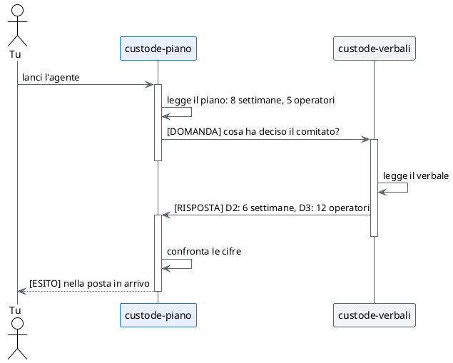

# Prova 4: il dialogo tra due agenti

## TL;DR

Ogni agente conosce solo il proprio documento. Per scoprire se dice la stessa cosa degli altri, deve **chiederlo al
collega** che li conosce. Questa prova ti fa lanciare un agente e guardare che cosa si scrivono: la conversazione
si vede nella finestra «Messaggi degli agenti» e il risultato ti arriva nella posta in arrivo.

- Lanci `custode-piano`, che legge il piano e chiede al collega cosa ha deciso il comitato.
- `custode-verbali` risponde: i messaggi sono due, e finiscono lì.
- Il risultato ti arriva come `[ESITO]`: tre differenze, ciascuna con documento e punto.

## Prima di cominciare

Servono la città accesa ([prova 1](01-accendi-la-citta.md)) e i tre agenti fidati ([prova 2](02-registro-e-fiducia.md)).
Se un collega non è fidato, `custode-piano` non lo vede nella rubrica e non può scrivergli.

## Lancia l'agente

1. Nel pannello di sinistra apri la cartella `.github` e poi `agents`.
2. Sulla riga di `custode-piano.agent.md` clicca l'icona del **robot**, «Lancia agente». Se il pannello è stretto
   l'icona può essere tagliata: allargalo un po'.
3. Nella casella «Prompt di lancio» scrivi:

   > Controlla il tuo piano contro le decisioni del comitato.

4. Lascia spuntata la casella «Lavora in un posto di lavoro isolato» e clicca **Lancia ora**.

Compare «Agente "custode-piano.agent.md" avviato in background». Il giro intero dura uno o due minuti: ogni
agente deve leggere un file e ragionare.

## Guarda la conversazione

Apri «Messaggi degli agenti» (il fumetto nella barra degli strumenti) e vai alla scheda **Conversazioni**. Vedi un
thread con:

- lo stato, «attiva»;
- il contatore dei passaggi, **2/6**: due messaggi su un massimo di sei;
- i partecipanti, `custode-piano` e `custode-verbali`;
- tre pulsanti: **Vedi messaggi**, **Consolida** e **Termina thread**.

Clicca **Vedi messaggi**. Sono due:

1. `custode-piano` → `custode-verbali`, che comincia con **`[DOMANDA]`**: le tre cifre che il piano contiene
   (durata, persone, dati dei ticket) e la richiesta di dirgli cosa ha deciso il comitato.
2. `custode-verbali` → `custode-piano`, che comincia con **`[RISPOSTA]`**: le decisioni D2, D3 e D4 con le righe
   del verbale.

## Leggi il risultato

Quando il giro finisce, sul fumetto compare un numero: è un messaggio non letto. Aprilo, scheda **Posta in
arrivo**. C'è un messaggio di `custode-piano` che comincia con **`[ESITO]`**. Dice, per ogni differenza, le due
cifre e il punto:

| Cosa non torna | Nel piano | Nel verbale |
|---|---|---|
| La durata | 8 settimane | 6 settimane (D2) |
| Le persone | cinque nella fase ristretta, poi «tutti», nessun totale | 12 operatori del turno diurno (D3) |
| I dati dei ticket | da chiarire col DPO prima della fase 3 | nessun testo esce senza anonimizzazione (D4) |

Le parole cambiano da una volta all'altra: è un modello, non uno script. Le tre differenze, no.

## Perché solo due messaggi

Gli agenti seguono un piccolo protocollo, scritto nella loro scheda: una **domanda** si scrive solo quando ti ha
lanciato una persona, a una **risposta** non si replica, e il risultato per te è l'**esito**. Senza queste regole
due agenti educati continuerebbero a ringraziarsi.

E se non bastasse? Ogni conversazione ha un **tetto di sei passaggi**: al sesto si ferma da sola, il thread diventa
«esaurita» e solo tu puoi riaprirlo, con **Riapri**. **Termina thread** la chiude subito. Il tetto sta nella scheda,
alla riga `max_hops`.

## Prova anche l'altro

Ripeti con `custode-requisiti` e la richiesta «Controlla i tuoi requisiti contro le decisioni del comitato.». Il suo
esito riporta le differenze dal suo punto di vista: **20 operatori contro 12** e **il requisito R6 contro la decisione
D4**, oltre alla durata.

[Prova 5: la fiducia che decade](05-la-fiducia-che-decade.md) · [Indice della sezione](../README.md)
