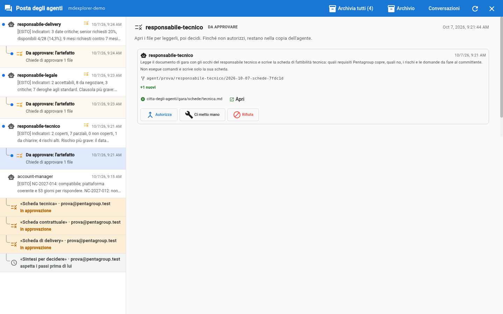
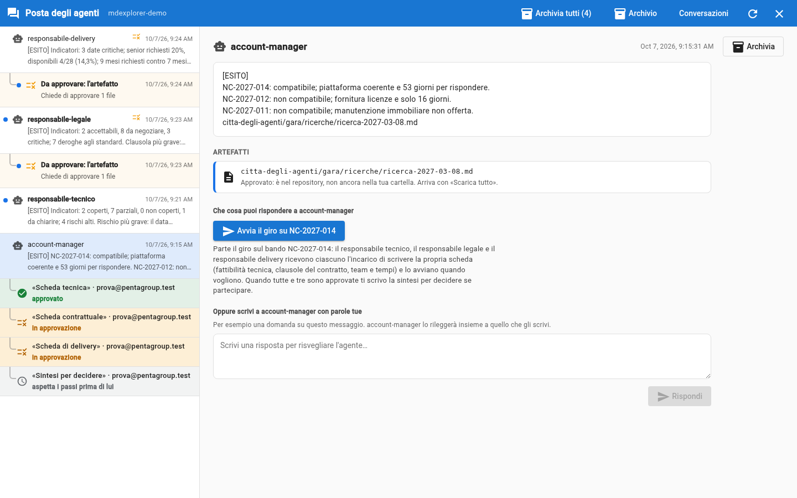

# Prova 5: approva, e il giro va avanti

## TL;DR

Approvare una scheda la porta nel ramo principale e la scrive nel registro del giro. Non devi passarla a nessuno: chi viene
dopo lo dice il workflow, e MdExplorer lo fa partire. Dopo la terza approvazione la sintesi dell'account manager parte da
sola, con i file delle tre schede.

- Nella richiesta ci sono i tre gesti di sempre: **Autorizza**, **Ci metto mano**, **Rifiuta**.
- Sotto il messaggio da cui hai avviato il giro, la riga di ogni scheda approvata diventa verde.
- Nessun agente si scrive con un altro: la sintesi la fa partire il giro.

## Approva la prima scheda

1. Nella posta, sotto il messaggio di `responsabile-tecnico`, clicca la riga rientrata **Da approvare: l'artefatto**.

   

2. Clicca **Autorizza**: la scheda entra nel ramo principale del repository.

Ora clicca il messaggio dell'account manager da cui hai avviato il giro: la riga «Scheda tecnica» è diventata **verde**,
approvato. Le altre due sono ancora ambra, in approvazione, e la sintesi aspetta.

## Approva la seconda e la terza

Ripeti con `responsabile-legale` e con `responsabile-delivery`. Dopo la terza, entro un minuto la riga «Sintesi per
decidere» passa da «aspetta i passi prima di lui» a «sta lavorando»: l'account manager sta scrivendo la sintesi.

## Cosa è successo, passo per passo

| Tuo gesto | Cosa fa MdExplorer |
|---|---|
| **Autorizza** la prima e la seconda scheda | le porta nel ramo principale e scrive «approvato» nel registro del giro; la sintesi aspetta ancora |
| **Autorizza** la terza | come sopra; ora il workflow dice che la sintesi può partire: MdExplorer manda l'incarico all'account manager, con i percorsi delle tre schede approvate |

La sintesi parte **sul computer dell'account manager**: è lui che ha lanciato il giro, e la sintesi è del suo agente. Non
c'è niente da avviare a mano: il workflow la dichiara «parte da sola» (si vede nel [diagramma](../gara/workflow.md)).

Il registro del giro sta in git, su un ramo a parte (`mde/giri`): ogni gesto ci aggiunge una riga, con chi l'ha fatto e
quando. In azienda è lì che i computer delle quattro persone leggono a che punto è il giro.

## Se rifiuti una scheda

La sintesi **non parte**: aspetta tutte e tre le schede approvate. La scheda rifiutata resta ferma finché il suo
responsabile non preme **Fai ripartire**; quando la nuova versione è approvata, il giro va avanti da dove era.

## E se non succede niente

- **Dopo la terza approvazione la sintesi resta «aspetta i passi prima di lui».** Controlla che le tre righe siano verdi:
  se una è ancora ambra, quella scheda non è approvata. La posta si rilegge da sola; per forzarla, la freccia circolare in
  alto a destra.
- **Una riga dice «non riuscito».** Passaci sopra con il mouse: il motivo è nel suggerimento.

[Prova 6: la sintesi e la tua decisione](06-la-sintesi-e-la-tua-decisione.md) · [Prova 4](04-avvia-il-giro.md) · [Indice della sezione](../README.md)
