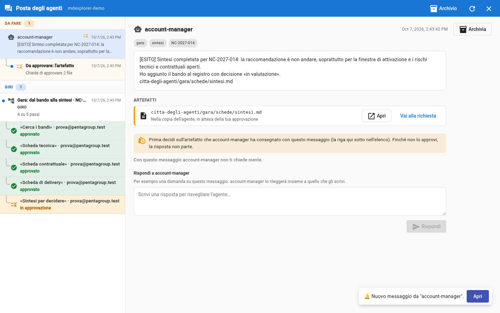
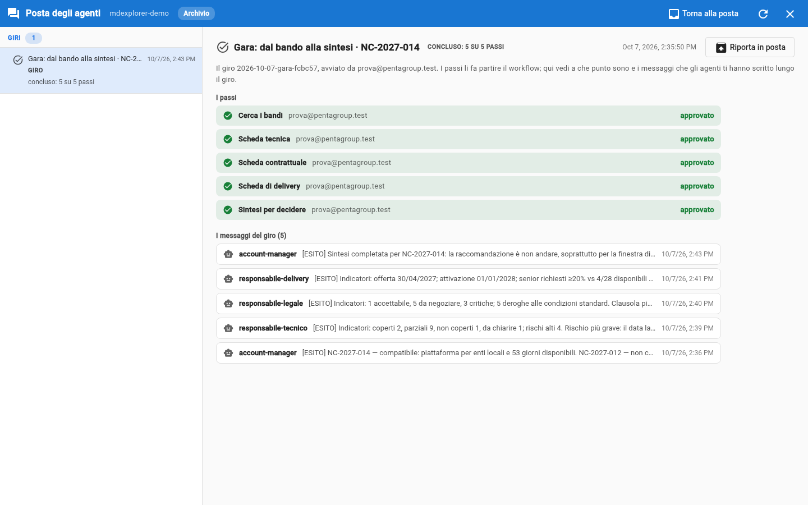

# Prova 6: la sintesi e la tua decisione

## TL;DR

Con le tre schede approvate, la sintesi parte da sola: l'account manager scrive i cinque indicatori che interessano a lui e
aggiorna il registro dei bandi. È una **quarta richiesta**, e la approvi tu come le altre. La decisione di partecipare,
invece, non è di nessun agente: è tua.

- La sintesi mette insieme le tre schede e dice dove si sommano o si contraddicono.
- La raccomandazione è una proposta («andare», «andare a condizioni», «non andare»).
- Anche la sintesi ha «Da verificare da te»: il punto in cui il suo autore è meno sicuro.

## Leggi la sintesi

1. Dopo l'approvazione della terza scheda, aspetta un paio di minuti: `account-manager` ti scrive un messaggio con la
   raccomandazione e i cinque indicatori. Nel giro, la riga «Sintesi per decidere» dice «in approvazione».
2. Sotto quel messaggio c'è la riga **Da approvare: l'artefatto**: è la richiesta di `account-manager`, con due file,
   `schede/sintesi.md` e `registro-bandi.md`.
3. Come nella prova 4: sul file `sintesi.md` clicca **Apri**, leggi, poi **Torna**.

   

## I cinque indicatori

| Indicatore | Cosa dice |
|---|---|
| **Andare o non andare** | la raccomandazione, con il motivo in due righe |
| **Rischi aperti per area** | quanti per tecnica, contratto e delivery, e il più grave di ciascuna |
| **Punti da chiarire con il committente** | l'elenco per l'Allegato C: ogni punto con l'area e la sezione del capitolato |
| **Scadenze** | offerta, decreto attuativo, attivazione richiesta, con i giorni che mancano dall'8 marzo 2027 |
| **Cosa serve da ciascun responsabile** | un elenco per persona |

## Cerca dove le schede si parlano

È la parte che un solo agente non potrebbe fare: **«Dove le schede si sommano o si contraddicono»**. Con le tre schede
davanti, di solito trovi che:

- tecnica e legale sono d'accordo su uno scarto della normativa DORA: la notifica degli incidenti che Pentagroup garantisce
  non corrisponde a quella che il capitolato richiede;
- il responsabile delivery ha calcolato che la prima ondata di lavoro richiede più mesi di quelli che restano prima della
  data di attivazione richiesta, anche nel caso più favorevole. Per questo la raccomandazione, di solito, è **non andare**.

**Controlla tu.** Prendi un punto della sintesi e risali: cita la scheda, la scheda cita il capitolato. Tre salti, e sei
alla frase originale. Se un punto non regge, ti sei appena guadagnato la ragione per non approvare.

## Approva, o no

Approva la sintesi con **Autorizza**: è l'ultimo passo del giro, e tutte le sue righe ora sono verdi. Il registro dei bandi
ora contiene la gara, «in valutazione».

Se non sei d'accordo, la strada normale è correggerla tu: entri nella copia dell'agente dal selettore del ramo («Worktree»),
sistemi la sintesi, torni al tuo lavoro e la approvi. **Rifiuta** è l'eccezione: ti chiede il motivo e chiude lì. La sintesi
è l'ultimo passo del giro, quindi nessuno la aspetta: dopo il rifiuto **Fai ripartire** la fa riscrivere con il tuo motivo.

## La decisione è tua

Gli agenti hanno **preparato**: hanno letto un capitolato lungo, applicato i criteri della tua azienda,
incrociato le competenze e scritto cosa serve decidere. Ma non hanno deciso, e non potevano: la raccomandazione è una
riga di una sintesi, non un impegno. Se vuoi partecipare lo stesso, la scelta è dell'account manager, cioè tua, e la
sintesi ti ha dato la lista delle condizioni da ottenere: i punti da chiarire con il committente.

## Metti in ordine

Il giro è concluso: nella sezione «Giri» dice «concluso: 5 su 5 passi». Selezionalo e premi **Archivia il giro**: esce dalla
posta con tutti i suoi messaggi. Lo ritrovi in **Archivio**, nella barra in alto, con «Riporta in posta». Il registro del giro
non cambia: archiviare riguarda solo la tua posta.

## Dopo la prova

Il demo ha creato un ramo e dei file nel tuo clone: per leggere la sintesi nella tua cartella, scarica gli aggiornamenti
con il pull dalla barra git. Se vuoi ripartire da zero, riapri il demo con «Crea progetto demo».

## E se non succede niente

- **Non arriva il messaggio con la sintesi.** Nel giro, nella sezione «Giri», le tre righe delle schede
  devono essere verdi (approvato): se una è ancora ambra, quella scheda non è approvata.
- **La sintesi dice che non può calcolare i giorni.** Non ha trovato la «Data di lavoro» nel profilo: controlla che il
  [profilo di Pentagroup](../gara/profilo-pentagroup.md) sia intatto.

[Indice della sezione](../README.md) · [Prova 5](05-approva-e-passa-il-lavoro.md) · [Torna all'inizio](../../README.md)
