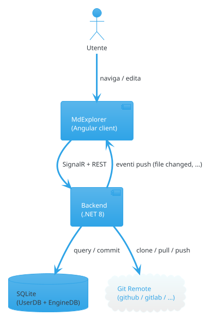
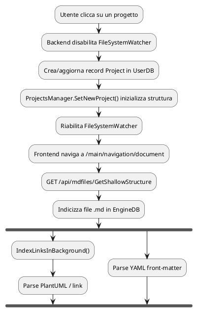

# 🏗️ Architettura

Questo file mostra come MdExplorer renderizza un diagramma **PlantUML embedded** in markdown.

## Vista d'insieme

> Il diagramma sopra è **renderizzato live** da MdExplorer. Per modificarlo, cliccaci sopra: si apre l'editor PlantUML, salvi e il render si aggiorna istantaneamente.

## Flow di un'apertura progetto

## Riferimenti

- [Feature MDE-specifiche](features.md) — l'altra metà di `docs/`
- [README del progetto demo](../README.md) — torna alla home
- [Sintassi markdown](../02-markdown-basics.md) — sintassi base

---

*Vedi anche: PlantUML è renderizzato per-block in modo isolato (vedi commit `51d7583b` di MDE) per evitare che un errore in un diagramma blocchi gli altri.*
