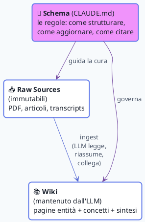

# 🛰️ LLM Wiki con MdExplorer

> **MdExplorer è l'IDE; l'LLM è il programmatore; il wiki è il codebase.**
> — adattamento dell'idea di Karpathy (LLM Wiki, Aprile 2026)

Questa cartella è un **esempio funzionante** del pattern **LLM Wiki** proposto da [Andrej Karpathy](https://gist.github.com/karpathy/442a6bf555914893e9891c11519de94f) ad Aprile 2026, **applicato nativamente a MdExplorer** — dove tutti gli ingredienti (markdown project, Git, CLAUDE.md, LLM locale, PlantUML, search semantico) sono integrati in un'unica app.

L'idea, in una frase: invece di fare retrieval (RAG) su documenti grezzi ad ogni domanda — riscoprendo le stesse cose mille volte — si lascia che un agente AI **mantenga un wiki strutturato in markdown** che cresce e si raffina nel tempo. Ogni risposta utile diventa una nuova pagina del wiki. La conoscenza **compone** invece di evaporare.

## 🧱 I tre livelli

| Layer | Cos'è | Chi lo modifica |
|---|---|---|
| **📥 Raw Sources** | I documenti originali (PDF, articoli, screenshot, transcript) — **mai modificati** | Il curatore umano (li raccoglie, li annota) |
| **📚 Wiki** | Pagine markdown sintetiche: entità, concetti, riassunti, sintesi, indice, log | L'LLM (riscrive, aggiorna cross-reference, risolve contraddizioni) |
| **📜 Schema** | Un singolo file (`CLAUDE.md`) che dice all'LLM **come** strutturare il wiki | L'umano lo definisce, l'LLM lo segue |

## 🗺️ Naviga la demo

| Cartella | Contiene |
|---|---|
| [`CLAUDE.md`](CLAUDE.md) | **Lo schema** — le regole che l'LLM segue per mantenere questo wiki |
| [`index.md`](index.md) | **Catalogo** orientato al contenuto — una riga per pagina, raggruppato per categoria |
| [`log.md`](log.md) | **Diario** append-only di ingest, query e operazioni di lint |
| [`sources/`](sources/) | I documenti grezzi (immutabili) e i loro riassunti |
| [`entities/`](entities/) | Pagine entità (persone, organizzazioni, prodotti) |
| [`concepts/`](concepts/) | Pagine concetto (idee, pattern, tecniche) |
| [`diagrams/`](diagrams/) | Diagrammi PlantUML che spiegano il funzionamento |

## 📊 Diagrammi del flusso

| Diagramma | Cosa illustra |
|---|---|
| [Use case](diagrams/use-case.md) | Chi fa cosa nel sistema (umano + agente AI + MdExplorer) |
| [Workflow di ingest](diagrams/workflow-ingestion.md) | Cosa succede quando arriva una nuova fonte |
| [Sequence di query](diagrams/sequence-query.md) | Come una domanda diventa una risposta (e una nuova pagina) |

## 🪄 Perché MdExplorer è il sostrato perfetto

Il pattern LLM Wiki può essere implementato con setup multi-app (editor markdown generico + Git CLI + agenti AI esterni configurati a mano). MdExplorer **integra tutto out-of-the-box** in un'unica app cross-platform, senza configurazione:

| Bisogno LLM Wiki | Feature MDE che lo soddisfa |
|---|---|
| Strutturare progetti markdown con cross-link | Project-based, link tracking nativo |
| Schema document letto da agenti AI | `CLAUDE.md` (o `.github/copilot-instructions.md`) già supportati |
| Versioning del wiki (vedere cosa l'LLM ha cambiato) | Git integrato (commit/push/diff/blame) |
| Trovare velocemente una pagina | Full-text search + indicizzazione semantica con embeddings locali |
| Diagrammi nelle pagine concetto | PlantUML embedded con render live |
| Eseguire l'LLM senza cloud | LLamaSharp + supporto modelli locali |
| Embed agenti esterni (Claude Code, Copilot CLI) | App Store interno + iframe via `.mdeapps.json` |

## ▶️ Da dove iniziare

1. Apri [`CLAUDE.md`](CLAUDE.md) — capisci le regole
2. Sfoglia [`index.md`](index.md) — vedi la mappa del wiki
3. Apri una pagina entità (es. [`entities/karpathy.md`](entities/karpathy.md)) — vedi com'è scritta
4. Guarda [`log.md`](log.md) — segui la storia del wiki
5. Esamina [`diagrams/use-case.md`](diagrams/use-case.md) — vedi il flusso completo

## 📚 Riferimenti

- [Karpathy — gist originale](https://gist.github.com/karpathy/442a6bf555914893e9891c11519de94f)
- [README del progetto demo](../README.md) — torna alla home
- [Sito ufficiale MdExplorer](https://www.mdexplorer.net)

---

*Mark — l'astronauta — ti accompagna durante il tour del LLM Wiki. Premi `?` se ti perdi.*
