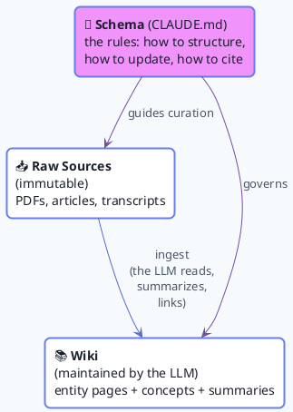

# 🛰️ LLM Wiki with MdExplorer

> **MdExplorer is the IDE; the LLM is the programmer; the wiki is the codebase.**
> — adapted from Karpathy's idea (LLM Wiki, April 2026)

This folder is a **working example** of the **LLM Wiki** pattern proposed by [Andrej Karpathy](https://gist.github.com/karpathy/442a6bf555914893e9891c11519de94f) in April 2026, **applied natively to MdExplorer** — where all the ingredients are built into a single app: markdown project, Git, CLAUDE.md, an AI agent (GitHub Copilot, Claude Code or opencode), PlantUML, full-text search.

The idea, in one sentence: instead of running retrieval (RAG) on raw documents at every question — rediscovering the same things a thousand times — you let an AI agent **maintain a structured markdown wiki** that grows and gets better over time. Every useful answer becomes a new wiki page. Knowledge **compounds** instead of evaporating.

## 🧱 The three layers

```plantuml
@startuml
skinparam backgroundColor #f7fafc
skinparam shadowing false
skinparam roundCorner 12
skinparam DefaultFontName Helvetica
skinparam DefaultFontColor #1a202c
skinparam ArrowColor #5568d3
skinparam ArrowFontColor #4a5568
skinparam rectangle {
  BackgroundColor #ffffff
  BorderColor #667eea
  FontColor #1a202c
  BorderThickness 2
}

rectangle "📥 **Raw Sources**\n(immutable)\nPDFs, articles, transcripts" as raw
rectangle "📚 **Wiki**\n(maintained by the LLM)\nentity pages + concepts + summaries" as wiki
rectangle "📜 **Schema** (CLAUDE.md)\nthe rules: how to structure,\nhow to update, how to cite" as schema #f093fb

raw --> wiki : ingest\n(the LLM reads,\nsummarizes,\nlinks)
schema -[#764ba2]-> wiki : governs
schema -[#764ba2]-> raw : guides curation
@enduml
```

| Layer | What it is | Who changes it |
|---|---|---|
| **📥 Raw Sources** | The original documents (PDFs, articles, screenshots, transcripts) — **never modified** | The human curator (collects them, annotates them) |
| **📚 Wiki** | Short markdown pages: entities, concepts, summaries, syntheses, index, log | The LLM (rewrites, updates cross-references, resolves contradictions) |
| **📜 Schema** | A single file (`CLAUDE.md`) that tells the LLM **how** to structure the wiki | The human defines it, the LLM follows it |

## 🗺️ Browse the demo

| Folder | Contains |
|---|---|
| [`CLAUDE.md`](CLAUDE.md) | **The schema** — the rules the LLM follows to maintain this wiki |
| [`index.md`](index.md) | Content-oriented **catalogue** — one line per page, grouped by category |
| [`log.md`](log.md) | Append-only **journal** of ingests, queries and lint runs |
| [`sources/`](sources/) | The raw documents (immutable) and their summaries |
| [`entities/`](entities/) | Entity pages (people, organizations, products) |
| [`concepts/`](concepts/) | Concept pages (ideas, patterns, techniques) |
| [`diagrams/`](diagrams/) | PlantUML diagrams that explain how it works |

## 📊 Flow diagrams

| Diagram | What it shows |
|---|---|
| [Use case](diagrams/use-case.md) | Who does what in the system (human + AI agent + MdExplorer) |
| [Ingest workflow](diagrams/workflow-ingestion.md) | What happens when a new source arrives |
| [Query sequence](diagrams/sequence-query.md) | How a question becomes an answer (and a new page) |

## 🪄 Why MdExplorer is the perfect foundation

The LLM Wiki pattern can be implemented with a multi-app setup (a generic markdown editor + the Git CLI + external AI agents configured by hand). MdExplorer **integrates everything out of the box** in a single cross-platform app, with no configuration:

| LLM Wiki need | MDE feature that meets it |
|---|---|
| Structure markdown projects with cross-links | Project-based, native link tracking |
| Schema document read by AI agents | `CLAUDE.md` (or `.github/copilot-instructions.md`) already supported |
| Versioning of the wiki (see what the LLM changed) | Built-in Git (commit/push/diff/blame) |
| Find a page quickly | Full-text search |
| Diagrams in concept pages | Embedded PlantUML with live rendering |
| Run the LLM that maintains the wiki | An AI agent (GitHub Copilot, Claude Code or opencode) |
| Embed external agents (Claude Code, Copilot CLI) | Internal App Store + iframe via `.mdeapps.json` |

## ▶️ Where to start

1. Open [`CLAUDE.md`](CLAUDE.md) — understand the rules
2. Browse [`index.md`](index.md) — see the map of the wiki
3. Open an entity page (e.g. [`entities/karpathy.md`](entities/karpathy.md)) — see how it is written
4. Look at [`log.md`](log.md) — follow the history of the wiki
5. Study [`diagrams/use-case.md`](diagrams/use-case.md) — see the full flow

## 📚 References

- [Karpathy — original gist](https://gist.github.com/karpathy/442a6bf555914893e9891c11519de94f)
- [README of the demo project](../README.md) — back to the home page
- [MdExplorer official site](https://www.mdexplorer.net)

---

*Mark — the astronaut — guides you through the LLM Wiki tour. Press `?` if you get lost.*
