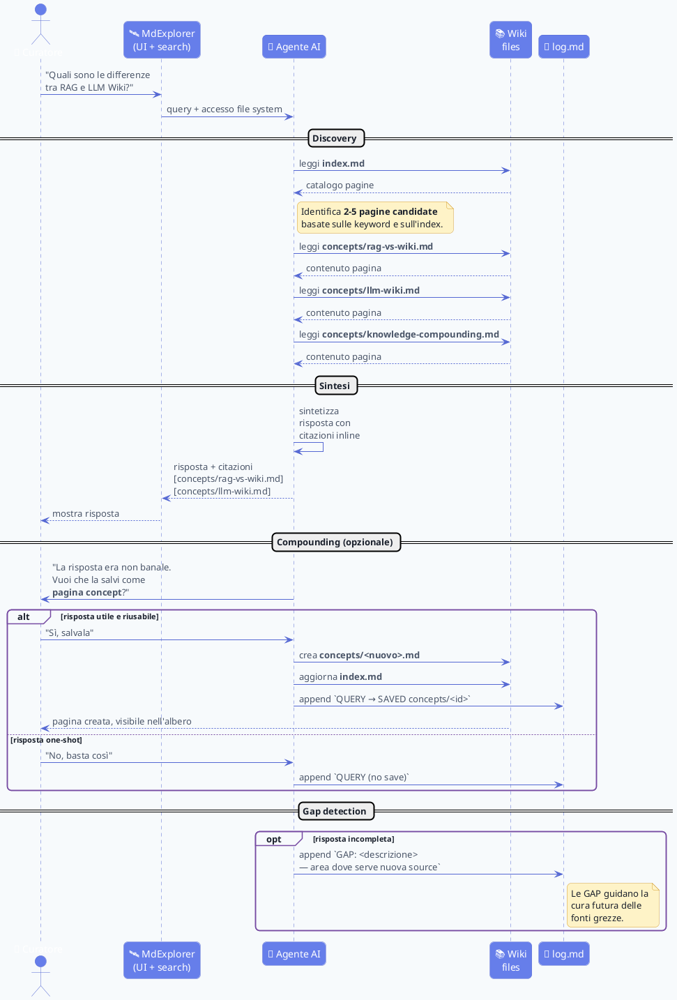

# 💬 Sequence: dalla domanda alla nuova pagina

Quando l'umano fa una domanda al wiki, l'LLM non si limita a rispondere — la risposta utile diventa **nuova conoscenza permanente**. Questo è il meccanismo del **knowledge compounding**.

## Cosa rende speciale questo flusso

1. **Search via index, non via embeddings**: l'LLM legge `index.md` (è il TOC del wiki) e identifica le pagine candidate. Niente vector DB richiesto.
2. **Lettura completa, non chunk**: se una pagina è candidata, l'LLM la legge **per intero** invece di prendere solo i top-k chunk. Questo evita risposte frammentate.
3. **Citazione inline obbligatoria**: ogni claim nella risposta ha `[fonte]` puntuale alla pagina del wiki.
4. **Compounding opt-in**: l'umano decide caso per caso se "promuovere" una risposta a pagina permanente.
5. **Gap come lavoro futuro**: se la risposta è incompleta, viene loggato un `GAP` che guida la prossima ingestione di fonti.

## Vedi anche

- [Use case](use-case.md) — vista d'insieme degli attori
- [Workflow di ingest](workflow-ingestion.md) — l'altro flusso principale
- [Knowledge Compounding](../concepts/knowledge-compounding.md) — il concetto teorico dietro questo flusso
