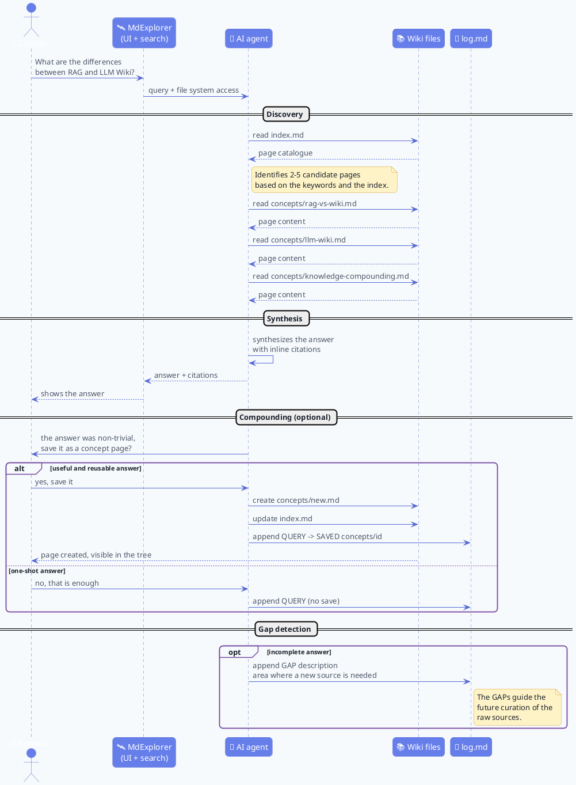

# 💬 Sequence: from the question to the new page

When the human asks the wiki a question, the LLM does not just answer — the useful answer becomes **new permanent knowledge**. This is the mechanism of **knowledge compounding**.

```plantuml
@startuml
skinparam backgroundColor #f7fafc
skinparam shadowing false
skinparam roundCorner 12
skinparam DefaultFontName Helvetica
skinparam DefaultFontColor #1a202c

skinparam sequence {
  ArrowColor #5568d3
  ArrowFontColor #4a5568
  LifeLineBorderColor #5568d3
  LifeLineBackgroundColor #e0e7ff
  ParticipantBackgroundColor #667eea
  ParticipantBorderColor #5568d3
  ParticipantFontColor #ffffff
  ActorBackgroundColor #667eea
  ActorBorderColor #5568d3
  ActorFontColor #ffffff
  GroupBackgroundColor #f7fafc
  GroupBorderColor #764ba2
  GroupFontColor #1a202c
}

skinparam noteBackgroundColor #fef3c7
skinparam noteBorderColor #d69e2e
skinparam noteFontColor #1a202c

actor "👤 Curator" as H
participant "🛰️ MdExplorer\n(UI + search)" as MDE
participant "🤖 AI agent" as LLM
participant "📚 Wiki files" as W
participant "📜 log.md" as L

H -> MDE : What are the differences\nbetween RAG and LLM Wiki?
MDE -> LLM : query + file system access

== Discovery ==
LLM -> W : read index.md
W --> LLM : page catalogue
note right of LLM
  Identifies 2-5 candidate pages
  based on the keywords and the index.
end note

LLM -> W : read concepts/rag-vs-wiki.md
W --> LLM : page content
LLM -> W : read concepts/llm-wiki.md
W --> LLM : page content
LLM -> W : read concepts/knowledge-compounding.md
W --> LLM : page content

== Synthesis ==
LLM -> LLM : synthesizes the answer\nwith inline citations
LLM --> MDE : answer + citations
MDE --> H : shows the answer

== Compounding (optional) ==
LLM -> H : the answer was non-trivial,\nsave it as a concept page?

alt useful and reusable answer
  H -> LLM : yes, save it
  LLM -> W : create concepts/new.md
  LLM -> W : update index.md
  LLM -> L : append QUERY -> SAVED concepts/id
  W --> H : page created, visible in the tree
else one-shot answer
  H -> LLM : no, that is enough
  LLM -> L : append QUERY (no save)
end

== Gap detection ==
opt incomplete answer
  LLM -> L : append GAP description\narea where a new source is needed
  note right of L
    The GAPs guide the
    future curation of the
    raw sources.
  end note
end

@enduml
```

## What makes this flow special

1. **Search via the index, not via embeddings**: the LLM reads `index.md` (it is the TOC of the wiki) and identifies the candidate pages. No vector DB required.
2. **Full reading, not chunks**: if a page is a candidate, the LLM reads it **in full** instead of taking only the top-k chunks. This avoids fragmented answers.
3. **Inline citation is mandatory**: every claim in the answer has a `[source]` that points to the exact wiki page.
4. **Opt-in compounding**: the human decides case by case whether to "promote" an answer to a permanent page.
5. **Gaps as future work**: if the answer is incomplete, a `GAP` is logged, and it guides the next ingest of sources.

## See also

- [Use case](use-case.md) — overview of the actors
- [Ingest workflow](workflow-ingestion.md) — the other main flow
- [Knowledge Compounding](../concepts/knowledge-compounding.md) — the theoretical concept behind this flow
