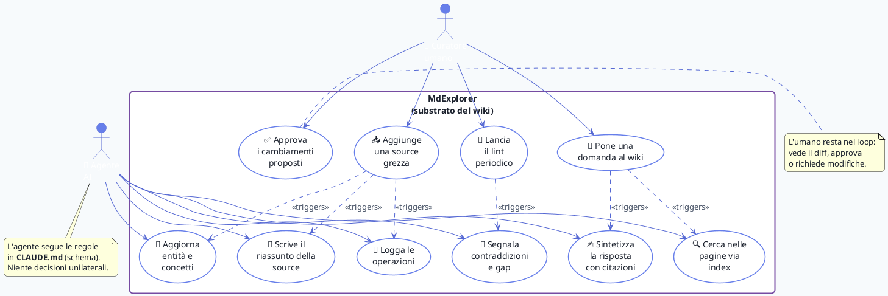

# 🎭 Use Case: chi fa cosa nel LLM Wiki

Questo diagramma mostra gli **attori** del sistema LLM Wiki (umano curatore, agente AI) e le loro **interazioni principali** col substrato (MdExplorer).

## Attori

| Attore | Ruolo | Decisioni |
|---|---|---|
| 👤 **Curatore umano** | Cura le fonti, fa domande, approva i cambiamenti | Cosa includere, cosa escludere, priorità |
| 🤖 **Agente AI** (LLM) | Mantiene il wiki: scrive, aggiorna, sintetizza, segnala | Come strutturare seguendo lo schema |

## Vedi anche

- [Workflow di ingest](workflow-ingestion.md) — l'attività dietro UC1+UC5+UC6
- [Sequence di query](sequence-query.md) — l'attività dietro UC2+UC7+UC8
- [Concept LLM Wiki](../concepts/llm-wiki.md) — il pattern generale
