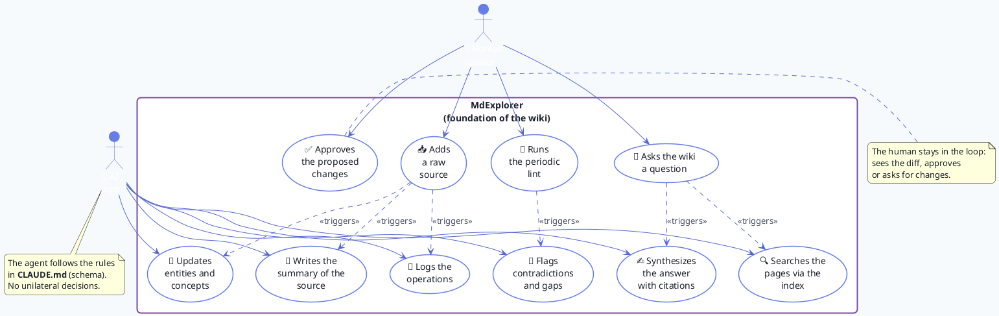

# 🎭 Use Case: who does what in the LLM Wiki

This diagram shows the **actors** of the LLM Wiki system (human curator, AI agent) and their **main interactions** with the foundation (MdExplorer).

```plantuml
@startuml
skinparam backgroundColor #f7fafc
skinparam shadowing false
skinparam roundCorner 12
skinparam DefaultFontName Helvetica
skinparam DefaultFontColor #1a202c

skinparam actor {
  BackgroundColor #667eea
  BorderColor #5568d3
  FontColor #ffffff
}

skinparam usecase {
  BackgroundColor #ffffff
  BorderColor #667eea
  FontColor #1a202c
  BorderThickness 1.5
}

skinparam rectangle {
  BackgroundColor #ffffff
  BorderColor #764ba2
  FontColor #1a202c
  BorderThickness 2
}

skinparam ArrowColor #5568d3
skinparam ArrowFontColor #4a5568

actor "👤 Human\ncurator" as Human
actor "🤖 AI\nagent" as LLM

rectangle "**MdExplorer**\n(foundation of the wiki)" as MDE {

  usecase "📥 Adds\na raw\nsource" as UC1
  usecase "💬 Asks the wiki\na question" as UC2
  usecase "✅ Approves\nthe proposed\nchanges" as UC3
  usecase "🧹 Runs\nthe periodic\nlint" as UC4

  usecase "📝 Writes the\nsummary of the\nsource" as UC5
  usecase "🔄 Updates\nentities and\nconcepts" as UC6
  usecase "🔍 Searches the\npages via the\nindex" as UC7
  usecase "✍️ Synthesizes\nthe answer\nwith citations" as UC8
  usecase "📜 Logs the\noperations" as UC9
  usecase "🚨 Flags\ncontradictions\nand gaps" as UC10
}

Human --> UC1
Human --> UC2
Human --> UC3
Human --> UC4

LLM --> UC5
LLM --> UC6
LLM --> UC7
LLM --> UC8
LLM --> UC9
LLM --> UC10

UC1 ..> UC5 : <<triggers>>
UC1 ..> UC6 : <<triggers>>
UC1 ..> UC9 : <<triggers>>

UC2 ..> UC7 : <<triggers>>
UC2 ..> UC8 : <<triggers>>

UC4 ..> UC10 : <<triggers>>

note right of UC3
  The human stays in the loop:
  sees the diff, approves
  or asks for changes.
end note

note bottom of LLM
  The agent follows the rules
  in **CLAUDE.md** (schema).
  No unilateral decisions.
end note

@enduml
```

## Actors

| Actor | Role | Decisions |
|---|---|---|
| 👤 **Human curator** | Curates the sources, asks questions, approves the changes | What to include, what to leave out, priorities |
| 🤖 **AI agent** (LLM) | Maintains the wiki: writes, updates, synthesizes, flags | How to structure it, following the schema |

## See also

- [Ingest workflow](workflow-ingestion.md) — the activity behind UC1+UC5+UC6
- [Query sequence](sequence-query.md) — the activity behind UC2+UC7+UC8
- [LLM Wiki concept](../concepts/llm-wiki.md) — the general pattern
