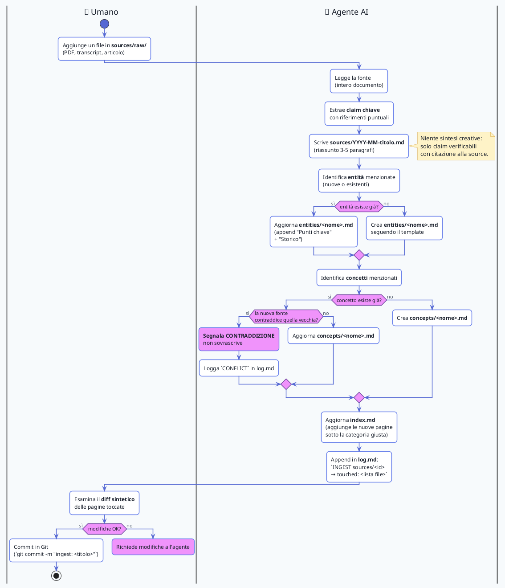

# 🔄 Workflow: ingest di una nuova source

Cosa succede quando l'umano aggiunge un documento grezzo al wiki: l'agente AI legge, riassume, propaga, e logga — il tutto sotto il controllo dell'umano (che approva o richiede modifiche).

## Note operative

- **Niente decisioni unilaterali**: il diff viene sempre mostrato all'umano prima del commit
- **Contraddizioni mai sovrascritte**: vengono segnalate esplicitamente come marker visibile (`> ⚠️ Contraddizione...`) e loggate
- **Touched list**: il log riporta esattamente quali file sono cambiati, per poter riprodurre/auditare
- **Ingestion batch**: per progetti grandi si può ingerire più sources in un colpo, ma con minor controllo umano

## Vedi anche

- [Use case](use-case.md) — vista d'insieme degli attori
- [Sequence di query](sequence-query.md) — l'altro flusso principale
- [CLAUDE.md](../CLAUDE.md) — le regole che l'agente segue
