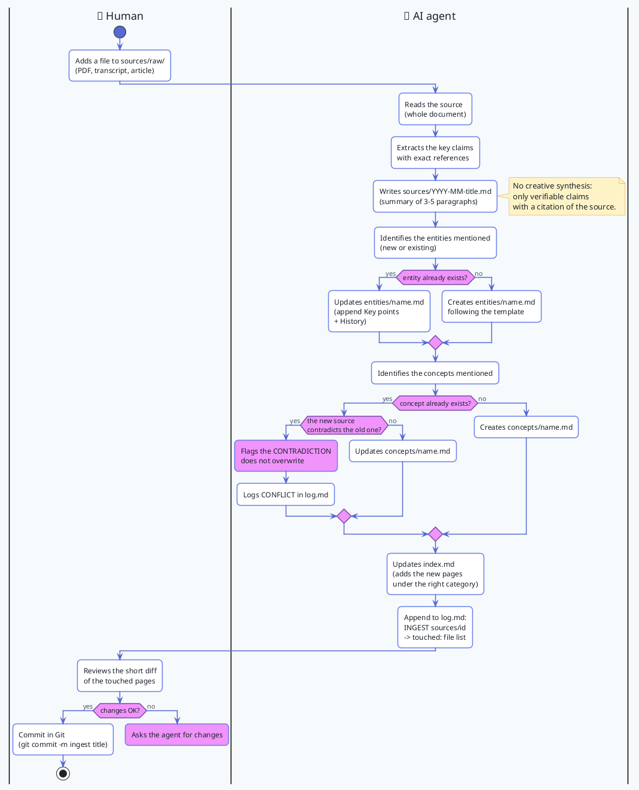

# 🔄 Workflow: ingest of a new source

What happens when the human adds a raw document to the wiki: the AI agent reads, summarizes, propagates, and logs — all under the control of the human (who approves or asks for changes).

```plantuml
@startuml
skinparam backgroundColor #f7fafc
skinparam shadowing false
skinparam roundCorner 12
skinparam DefaultFontName Helvetica
skinparam DefaultFontColor #1a202c

skinparam activityBackgroundColor #ffffff
skinparam activityBorderColor #667eea
skinparam activityFontColor #1a202c
skinparam activityBorderThickness 1.5
skinparam activityStartColor #5568d3
skinparam activityEndColor #5568d3
skinparam activityBarColor #5568d3
skinparam activityDiamondBackgroundColor #f093fb
skinparam activityDiamondBorderColor #764ba2
skinparam activityDiamondFontColor #1a202c

skinparam ArrowColor #5568d3
skinparam ArrowFontColor #4a5568

skinparam partitionBackgroundColor #f7fafc
skinparam partitionBorderColor #cbd5e0
skinparam partitionFontColor #4a5568

skinparam noteBackgroundColor #fef3c7
skinparam noteBorderColor #d69e2e
skinparam noteFontColor #1a202c

|👤 Human|
start
:Adds a file to sources/raw/\n(PDF, transcript, article);

|🤖 AI agent|
:Reads the source\n(whole document);

:Extracts the key claims\nwith exact references;

:Writes sources/YYYY-MM-title.md\n(summary of 3-5 paragraphs);

note right
  No creative synthesis:
  only verifiable claims
  with a citation of the source.
end note

:Identifies the entities mentioned\n(new or existing);

if (entity already exists?) then (yes)
  :Updates entities/name.md\n(append Key points\n+ History);
else (no)
  :Creates entities/name.md\nfollowing the template;
endif

:Identifies the concepts mentioned;

if (concept already exists?) then (yes)
  if (the new source\ncontradicts the old one?) then (yes)
    #f093fb:Flags the CONTRADICTION\ndoes not overwrite;
    :Logs CONFLICT in log.md;
  else (no)
    :Updates concepts/name.md;
  endif
else (no)
  :Creates concepts/name.md;
endif

:Updates index.md\n(adds the new pages\nunder the right category);

:Append to log.md:\nINGEST sources/id\n-> touched: file list;

|👤 Human|
:Reviews the short diff\nof the touched pages;

if (changes OK?) then (yes)
  :Commit in Git\n(git commit -m ingest title);
  stop
else (no)
  #f093fb:Asks the agent for changes;
  detach
endif

@enduml
```

## Operating notes

- **No unilateral decisions**: the diff is always shown to the human before the commit
- **Contradictions are never overwritten**: they are flagged explicitly with a visible marker (`> ⚠️ Contradiction...`) and logged
- **Touched list**: the log records exactly which files changed, so the operation can be reproduced/audited
- **Batch ingestion**: for large projects you can ingest several sources in one go, but with less human control

## See also

- [Use case](use-case.md) — overview of the actors
- [Query sequence](sequence-query.md) — the other main flow
- [CLAUDE.md](../CLAUDE.md) — the rules the agent follows
