# The assets of the presentation

## TL;DR

Backgrounds and characters of the presentations are files of their own, in this folder. The slides call
them by name: to change an illustration, replace the file with a new one of the same name, without touching
the slides. Here is the list, with the sizes to respect and where each file is used.

- Seven SVG files: three backgrounds, two versions of the astronaut, the rocket, Mark's panel.
- The animations are **inside** each file, so they travel with it.
- Same name and same proportions: the replacement needs nothing else.

## The characters

| File | Size | What it does |
|---|---|---|
| `astronauta.svg` | 290 × 255 | floats, blinks, winks now and then |
| `astronauta-ok.svg` | 290 × 255 | raises her hand, makes the "ok" sign, winks |
| `razzo.svg` | 240 × 240 | sways, the flame flickers |
| `mark.svg` | 600 × 330 | blinking lights, lines being written |


## The backgrounds

| File | What it shows | Size | Where it is used |
|---|---|---|---|
| `sfondo-luna.svg` | lunar ground, the Earth turning, the little markdown flag | 1280 × 720 | opening and closing |
| `sfondo-spazio.svg` | Saturn, asteroids, the Earth, a rocket passing by | 1280 × 720 | start of each part |
| `sfondo-chiaro.svg` | the same elements, barely hinted | 1280 × 720 | every content slide |




The file names are the same as in the Italian version of the demo, on the `main` branch: one set of files
serves both. Only `mark.svg` differs, because the panel carries a short text.

## How the slides call them

A character is an image inside the slide:

```markdown

```

A background is a comment on the first line of the slide:

```markdown
<!-- .slide: data-background-color="#0f1b2d" data-background-image="assets/sfondo-spazio.svg" -->
```

The colour next to the image is needed for dark backgrounds: it is from the colour that the slide
understands it must write the text in white.

## How to replace an asset

1. Prepare the new file with the tool you prefer.
2. Save it here with the **same name** as the one it replaces.
3. Reopen the presentation: it has already changed, in every slide that uses it.

If the new file has another format, for example PNG or GIF, change the name in the slides too: search for
the old name in `mdexplorer.md` and in `behind-the-scenes.md`.

## What to respect

| Rule | Why |
|---|---|
| Backgrounds stay 16:9 | the slide crops them to fill the screen |
| The centre of a background stays free | that is where the text of the slide goes |
| The light background stays very light | dark text goes on top of it, and so do the diagrams |
| Animations are written in the file, in CSS | an image does not run scripts |
| No external files inside an SVG | an image does not load them: Mark's portrait is embedded in the file |

A GIF or a video work the same way. For a video background see the `mde-slide` skill.

[Back to the presentations](../../tour/04-presentations.md)
