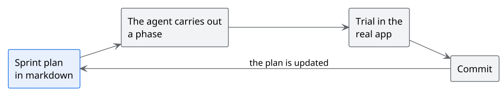
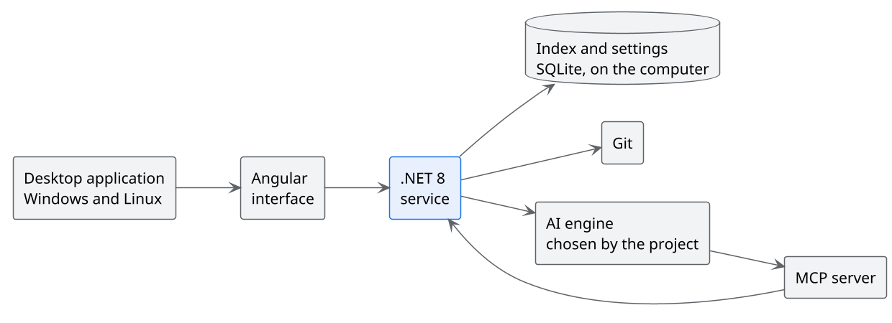

<!-- .slide: data-background-color="#0f1b2d" data-background-image="assets/sfondo-spazio.svg" -->

# Behind the scenes

How MdExplorer is built

Note:
This presentation opens from a link of the main one. The trail at the top left takes you back to the
slide you left from.

---

<!-- .slide: data-background-image="assets/sfondo-chiaro.svg" -->

## The numbers

| Fact | Value |
|---|---|
| Lines of C# code | about 150,000 |
| Lines of TypeScript code | about 43,000 |
| Projects in the solution | 22 |
| Automated tests | more than 1,300 |
| Commits since March 2021 | 1,311 |
| Sprint plans | 54 |

Measured on the repository on 1 October 2026.

---

<!-- .slide: data-background-image="assets/sfondo-chiaro.svg" -->

## Six years, one acceleration

2021149

2022122

202363

202494

2025221

2026<b>662</b>

Commits per year. In 2026, up to 1 October, 638 out of 662 are co-signed with an AI agent.

Note:
The jump does not come from more hours of work. It comes from the method on the next slide.

---

<!-- .slide: data-background-image="assets/sfondo-chiaro.svg" -->

## The method

The plan is a living document: decisions, phases, what has been tried and what remains.

Note:
Every function seen today has its sprint plan, written and read inside MdExplorer.
The person decides and checks, the agent carries out and documents.

---

<!-- .slide: data-background-image="assets/sfondo-chiaro.svg" -->

## How it is made

---

<!-- .slide: data-background-image="assets/sfondo-chiaro.svg" -->

## Three lessons learned

1. **The written plan is worth more than the request.** An agent with a clear plan works for hours without getting lost <!-- .element: class="fragment" -->
2. **Verify first, change after.** The agent tries things in the real application, it does not assume <!-- .element: class="fragment" -->
3. **Memory is made of documents.** What the agent learns stays written, and a person can read it too <!-- .element: class="fragment" -->

Note:
They are the same three things a company adopting AI needs: written knowledge, verification, shared rules.
