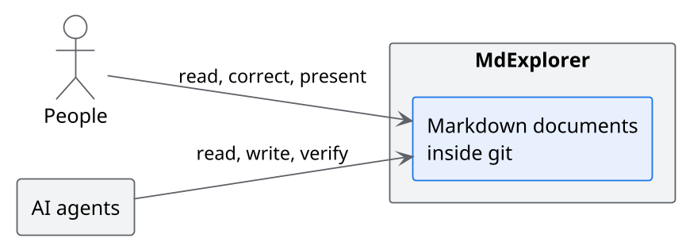
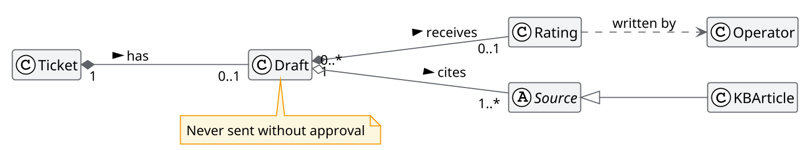
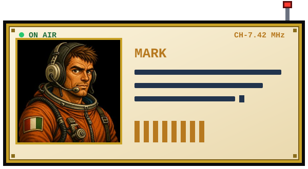
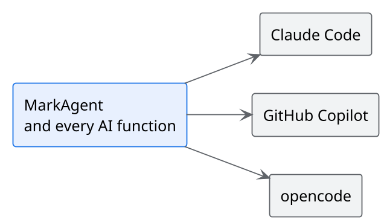

<!-- .slide: data-background-color="#0a1322" data-background-image="assets/sfondo-luna.svg" -->

# MdExplorer

Where people and AI agents work on the same documents

Note:
Open by saying that this presentation is a markdown file, opened inside MdExplorer.
Everything shown in the hour is inside this demo project: no outside material.

---

<!-- .slide: data-background-image="assets/sfondo-chiaro.svg" -->

## Why AI stalls in a company

- Knowledge lives in Word, in wikis and in people's heads: **AI cannot read it** <!-- .element: class="fragment fade-up" -->
- The most capable tools live in the terminal: **only programmers use them** <!-- .element: class="fragment fade-up" -->
- Everyone uses AI their own way: **no shared rules, no verification** <!-- .element: class="fragment fade-up" -->

Note:
Ask whether at least one of the three points sounds familiar. They are the three obstacles the three parts
of the presentation answer.

---

<!-- .slide: data-background-image="assets/sfondo-chiaro.svg" -->

## The idea

One format, one place, one history.

Note:
Markdown is the format models read and write best. Git is the history.
MdExplorer makes both comfortable for people who do not program and governable for those who decide.

---

<!-- .slide: data-background-image="assets/sfondo-chiaro.svg" -->

## Three things to remember

1. **Living documents**: knowledge is readable by people and by AI <!-- .element: class="fragment fade-up" -->
2. **MarkAgent**: AI works inside the project, with shared rules <!-- .element: class="fragment fade-up" -->
3. **Control**: every change is visible, and what matters is verified <!-- .element: class="fragment fade-up" -->

---

<!-- .slide: data-background-color="#0f1b2d" data-background-image="assets/sfondo-spazio.svg" data-transition="zoom" -->

## 1 · Living documents

Knowledge in a format everyone can read

---

<!-- .slide: data-background-image="assets/sfondo-chiaro.svg" -->

## A document that works on its own

- Diagrams answer a click
- Real files are included, not copied
- Text is corrected right where you read it
- Examples run from the page

[Try: living documents](../tour/01-living-documents.md) · [A real document: the architecture](../case-study/02-architecture.md)

Note:
Open the architecture of the case study. Click a class of the diagram, show the diagram
drawn from the JSON file, the HTML prototype. Come back here with the back arrow of the bar.

---

<!-- .slide: data-background-image="assets/sfondo-chiaro.svg" -->

## A diagram you can question

A click on a class lights up its relations, one colour per type.

Note:
Click Draft. Then the button with the eye to see it full page.

---

<!-- .slide: data-background-image="assets/sfondo-chiaro.svg" -->

## One markdown, every format

**The same file becomes**

- a presentation, like this one
- a Word document
- a PDF or a site to send

**Without changing tool**

- you correct from the slide
- you annotate while presenting
- everything stays in git

[Try: presentations](../tour/04-presentations.md) · [Try: Word, PDF and site](../tour/05-word-pdf-site.md)

Note:
Here correct a word of this slide live with "Edit", then annotate with the pen.

---

<!-- .slide: data-background-color="#0f1b2d" data-background-image="assets/sfondo-spazio.svg" data-transition="zoom" -->

## 2 · MarkAgent

AI inside the project, with shared rules

---

<!-- .slide: data-background-image="assets/sfondo-chiaro.svg" -->

## AI works where the knowledge is

- It reads and writes the documents of the project
- It explains a diagram, answers about a point of a slide
- It writes documents, diagrams, slides and tests with the house conventions
- One conversation for every function

[Try: MarkAgent](../tour/03-markagent.md) · [The case study](../case-study/README.md)

Note:
Main demonstration. The case study holds three deliberate inconsistencies between requirements, architecture and
minutes: ask MarkAgent to find them. Then ask it to add a slide to the committee presentation.

---

<!-- .slide: data-background-image="assets/sfondo-chiaro.svg" -->

## One engine, chosen by the company

It is chosen per project. Changing provider does not change the way you work.

Note:
The point for whoever governs adoption: one engine chosen in one place, for every function.
No function quietly using another model.

---

<!-- .slide: data-background-image="assets/sfondo-chiaro.svg" -->

## The rules travel with the project

| Skill | What it teaches the agent |
|---|---|
| mde-doc | how to write a document, summary first |
| mde-plantuml | how to draw a readable diagram |
| mde-slide | how to write a presentation |
| mde-e2e | how to write and run a test of a site |

MdExplorer distributes them to every project and keeps them up to date.

Note:
Skills are text files in the project: they are read, corrected, versioned. A company can
add its own. It is how good practice becomes the agent's behaviour.

---

<!-- .slide: data-background-image="assets/sfondo-chiaro.svg" -->

## Knowledge open to every agent

- An MCP server exposes the project to agents: it searches the documents, verifies the diagrams
- It connects Jira and Confluence
- For each project only the groups of functions needed are switched on

[Try: rules, skills and MCP](../tour/07-rules-skills-mcp.md)

Note:
MCP is the standard through which an agent uses external tools. Switching on only the groups needed
reduces the context used by every conversation.

---

<!-- .slide: data-background-color="#0f1b2d" data-background-image="assets/sfondo-spazio.svg" data-transition="zoom" -->

## 3 · Control

Trust the AI, and verify

---

<!-- .slide: data-background-image="assets/sfondo-chiaro.svg" -->

## Every change is visible

- Everything the AI writes is a change in git: you read it, accept it, undo it
- The AI proposes the commit message, the person approves it
- Every repository of the project has its own status, always visible

[Try: git without the terminal](../tour/06-git.md)

---

<!-- .slide: data-background-image="assets/sfondo-chiaro.svg" -->

## What matters is verified

- The agent verifies the diagrams it writes, before putting them in the document
- The tests of a site are written in plain language and the outcome stays in the file
- Every test leaves a script that replays in a few seconds, without AI

[Try: tests written in plain language](../tour/08-e2e-tests.md)

Note:
The end-to-end test is the clearest example of verifiable AI: the agent runs it, leaves screenshots,
the outcome and a script. From the next time the script runs on its own and costs nothing.

---

<!-- .slide: data-background-image="assets/sfondo-chiaro.svg" -->

## MdExplorer is built this way

| Fact | Value |
|---|---|
| Commits since March 2021 | 1,311 |
| Commits in 2026 | 662 |
| of which co-signed with an AI agent | 638 |
| Sprint plans written in MdExplorer | 54 |

[Behind the scenes](behind-the-scenes.md)

Note:
This is the strongest argument for whoever works on adoption: the product is the proof of the method.
A plan written in markdown, an agent that carries it out, a verification, a commit.

---

<!-- .slide: data-background-image="assets/sfondo-chiaro.svg" -->

## Open and under control

- Open source, MIT licence
- Documents stay on the computer and in the company's git
- Windows and Linux
- No proprietary format: they are markdown files

---

<!-- .slide: data-background-image="assets/sfondo-chiaro.svg" -->

## The next step

1. One team, one real project, four weeks
2. The house rules written as skills
3. Measure what changes: time, quality, use

Note:
Adapt this slide to what you want to ask your audience.

---

<!-- .slide: data-background-color="#0a1322" data-background-image="assets/sfondo-luna.svg" -->

## Thank you

[mdexplorer.net](https://www.mdexplorer.net) · [github.com/salaroglio/MdExplorer](https://github.com/salaroglio/MdExplorer)

The demo project you have seen opens with "Create demo project".

