# Gli asset della presentazione

## TL;DR

Sfondi e personaggi delle presentazioni sono file a sé, in questa cartella. Le slide li richiamano per
nome: per cambiare un'illustrazione basta sostituire il file con uno nuovo dallo stesso nome, senza toccare
le slide. Qui c'è l'elenco, con le misure da rispettare e dove ogni file è usato.

- Sette file SVG: tre sfondi, due versioni dell'astronauta, il razzo, il pannello di Mark.
- Le animazioni stanno **dentro** ogni file, quindi viaggiano con lui.
- Stesso nome e stesse proporzioni: la sostituzione non richiede altro.

## I personaggi

| File | Misure | Cosa fa |
|---|---|---|
| `astronauta.svg` | 290 × 255 | galleggia, batte le palpebre, ogni tanto fa l'occhiolino |
| `astronauta-ok.svg` | 290 × 255 | alza la mano, fa «ok», strizza l'occhio |
| `razzo.svg` | 240 × 240 | dondola, la fiamma tremola |
| `mark.svg` | 600 × 330 | luci che lampeggiano, righe che si scrivono |


## Gli sfondi

| File | Cosa mostra | Misure | Dove è usato |
|---|---|---|---|
| `sfondo-luna.svg` | suolo lunare, la Terra che gira, la bandierina markdown | 1280 × 720 | apertura e chiusura |
| `sfondo-spazio.svg` | Saturno, asteroidi, la Terra, un razzo che passa | 1280 × 720 | inizio di ogni parte |
| `sfondo-chiaro.svg` | gli stessi elementi, appena accennati | 1280 × 720 | tutte le slide di contenuto |





## Come le slide li richiamano

Un personaggio è un'immagine dentro la slide:

```markdown

```

Uno sfondo è un commento sulla prima riga della slide:

```markdown
<!-- .slide: data-background-color="#0f1b2d" data-background-image="assets/sfondo-spazio.svg" -->
```

Il colore accanto all'immagine serve negli sfondi scuri: è da lui che la slide capisce di dover scrivere
il testo in bianco.

## Come sostituire un asset

1. Prepara il file nuovo con lo strumento che preferisci.
2. Salvalo qui con lo **stesso nome** di quello che sostituisce.
3. Riapri la presentazione: è già cambiata, in tutte le slide che lo usano.

Se il file nuovo ha un altro formato, per esempio PNG o GIF, cambia il nome anche nelle slide: cerca il
nome vecchio in `mdexplorer.md` e in `dietro-le-quinte.md`.

## Cosa rispettare

| Regola | Perché |
|---|---|
| Gli sfondi restano 16:9 | la slide li ritaglia per riempire lo schermo |
| Il centro di uno sfondo resta libero | lì sta il testo della slide |
| Lo sfondo chiaro resta molto chiaro | sopra ci va testo scuro, e i diagrammi |
| Le animazioni si scrivono nel file, in CSS | un'immagine non esegue script |
| Niente file esterni dentro un SVG | un'immagine non li carica: il ritratto di Mark è incorporato nel file |

Una GIF o un video funzionano allo stesso modo. Per un video di sfondo vedi la skill `mde-slide`.

[Torna alle presentazioni](../../tour/04-presentazioni.md)
