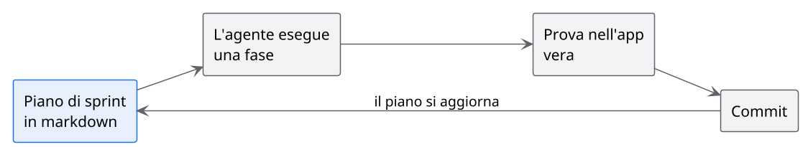
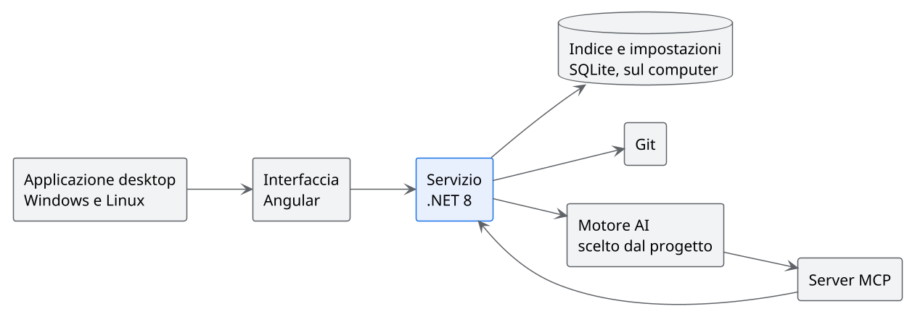

# Dietro le quinte

Come è costruito MdExplorer

Note:
Questa presentazione si apre da un link della principale. La traccia in alto a sinistra riporta alla
slide di partenza.

---

## I numeri

| Dato | Valore |
|---|---|
| Righe di codice C# | circa 150.000 |
| Righe di codice TypeScript | circa 43.000 |
| Progetti nella soluzione | 22 |
| Test automatici | più di 1.300 |
| Commit da marzo 2021 | 1.311 |
| Piani di sprint | 54 |

Misurati sul repository il 1° ottobre 2026.

---

## Sei anni, un'accelerazione

2021149

2022122

202363

202494

2025221

2026<b>662</b>

Commit per anno. Nel 2026, fino al 1° ottobre, 638 su 662 sono firmati insieme a un agente AI.

Note:
Il salto non viene da più ore di lavoro. Viene dal metodo della slide successiva.

---

## Il metodo

Il piano è un documento vivo: decisioni, fasi, cosa è stato provato e cosa resta.

Note:
Ogni funzione vista oggi ha il suo piano di sprint, scritto e letto dentro MdExplorer.
La persona decide e controlla, l'agente esegue e documenta.

---

## Com'è fatto

---

## Tre cose imparate

1. **Il piano scritto vale più della richiesta.** Un agente con un piano chiaro lavora per ore senza perdersi <!-- .element: class="fragment" -->
2. **Prima si verifica, poi si cambia.** L'agente prova nell'applicazione vera, non suppone <!-- .element: class="fragment" -->
3. **La memoria è fatta di documenti.** Ciò che l'agente impara resta scritto, e lo legge anche una persona <!-- .element: class="fragment" -->

Note:
Sono le stesse tre cose che servono a un'azienda che adotta l'AI: conoscenza scritta, verifica, regole comuni.
