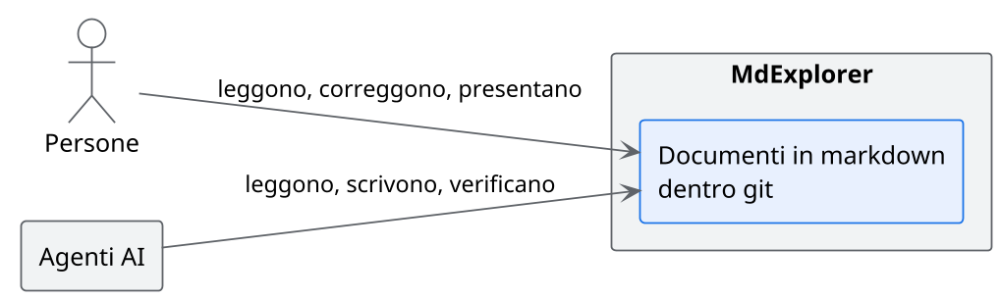
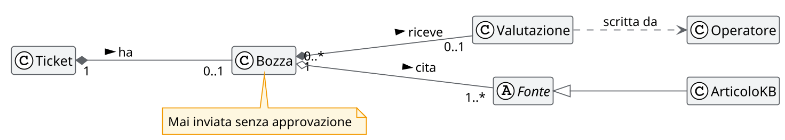
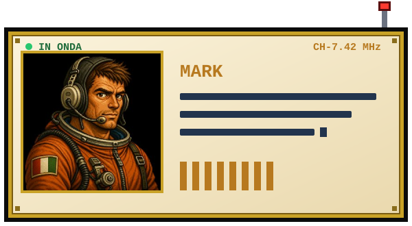
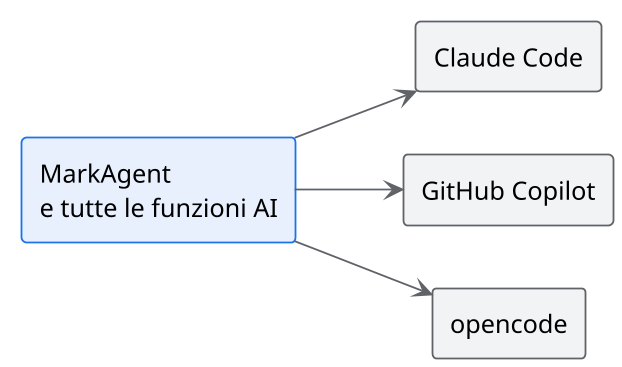

<!-- .slide: data-background-color="#0a1322" data-background-image="assets/sfondo-luna.svg" -->

# MdExplorer

Dove persone e agenti AI lavorano sugli stessi documenti

Note:
Aprire dicendo che questa presentazione è un file markdown, aperto dentro MdExplorer.
Tutto quello che si vedrà nell'ora è dentro questo progetto demo: nessun materiale esterno.

---

<!-- .slide: data-background-image="assets/sfondo-chiaro.svg" -->

## Perché l'AI in azienda si ferma

- La conoscenza sta in Word, nelle wiki e nelle teste: **l'AI non la legge** <!-- .element: class="fragment fade-up" -->
- Gli strumenti più capaci vivono nel terminale: **li usa solo chi programma** <!-- .element: class="fragment fade-up" -->
- Ognuno usa l'AI a modo suo: **nessuna regola comune, nessuna verifica** <!-- .element: class="fragment fade-up" -->

Note:
Chiedere se si riconosce in almeno uno dei tre punti. Sono i tre ostacoli a cui rispondono le tre parti
della presentazione.

---

<!-- .slide: data-background-image="assets/sfondo-chiaro.svg" -->

## L'idea

Un solo formato, un solo posto, una sola cronologia.

Note:
Il markdown è il formato che i modelli leggono e scrivono meglio. Git è la cronologia.
MdExplorer rende le due cose comode per chi non programma e governabili per chi decide.

---

<!-- .slide: data-background-image="assets/sfondo-chiaro.svg" -->

## Tre cose da ricordare

1. **Documenti vivi**: la conoscenza è leggibile dalle persone e dall'AI <!-- .element: class="fragment fade-up" -->
2. **MarkAgent**: l'AI lavora dentro il progetto, con regole comuni <!-- .element: class="fragment fade-up" -->
3. **Controllo**: ogni modifica si vede, e ciò che conta si verifica <!-- .element: class="fragment fade-up" -->

---

<!-- .slide: data-background-color="#0f1b2d" data-background-image="assets/sfondo-spazio.svg" data-transition="zoom" -->

## 1 · Documenti vivi

La conoscenza in un formato che leggono tutti

---

<!-- .slide: data-background-image="assets/sfondo-chiaro.svg" -->

## Un documento che fa da solo

- I diagrammi rispondono al clic
- I file veri si includono, non si copiano
- Il testo si corregge nel punto in cui si legge
- Gli esempi si eseguono dalla pagina

[Prova: i documenti vivi](../tour/01-documenti-vivi.md) · [Un documento vero: l'architettura](../caso-studio/02-architettura.md)

Note:
Aprire l'architettura del caso di studio. Cliccare una classe del diagramma, mostrare il diagramma
disegnato dal file JSON, il prototipo HTML. Tornare qui con la freccia indietro della barra.

---

<!-- .slide: data-background-image="assets/sfondo-chiaro.svg" -->

## Un diagramma che si interroga

Un clic su una classe accende le sue relazioni, con un colore per tipo.

Note:
Cliccare Bozza. Poi il pulsante con l'occhio per vederlo a tutta pagina.

---

<!-- .slide: data-background-image="assets/sfondo-chiaro.svg" -->

## Da un markdown a tutto il resto

**Lo stesso file diventa**

- una presentazione, come questa
- un documento Word
- un PDF o un sito da inviare

**Senza cambiare strumento**

- si corregge dalla slide
- si annota mentre si presenta
- resta tutto in git

[Prova: le presentazioni](../tour/04-presentazioni.md) · [Prova: Word, PDF e sito](../tour/05-word-pdf-sito.md)

Note:
Qui correggere dal vivo una parola di questa slide con «Modifica», poi annotare con la penna.

---

<!-- .slide: data-background-color="#0f1b2d" data-background-image="assets/sfondo-spazio.svg" data-transition="zoom" -->

## 2 · MarkAgent

L'AI dentro il progetto, con regole comuni

---

<!-- .slide: data-background-image="assets/sfondo-chiaro.svg" -->

## L'AI lavora dove sta la conoscenza

- Legge e scrive i documenti del progetto
- Spiega un diagramma, risponde su un punto di una slide
- Scrive documenti, diagrammi, slide e test con le convenzioni di casa
- Una sola conversazione per tutte le funzioni

[Prova: MarkAgent](../tour/03-markagent.md) · [Il caso di studio](../caso-studio/README.md)

Note:
Dimostrazione principale. Nel caso di studio ci sono tre incongruenze volute fra requisiti, architettura e
verbale: chiedere a MarkAgent di trovarle. Poi chiedere di aggiungere una slide alla presentazione del comitato.

---

<!-- .slide: data-background-image="assets/sfondo-chiaro.svg" -->

## Un motore solo, a scelta dell'azienda

Si sceglie per progetto. Cambiare fornitore non cambia il modo di lavorare.

Note:
Il punto per chi governa l'adozione: un solo motore scelto in un solo posto, per tutte le funzioni.
Niente funzioni che di nascosto usano un altro modello.

---

<!-- .slide: data-background-image="assets/sfondo-chiaro.svg" -->

## Le regole viaggiano con il progetto

| Skill | Cosa insegna all'agente |
|---|---|
| mde-doc | come si scrive un documento, con il riassunto in testa |
| mde-plantuml | come si disegna un diagramma leggibile |
| mde-slide | come si scrive una presentazione |
| mde-e2e | come si scrive e si esegue un test di un sito |

MdExplorer le distribuisce in ogni progetto e le tiene aggiornate.

Note:
Le skill sono file di testo nel progetto: si leggono, si correggono, si versionano. Un'azienda può
aggiungere le proprie. È il modo in cui le buone pratiche diventano comportamento dell'agente.

---

<!-- .slide: data-background-image="assets/sfondo-chiaro.svg" -->

## La conoscenza aperta a ogni agente

- Un server MCP espone il progetto agli agenti: cerca nei documenti, verifica i diagrammi
- Collega Jira e Confluence
- Per ogni progetto si accendono solo i gruppi di funzioni che servono

[Prova: regole, skill e MCP](../tour/07-regole-skill-mcp.md)

Note:
MCP è lo standard con cui un agente usa strumenti esterni. Accendere solo i gruppi che servono
riduce il contesto consumato a ogni conversazione.

---

<!-- .slide: data-background-color="#0f1b2d" data-background-image="assets/sfondo-spazio.svg" data-transition="zoom" -->

## 3 · Controllo

Fidarsi dell'AI, e verificare

---

<!-- .slide: data-background-image="assets/sfondo-chiaro.svg" -->

## Ogni modifica si vede

- Tutto ciò che l'AI scrive è una modifica in git: si legge, si accetta, si annulla
- Il messaggio di commit lo propone l'AI, lo approva la persona
- Ogni repository del progetto ha il suo stato, sempre visibile

[Prova: git senza terminale](../tour/06-git.md)

---

<!-- .slide: data-background-image="assets/sfondo-chiaro.svg" -->

## Ciò che conta si verifica

- L'agente verifica i diagrammi che scrive, prima di metterli nel documento
- I test di un sito si scrivono in italiano e l'esito resta scritto nel file
- Ogni test lascia uno script che si rigioca in pochi secondi, senza AI

[Prova: i test scritti in italiano](../tour/08-test-e2e.md)

Note:
Il test end-to-end è l'esempio più chiaro di AI verificabile: l'agente esegue, lascia screenshot,
esito e uno script. Dalla volta dopo lo script gira da solo e non costa niente.

---

<!-- .slide: data-background-image="assets/sfondo-chiaro.svg" -->

## MdExplorer è costruito così

| Dato | Valore |
|---|---|
| Commit da marzo 2021 | 1.311 |
| Commit nel 2026 | 662 |
| di cui firmati insieme a un agente AI | 638 |
| Piani di sprint scritti in MdExplorer | 54 |

[Dietro le quinte](dietro-le-quinte.md)

Note:
Questo è l'argomento più forte per chi si occupa di adozione: il prodotto è la prova del metodo.
Un piano scritto in markdown, un agente che lo esegue, una verifica, un commit.

---

<!-- .slide: data-background-image="assets/sfondo-chiaro.svg" -->

## Aperto e sotto controllo

- Codice aperto, licenza MIT
- I documenti restano sul computer e nel git dell'azienda
- Windows e Linux
- Nessun formato proprietario: sono file markdown

---

<!-- .slide: data-background-image="assets/sfondo-chiaro.svg" -->

## Il prossimo passo

1. Un gruppo, un progetto vero, quattro settimane
2. Le regole di casa scritte come skill
3. Si misura cosa cambia: tempi, qualità, uso

Note:
Adattare questa slide alla richiesta che si vuole fare all'interlocutore.

---

<!-- .slide: data-background-color="#0a1322" data-background-image="assets/sfondo-luna.svg" -->

## Grazie

[mdexplorer.net](https://www.mdexplorer.net) · [github.com/salaroglio/MdExplorer](https://github.com/salaroglio/MdExplorer)

Il progetto demo che avete visto si apre con «Crea progetto demo».

