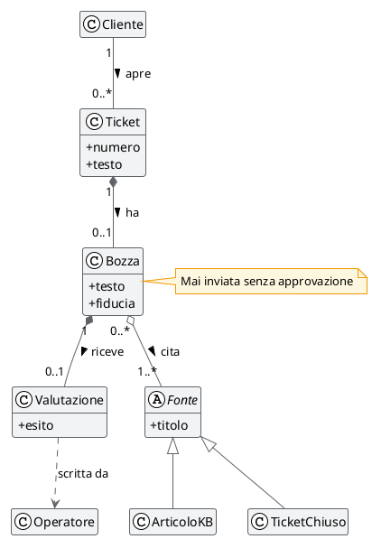
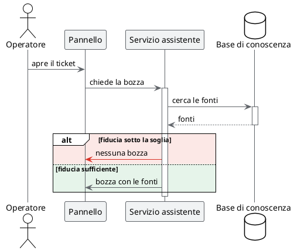

# Diagrammi che rispondono

## TL;DR

In MdExplorer un diagramma è testo dentro il documento, quindi lo scrive e lo corregge anche un agente AI.
Una volta disegnato non è un'immagine ferma: risponde al clic, si ingrandisce, si fa spiegare. Questa pagina
ne mostra tre tipi, da provare.

- Un clic su un elemento accende ciò che gli è collegato e spegne il resto.
- Nei diagrammi delle classi il colore dice il **tipo** di relazione.
- Tasto destro su un elemento: «💬 Ask to MarkAgent» lo spiega con i documenti del progetto.

## Un diagramma delle classi

Clicca **Bozza**. Poi passa il mouse sul diagramma: nella barra che compare, 🎨 mostra la legenda dei colori.

| Relazione | Come si scrive | Colore al clic |
|---|---|---|
| ereditarietà | `<\|--` | viola |
| composizione | `*--` | arancione |
| aggregazione | `o--` | azzurro |
| associazione | `--` | verde acqua |
| dipendenza | `..>` | magenta |

Anche la nota agganciata a una classe si accende con lei.

## Un diagramma di sequenza

Clicca un partecipante o un messaggio per seguirne il percorso.

## Gli strumenti sul diagramma

Passa il mouse su un diagramma: compare una barra.

| Strumento | Cosa fa |
|---|---|
| 🎨 | mostra o nasconde la legenda dei colori |
| lampadina | in tema scuro, mostra il diagramma a colori chiari |
| lente | cerca una parola dentro il diagramma |
| Ctrl + rotella | ingrandisce e rimpicciolisce; trascinando ci si sposta |

## Farsi spiegare un elemento

Tasto destro su un riquadro, poi «💬 Ask to MarkAgent». La risposta arriva nel pannello di Mark, in poche
frasi, e usa i documenti del progetto. Serve un motore AI configurato: vedi [MarkAgent](03-markagent.md).

## Chi scrive i diagrammi

Tu, oppure MarkAgent. Prova a chiedergli:

> Disegna nel documento caso-studio/02-architettura.md un diagramma di sequenza dell'anonimizzazione decisa
> nel verbale del 18 settembre.

MarkAgent segue le regole della skill `mde-plantuml` e ha uno strumento per verificare il diagramma prima
di scriverlo: vedi [Regole, skill e MCP](07-regole-skill-mcp.md).

## Cosa serve

Java per disegnare i diagrammi. Un motore AI solo per «Ask to MarkAgent».

Avanti: [MarkAgent](03-markagent.md) · Indietro: [Documenti vivi](01-documenti-vivi.md) · [Torna all'inizio](../README.md)
