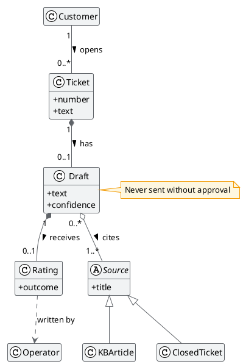
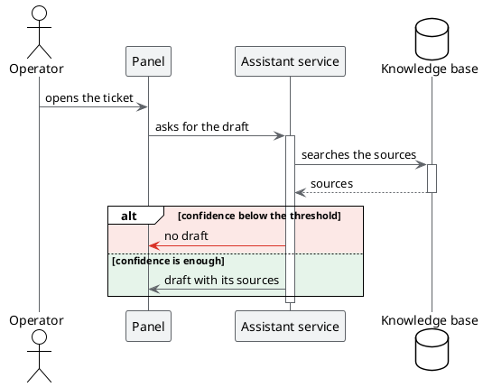

# Diagrams that answer

## TL;DR

In MdExplorer a diagram is text inside the document, so an AI agent can write and correct it too.
Once drawn it is not a still image: it answers a click, it zooms, it can be explained. This page
shows three kinds, to try.

- A click on an element lights up what is connected to it and dims the rest.
- In class diagrams the colour tells the **type** of relation.
- Right click on an element: "💬 Ask to MarkAgent" explains it with the documents of the project.

## A class diagram

Click **Draft**. Then move the mouse over the diagram: in the bar that appears, 🎨 shows the colour legend.

| Relation | How it is written | Colour on click |
|---|---|---|
| inheritance | `<\|--` | purple |
| composition | `*--` | orange |
| aggregation | `o--` | light blue |
| association | `--` | teal |
| dependency | `..>` | magenta |

The note attached to a class lights up with it too.

## A sequence diagram

Click a participant or a message to follow its path.

## The tools on the diagram

Move the mouse over a diagram: a bar appears.

| Tool | What it does |
|---|---|
| 🎨 | shows or hides the colour legend |
| light bulb | in the dark theme, shows the diagram in light colours |
| magnifier | searches a word inside the diagram |
| Ctrl + wheel | zooms in and out; dragging moves around |

## Having an element explained

Right click on a box, then "💬 Ask to MarkAgent". The answer arrives in Mark's panel, in a few
sentences, and uses the documents of the project. It needs a configured AI engine: see [MarkAgent](03-markagent.md).

## Who writes the diagrams

You, or MarkAgent. Try asking it:

> Draw in the document case-study/02-architecture.md a sequence diagram of the anonymisation decided
> in the minutes of 18 September.

MarkAgent follows the rules of the `mde-plantuml` skill and has a tool to verify the diagram before
writing it: see [Rules, skills and MCP](07-rules-skills-mcp.md).

## What you need

Java to draw the diagrams. An AI engine only for "Ask to MarkAgent".

Next: [MarkAgent](03-markagent.md) · Back: [Living documents](01-living-documents.md) · [Back to the start](../README.md)
