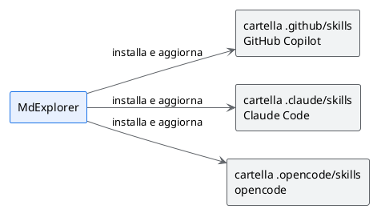

# Regole, skill e MCP

## TL;DR

Un agente AI lavora bene quando sa come si lavora in quel progetto. MdExplorer mette nel progetto le regole
di scrittura, sotto forma di skill, e dà all'agente gli strumenti per usare la conoscenza del progetto, con
un server MCP. Questa pagina dice cosa sono, dove stanno e come si governano.

- Una **skill** è un file di testo che insegna all'agente un mestiere: si legge e si corregge.
- MdExplorer installa le skill nel progetto e le tiene aggiornate da solo.
- Gli **strumenti MCP** si accendono per progetto, a gruppi: l'agente vede solo ciò che gli serve.

## Le skill che MdExplorer porta nel progetto

| Skill | Cosa insegna all'agente |
|---|---|
| `mde-doc` | scrivere un documento tecnico, con il riassunto in testa |
| `mde-readme` | scrivere un README con esempi che si eseguono dalla pagina |
| `mde-features` | usare le estensioni del markdown di MdExplorer |
| `mde-plantuml` | disegnare un diagramma leggibile, con colori che hanno un significato |
| `mde-slide` | scrivere una presentazione |
| `mde-e2e` | scrivere ed eseguire i test di un sito |
| `mde-e2e-signals` | far annunciare a un sito quando ha finito di caricare |
| `mde-prompt-for-agents` | preparare la richiesta di lancio di un agente |

Questi stessi documenti sono scritti con quelle regole: ognuno si apre con un riassunto di tre righe e tre
punti, come chiede `mde-doc`.

## Dove stanno

All'apertura del progetto MdExplorer scrive le skill nella cartella del motore scelto.

Ogni skill ha un numero di versione. Quando MdExplorer ne ha una più recente, sostituisce quella nel
progetto. Se vuoi personalizzarne una, togli il blocco `mde:` dalla sua intestazione: da quel momento è tua
e MdExplorer non la tocca più.

## Le regole di casa

Le regole generali del progetto stanno nel file di istruzioni, che l'agente legge all'inizio di ogni
conversazione. Il nome dipende dal motore: `CLAUDE.md`, `AGENTS.md` oppure `.github/copilot-instructions.md`.
Quello di questo progetto è breve: [aprilo](../CLAUDE.md).

Le skill di MdExplorer sono un punto di partenza. Un'azienda può aggiungere le proprie nello stesso posto:
come si scrive un verbale, come si nomina un requisito, quali parole non usare con i clienti. Sono file di
testo nel repository, quindi si rivedono e si approvano come ogni altro documento.

## Gli strumenti MCP

MCP è lo standard con cui un agente usa strumenti esterni. MdExplorer ha un suo server MCP, che si registra
da solo per il motore scelto.

| Gruppo | Cosa permette all'agente |
|---|---|
| Progetti e ricerca | elencare i progetti e cercare nei documenti. Sempre acceso |
| PlantUML | verificare un diagramma prima di scriverlo |
| Jira | cercare, leggere, creare e aggiornare le segnalazioni |
| Confluence | cercare, leggere e scrivere le pagine |
| Knowledge graph | interrogare il grafo dei concetti |
| Città degli agenti | scambiare messaggi con altri agenti. Sperimentale |

I gruppi si accendono in «Impostazioni Progetto», scheda «AI & RAG», riquadro «Strumenti MCP nel
contesto». Accanto a ogni gruppo c'è il suo peso in token. Un progetto che non usa Jira non lo accende, e
ogni conversazione parte più leggera.

## Da provare

Chiedi a MarkAgent:

> Quali skill hai a disposizione in questo progetto, e quali strumenti MCP?

Poi:

> Scrivi un documento tour/prova.md che spiega in dieci righe cos'è una skill, con un diagramma.

Guarda il risultato: si apre con il riassunto e il diagramma segue le regole dei colori.

## Cosa serve

Un motore AI configurato: vedi [MarkAgent](03-markagent.md). Per Jira e Confluence serve un sito Atlassian
con un token di accesso.

Avanti: [Test scritti in italiano](08-test-e2e.md) · Indietro: [Git senza terminale](06-git.md) · [Torna all'inizio](../README.md)
