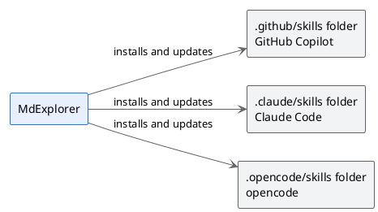

# Rules, skills and MCP

## TL;DR

An AI agent works well when it knows how work is done in that project. MdExplorer puts the writing rules
into the project, as skills, and gives the agent the tools to use the knowledge of the project, with an
MCP server. This page says what they are, where they live and how they are governed.

- A **skill** is a text file that teaches the agent a trade: you can read it and correct it.
- MdExplorer installs the skills in the project and keeps them up to date on its own.
- **MCP tools** are switched on per project, in groups: the agent sees only what it needs.

## The skills MdExplorer brings to the project

| Skill | What it teaches the agent |
|---|---|
| `mde-doc` | writing a technical document, with the summary at the top |
| `mde-readme` | writing a README with examples that run from the page |
| `mde-features` | using the markdown extensions of MdExplorer |
| `mde-plantuml` | drawing a readable diagram, with colours that carry a meaning |
| `mde-slide` | writing a presentation |
| `mde-e2e` | writing and running the tests of a site |
| `mde-e2e-signals` | making a site announce when it has finished loading |
| `mde-prompt-for-agents` | preparing the launch request of an agent |

These very documents are written with those rules: each one opens with a summary of three lines and three
points, as `mde-doc` asks.

## Where they live

When the project is opened, MdExplorer writes the skills in the folder of the chosen engine.

Every skill has a version number. When MdExplorer has a newer one, it replaces the one in the
project. If you want to customise one, remove the `mde:` block from its header: from then on it is yours
and MdExplorer no longer touches it.

## The house rules

The general rules of the project are in the instructions file, which the agent reads at the start of every
conversation. Its name depends on the engine: `CLAUDE.md`, `AGENTS.md` or `.github/copilot-instructions.md`.
The one of this project is short: [open it](../CLAUDE.md).

The skills of MdExplorer are a starting point. A company can add its own in the same place: how minutes
are written, how a requirement is named, which words not to use with customers. They are text files in the
repository, so they are reviewed and approved like any other document.

## The MCP tools

MCP is the standard through which an agent uses external tools. MdExplorer has its own MCP server, which
registers itself for the chosen engine.

| Group | What it lets the agent do |
|---|---|
| Projects and search | list the projects and search the documents. Always on |
| PlantUML | verify a diagram before writing it |
| Jira | search, read, create and update issues |
| Confluence | search, read and write pages |
| Knowledge graph | query the graph of concepts |
| Agent city | exchange messages with other agents. Experimental |

The groups are switched on in "Project Settings", "AI & RAG" tab, in the "MCP tools in the context" box.
Next to each group is its weight in tokens. A project that does not use Jira leaves it off, and
every conversation starts lighter.

## To try

Ask MarkAgent:

> Which skills do you have in this project, and which MCP tools?

Then:

> Write a document tour/trial.md that explains in ten lines what a skill is, with a diagram.

Look at the result: it opens with the summary and the diagram follows the colour rules.

## What you need

A configured AI engine: see [MarkAgent](03-markagent.md). For Jira and Confluence you need an Atlassian
site with an access token.

Next: [Tests written in plain language](08-e2e-tests.md) · Back: [Git without the terminal](06-git.md) · [Back to the start](../README.md)
