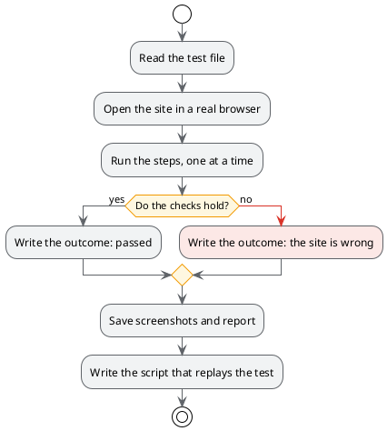

# Tests written in plain language

## TL;DR

An end-to-end test checks a site the way a person would: it opens a page, presses a button, looks at
what appears. In MdExplorer the test is a markdown file written in plain language. MarkAgent runs it on a
real browser, writes the outcome in the file and leaves a script that replays without AI.

- Whoever knows the site writes the steps: no programming needed.
- Every run leaves an outcome, screenshots and a report, all in the project.
- The generated script replays in a few seconds, with no agent and no cost.

## The sample test

The file [mdexplorer-site.e2e.md](e2e-tests/mdexplorer-site.e2e.md) checks the public site of MdExplorer.
Its first test is this:

```markdown
## T1 — La pagina iniziale si apre
1. Apri `/`
2. ✔ Il titolo della pagina è "MdExplorer — Editor Markdown per Spec Driven Development e LLM Wiki"
3. ✔ Compare il testo "Perché Spec Driven Development?"
```

A numbered line is a step. A line with **✔** is a check: if it does not hold, the test fails.

The steps are in Italian for a reason: the wording of steps and checks is defined by the `mde-e2e` skill,
which today is written in Italian, and the site under test shows Italian texts. This is what the lines mean:

| In the test | Meaning |
|---|---|
| `Apri` | open the address |
| `Premi il link "…"` | press the link with that text |
| `✔ Il titolo della pagina è "…"` | check: the page title is exactly that |
| `✔ Compare il testo "…"` | check: that text is visible |
| `✔ L'URL contiene "…"` | check: the address contains that |

## What happens when you run it



## To try

1. In the tree, right click on `mdexplorer-site.e2e.md`, then "E2E tests…".
2. The window checks the prerequisites and offers to install what is missing.
3. Press "Run the tests" and follow the progress.
4. At the end reopen the file: at the bottom are the outcomes, with the link to the report and the screenshots.
5. Press "Replay the scripts": the same tests run again, without MarkAgent.

## The three outcomes

| Outcome | What it means |
|---|---|
| ✅ passed | the steps were run and the checks hold |
| ❌ the application is wrong | a check does not hold: it is a defect of the site |
| ⚠️ the run did not succeed | the test did not reach the end: it is not known whether the site is right |

## Why it is a good example of verifiable AI

The agent does not say "I checked, all good". It leaves the evidence: the screenshot of every check, the
step-by-step report and a script anyone can replay. The next time, the agent is no longer needed.

The credentials of a site are in a file that never enters git, and the agent never sees them: MdExplorer
types them in at the right moment.

## What you need

- A configured AI engine and the network.
- The components that drive the browser: the test window lists them and installs them on request.
- To replay the scripts: the .NET development kit.

Back: [Rules, skills and MCP](07-rules-skills-mcp.md) · [Back to the start](../README.md)
