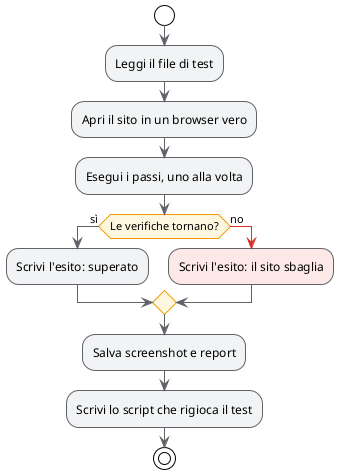

# Test scritti in italiano

## TL;DR

Un test end-to-end controlla un sito come farebbe una persona: apre una pagina, preme un bottone, guarda
cosa compare. In MdExplorer il test è un file markdown scritto in italiano. MarkAgent lo esegue su un
browser vero, scrive l'esito nel file e lascia uno script che si rigioca senza AI.

- Chi conosce il sito scrive i passi: non serve saper programmare.
- Ogni esecuzione lascia esito, screenshot e un report, tutti nel progetto.
- Lo script generato si rigioca in pochi secondi, senza agente e senza costi.

## Il test di esempio

Il file [sito-mdexplorer.e2e.md](test-e2e/sito-mdexplorer.e2e.md) controlla il sito pubblico di MdExplorer.
Il suo primo test è questo:

```markdown
## T1 — La pagina iniziale si apre
1. Apri `/`
2. ✔ Il titolo della pagina è "MdExplorer — Editor Markdown per Spec Driven Development e LLM Wiki"
3. ✔ Compare il testo "Perché Spec Driven Development?"
```

Una riga numerata è un passo. Una riga con **✔** è una verifica: se non torna, il test fallisce.

## Cosa succede quando lo esegui



## Da provare

1. Nell'albero, tasto destro su `sito-mdexplorer.e2e.md`, poi «Test e2e…».
2. La finestra controlla i prerequisiti e propone di installare ciò che manca.
3. Premi «Esegui i test» e segui l'avanzamento.
4. Alla fine riapri il file: in fondo ci sono gli esiti, con il link al report e agli screenshot.
5. Premi «Rigioca gli script»: gli stessi test girano di nuovo, senza MarkAgent.

## I tre esiti

| Esito | Cosa vuol dire |
|---|---|
| ✅ superato | i passi sono stati eseguiti e le verifiche tornano |
| ❌ l'applicazione sbaglia | una verifica non torna: è un difetto del sito |
| ⚠️ esecuzione non riuscita | il test non è arrivato in fondo: non si sa se il sito sia giusto |

## Perché è un buon esempio di AI verificabile

L'agente non dice «ho controllato, va tutto bene». Lascia le prove: lo screenshot di ogni verifica, il
report passo per passo e uno script che chiunque può rigiocare. La volta dopo l'agente non serve più.

Le credenziali di un sito stanno in un file che non entra in git, e l'agente non le vede mai: le inserisce
MdExplorer al momento giusto.

## Cosa serve

- Un motore AI configurato e la rete.
- I componenti per guidare il browser: la finestra dei test li elenca e li installa su richiesta.
- Per rigiocare gli script: il kit di sviluppo .NET.

Indietro: [Regole, skill e MCP](07-regole-skill-mcp.md) · [Torna all'inizio](../README.md)
